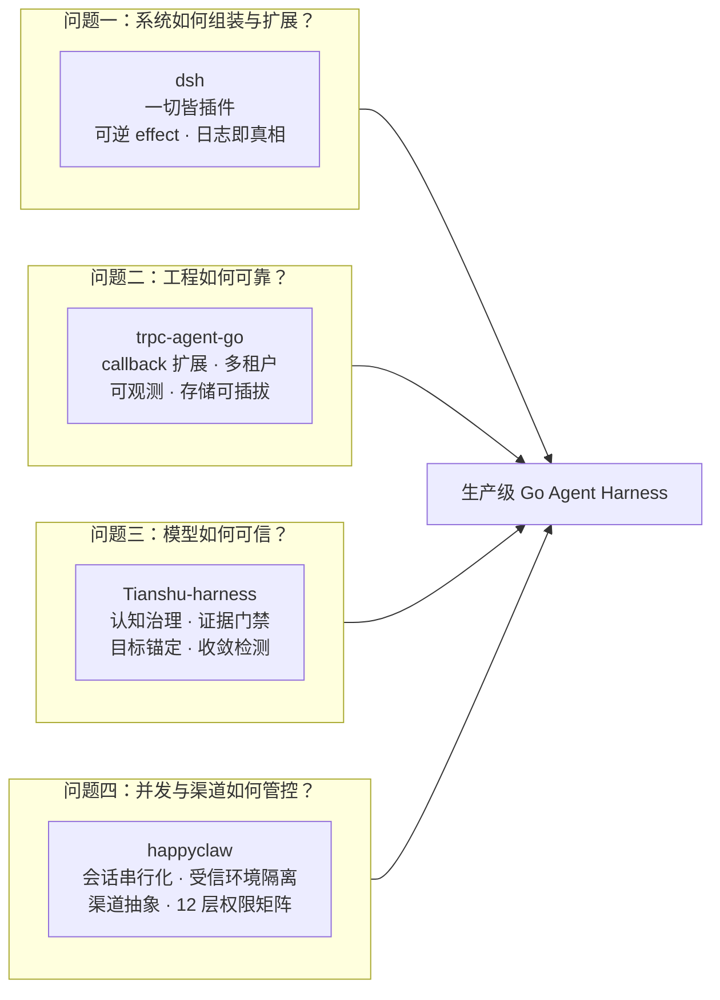
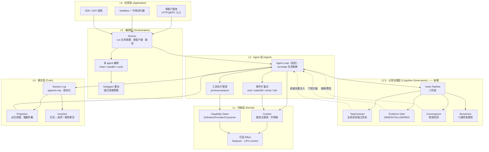
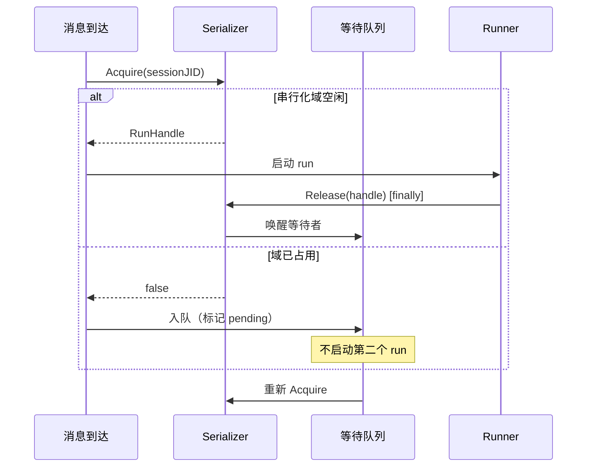
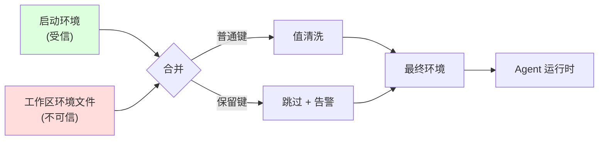
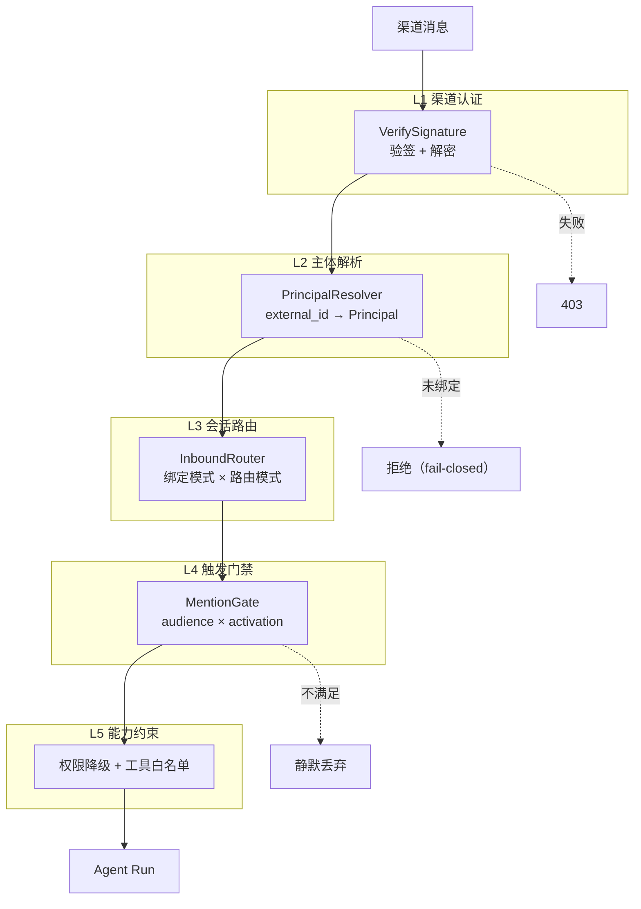
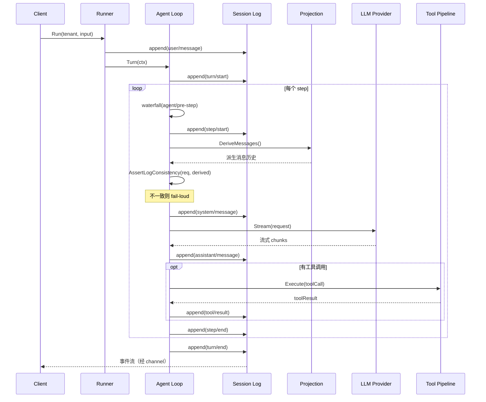

# Taiji · Go 原生 Agent Harness 设计文档

> 项目名称：**taiji**
> 版本：v1.4
> 日期：2026-09-22
> 配套：`01-需求文档.md`
> 定位：B 档 —— trpc-agent-go 工程形态 + dsh 日志派生理念 + **Tianshu-harness 认知治理层**，面向生产级多租户场景

---

## 1. 设计总纲

### 1.0 四个参照系的定位（新增）

本设计综合四个项目的长处，它们解决**四个正交问题**：



- **dsh 贡献**：可逆 effect 的语义、日志派生状态的纪律、capability seam 的三层结构
- **trpc-agent-go 贡献**：Go 工程形态、多租户三级键、9 个 callback hook 点、可插拔存储、OTel 可观测
- **Tianshu-harness 贡献**：TaskContract / Evidence / Convergence 三道反锚点结构、Sensorium 状态感知、前缀缓存引擎、分层可逆性
- **happyclaw 贡献**：会话串行化（per-conversation 串行 + 容量准入分叉）、运行时控制值隔离（受信环境 + 保留键三处检查）、渠道接入抽象（绑定×路由双维度 + 话题虚拟 JID）、fail-closed 触发门禁、12 层权限矩阵

**关键洞察**：四者缺一不可——dsh 解决"能不能替换"，trpc 解决"Go 生态能不能落地"，Tianshu 解决"模型会不会跑偏"，**happyclaw 解决"并发会不会互相污染、渠道身份能不能信任"**。

> **关于 WeKnora**：本设计在渠道接入部分引用了 WeKnora（`E:\aiops\WeKnora`）作为**次要对照**，用于交叉验证 happyclaw 的渠道设计（验签+解密、IM 用户降权、渠道管理需 Admin 三条在 WeKnora 中独立实现且方向一致）。**它不作为参照系**——其会话模式是二选一开关而非 happyclaw 的双维度正交设计，且无触发门禁与 owner 模型。理由详见需求文档 1.2.1。

### 1.1 核心设计决策

本设计在四个张力点上做了明确取舍，每个取舍都有源码依据：

**决策一：扩展范式用「可逆注册」而非纯 callback**

trpc-agent-go 的 `Plugin` 只能挂 9 个回调且无法卸载（`agent/plugins.go:26-45` 无 setter），这导致能力一旦注册就无法在运行期收回——对多租户场景是硬伤（一个租户的插件无法隔离卸载）。

本设计采用 dsh 的**可逆 effect** 语义：所有注册返回 `Disposer`，卸载时 LIFO unwind。这在 Go 中**完全可实现**（本会话探针已验证：可逆 effect、provider 替换、子作用域隔离三项全绿）。

**决策二：会话状态「派生优先」而非「物化唯一」**

trpc-agent-go 的 state 是物化存储的（`session.go:67` 的 `StateMap`，sqlite 在 `service_helper.go:301` 同事务写 state 列与 event 行），**不存在从日志重建的机制**。这带来的问题是：state 与 event 可能不一致，且无法审计"这个状态是怎么来的"。

本设计采用 dsh 的**日志即真相**：日志是 append-only 的事实源，state 是派生视图。关键差异——**保留物化缓存作为性能优化**，但物化结果必须可由日志重建，且运行时断言二者一致（对齐 `invariant.ts:42`）。

**决策三：事件总线「每类型一总线」而非「单总线多类型」**

dsh 靠 TypeScript declaration merging 实现"一个 ctx 挂多种事件类型"。Go **不支持泛型接口方法**（本会话实测报错 `interface method must have no type parameters`），因此单接口多事件类型无法类型安全地建模。

Go 1.27 新增了泛型方法（实测可运行），所以**每事件类型一个泛型总线实例**是可行方案（本会话探针 `TestMultiEventTypes` 通过）。代价是：事件类型需显式注册，而非自动合并。

**决策四：可逆性「分层」而非「一刀切」（新增，来自 Tianshu 的启发）**

调研 Tianshu 时发现一个精妙的设计：它的 CVM 核心 hook **不可逆**（`runtime-hooks.ts:251` 只有单向 `register`，注释明说"不改变注册集"），而用户扩展 hook **可逆**（`registry.ts:19` 有 `unregister`、`:86` 有 `clear`）。

这不是矛盾，是**按层给不同答案**：
- **编译期装配的核心能力**：不可逆，保证行为稳定与缓存前缀稳定
- **运行期注册的扩展能力**：可逆，保证灵活性与隔离

本设计采纳此原则。它同时解决了决策一的隐患——如果一切都可逆，多租户的隔离卸载会破坏核心稳定性。

### 1.2 架构分层图



**分层不重叠原则**（借鉴 dsh）：权限管决策，沙箱管效果，凭据管机密；事件管通信，服务管能力，工具管模型接口；**认知治理管目标与证据**。每层只做一件事。

**L2.5 的定位**：它不替代 agent loop，而是**包裹**它——模型负责认知（reason/decide/act），治理层负责执行语义（observe/measure/evaluate/gate/verify）。对齐 Tianshu 的核心命题：`Probabilistic Cognition inside Deterministic Supervision`。

---

## 2. 内核层设计（L1）

### 2.1 Context：服务注册表

```go
// Context 是服务仓库 + 作用域节点。
// 对齐 dsh vendor/cordis/src/context.ts:42 的 Context 类语义。
type Context struct {
    parent   *Context
    services map[string]any
    effects  []effectEntry   // 逆序 unwind 栈
    mu       sync.RWMutex
}

// Provide 注册服务，返回 Disposer（可逆）。
func (c *Context) Provide(key string, svc any) Disposer

// Resolve 查找服务（沿 parent 链向上）。
// 依赖未就绪时返回显式错误，绝不返回 nil。
func (c *Context) Resolve(key string) (any, error)

// Scope 创建子作用域（per-agent / per-session）。
func (c *Context) Scope() *Context

// Dispose 逆序 unwind 本作用域全部 effect。
func (c *Context) Dispose() error
```

**关键设计点**：

1. **Resolve 失败必须显式**。dsh 的 `reflect.ts:160` 在依赖未就绪时把错误改成 `cannot get required service ... in inactive context` 并 throw。Go 版必须遵循同样纪律——**绝不返回零值**，因为 Go 的零值 nil 会让调用方静默出错。

2. **子作用域隔离语义**（本会话探针已验证）：
   - 子能访问父的服务
   - 父**不能**访问子的服务
   - 子 Dispose 不影响父
   - 子 Dispose 后子的服务消失

### 2.2 可逆 Effect

```go
type Disposer func() error

type effectEntry struct {
    label   string
    dispose Disposer
}

// Effect 安装一个可逆副作用。
// 对齐 dsh fiber.ts:418 的 effect(execute, label)。
func (c *Context) Effect(label string, body func() (Disposer, error)) error

// dispose 逆序执行（LIFO）。
// 对齐 dsh fiber.ts:675-676 的 _disposables.clear() 逆序语义。
func (c *Context) dispose() error {
    var errs []error
    for i := len(c.effects) - 1; i >= 0; i-- {
        if err := c.effects[i].dispose(); err != nil {
            errs = append(errs, err)
        }
    }
    return errors.Join(errs...)
}
```

**验收**（本会话探针已实测通过）：
- 注册 A→B→C，卸载顺序必须 C→B→A
- Dispose 后服务不可解析
- 错误聚合用 `errors.Join`，不吞错

### 2.3 Capability Seam（三层结构）

```go
// Definition 角色：声明能力接口
type LLMService interface {
    Stream(ctx context.Context, req *Request) (StreamReader, error)
}

// Provider 角色：实现并注册
type OpenAIProvider struct{}
func (p *OpenAIProvider) Register(c *Context) Disposer {
    return c.Provide("llm.openai", p)
}

// Consumer 角色：通过 key 使用，不 import 具体实现
type Agent struct{ ctx *Context }
func (a *Agent) call(ctx context.Context, req *Request) {
    svc, _ := a.ctx.Resolve("llm")   // 只认 key
    llm := svc.(LLMService)
    llm.Stream(ctx, req)
}
```

**seam 的判定标准**（来自 dsh `docs/capability-seams.md`）：Definition / Provider / Consumer **三者齐备**才构成 seam，单一角色不是。这防止"假装可替换"的伪抽象。

**seam 的实际威力**（dsh 文档原话）：文件系统与子进程 provider 共享一个执行世界，把二者指向远程沙箱，Bash、PTY、LSP 会跟着一起迁移，无需 fork provider。本设计要求同样的性质。

---

## 3. 事实层设计（L0）

这是本项目**与 trpc-agent-go 最本质的差异**，也是 dsh 理念的落地核心。

### 3.1 Session Log：append-only 事实源

```go
// Event 是日志中的一条不可变事实。
// 对齐 dsh packages/core/session/src/types.ts:269 的 SessionEventMap。
type Event struct {
    Seq       uint64          `json:"seq"`        // 单调递增
    Type      EventType       `json:"type"`       // 判别式
    Data      json.RawMessage `json:"data"`
    Timestamp time.Time       `json:"ts"`
}

// 事件类型词汇表（首期）
const (
    EventTurnStart        EventType = "turn/start"
    EventTurnEnd          EventType = "turn/end"
    EventStepStart        EventType = "step/start"
    EventStepEnd          EventType = "step/end"
    EventUserMessage      EventType = "user/message"
    EventAssistantMessage EventType = "assistant/message"
    EventSystemMessage    EventType = "system/message"
    EventAssistantAttempt EventType = "assistant/attempt"  // 失败/重试，不进模型历史
    EventToolCall         EventType = "tool/call"
    EventToolResult       EventType = "tool/result"
    EventRequestHeader    EventType = "request/header"
    EventRequestContext   EventType = "request/context"
)
```

**设计依据**：dsh 的 `SessionEventMap`（`types.ts:269-407`）包含 turn/start、step/start、user/message、assistant/message、assistant/attempt、tool/call、tool/result、request/header、request/context 等。本设计取其核心子集。

**与 trpc-agent-go 的关键差异**：trpc 的 `event.Event`（`event/event.go:99`）没有独立的事件类型枚举，靠 `Response.Object` 字符串判别（`model/response.go:24-55`，如 `"chat.completion"`、`"tool.response"`）。本设计采用**显式判别式**（`Type` 字段），理由：
- 判别式可穷举（Go 的 switch + `assertNever` 模式）
- 日志的 Type 与传输层的 Object 解耦，日志格式可独立演进

### 3.2 Projection：派生视图

```go
// Projection 从日志增量折叠出状态。
// 对齐 dsh session-projection/src/index.ts:32 的 ctx.sessionProjections。
type Projection interface {
    Key() string
    Apply(ev Event) error       // 增量折叠单条事件
    State() any                 // 读取当前派生状态
}

type ProjectionRegistry struct {
    units map[string]Projection
}

// DeriveMessages 投影出模型可见的消息序列。
// 这是"日志即真相"的核心 API。
func (s *Session) DeriveMessages() []Message
```

**增量折叠 vs 全量重放**：投影注册表在每条事件 append 时增量应用（对齐 dsh 的 `stateOf()` 语义），避免每次全量重放。**但全量重放必须始终可用**——这是崩溃恢复与审计的基础。

**关键不变式**（对齐 `invariant.ts:42`）：

```go
// AssertLogConsistency 在发往模型前校验：请求内容必须等于日志派生结果。
func AssertLogConsistency(req *LLMRequest, sess *Session) error {
    expected := sess.DeriveMessages()
    if !messagesEqual(req.Messages, expected) {
        return fmt.Errorf(
            "llm request for session %q diverges from log derivation (log-reconstruction desync)",
            sess.ID)
    }
    return nil
}
```

这条断言是**运行时**的，不是测试——它保证任何绕过日志直接构造请求的代码路径都会被立刻发现。

### 3.3 崩溃恢复

```go
// Repair 处理未闭合的 turn。
// 对齐 dsh packages/core/session/src/repair.ts 的 interruptedTurnClosers。
func Repair(events []Event) ([]Event, error)
```

**两种路径的语义区分**（来自 dsh 的实现）：
- **写路径**：发现未闭合 turn，**追加**一条 `turn/end` 到日志（持久化修复）
- **冷读路径**：只在内存中平衡，**不修改**日志文件（保持日志不可变）

### 3.4 日志格式版本与迁移

```go
const SESSION_FORMAT_VERSION = 3

// 相邻迁移：每个包负责恰好一个 vN -> vN+1 步骤。
// 对齐 dsh packages/session/session-format/src/chain.ts:23-88。
type Migration interface {
    From() int
    To() int
    Migrate(events []Event) ([]Event, error)
}
```

**硬约束**（来自 dsh 设计）：
- 迁移链必须相邻无缺口，否则拒绝加载
- 已提交的代（generation）不可重命名/覆盖/删除
- 未知的未来版本**拒绝加载**（fail-closed），不静默降级

---

## 4. Agent 层设计（L2）

### 4.1 Agent Loop（固定）

```go
// Loop 实现标准的 turn/step 生命周期。
// 对齐 dsh packages/core/agent-loop/src/agent.ts 的 ReactLoopAgent。
func (a *Loop) Turn(ctx context.Context) error {
    append(EventTurnStart)
    defer append(EventTurnEnd)

    for {
        decision := waterfall("agent/pre-step", ...)  // 可 reject / enter
        if decision.Rejected {
            return nil  // 关闭 turn，无 step
        }
        append(EventStepStart)

        // 组装 prompt → 校验一致性 → 调模型 → 流式 → 工具
        if err := a.step(ctx); err != nil { ... }
        append(EventStepEnd)

        if !a.owesAnotherRequest() && !a.hasPendingInput() {
            break
        }
    }
    serial("agent/turn-stopping")  // 无 next()，串行
    return nil
}
```

**turn/step 语义**（对齐 dsh `docs/architecture.md` 的 Turn flow）：
- **step** = 一次模型请求 + 它触发的工具调用
- **turn** = 零或多个 step；在首个输入被 claim 前打开，在无待办时关闭

### 4.2 事件扩展点（四种 dispatch）

dsh 有五种模式（`events.ts:183-234`）。Go 版实现其中四种：

```go
// emit：观察，无返回值，按注册序（不 await）
func Emit[T any](bus *Bus[T], ev T)

// waterfall：环绕中间件，必须调 next() 委派，不调即短路
func Waterfall[T any](bus *WaterfallBus[T], ev T, next func(T) T) T

// serial：顺序执行，有返回值，等待完成
func Serial[T any](bus *SerialBus[T], ev T) (T, error)

// bail：按注册序，首个"非空"值即停止
func Bail[T any](bus *BailBus[T], ev T) (T, bool)
```

**waterfall 的强制语义**（对齐 dsh `cordis-primer.md`）：
> 监听器接收 `(...args, next)`。调用 `next()` 委派（可能被包裹的结果）给下一个服务；不调用 `next()` 直接返回即短路。

这个语义是**扩展点的正确性基础**：策略监听器可以拥有决策（不委派），观察监听器必须委派。本设计要求所有 waterfall 监听器的契约在文档中明确标注。

**Go 实现要点**（本会话探针已验证）：泛型方法在 Go 1.27 可用，但**泛型接口方法不可用**。因此总线用**每事件类型一个实例**的形态：

```go
toolBus := NewBus[ToolEvent]()
llmBus  := NewBus[LLMEvent]()
```

这是**形态差异**而非能力缺失——类型安全仍然由泛型保证。

### 4.3 工具执行管线

```go
// 对齐 dsh 的 tools/pre-execute -> tools/execute -> tools/post-execute 三段
func (p *ToolPipeline) Execute(ctx context.Context, call ToolCall) (ToolResult, error) {
    if err := p.preExecute(ctx, &call); err != nil { return ..., err }
    result, err := p.execute(ctx, call)
    if err != nil { return ..., err }
    if err := p.postExecute(ctx, &result); err != nil { return ..., err }
    return result, nil
}
```

**并发控制**：区分"并行安全调用"与"独占调用"（保序）。对齐 trpc 的 `tool.ConcurrencyConfig`（`tool/concurrency.go:25-46`）与 dsh 的 `maxParallelToolCalls`。

---

### 4.4 认知治理层设计（L2.5）—— 新增

> **来源**：本节设计借鉴 Tianshu-harness v3.24.0 的 CVM 实现（`E:\aiops\Tianshu-harness`）。所有机制均附源码依据，并说明在 Go 中的实现方式。

#### 4.4.0 为什么需要这一层

**问题陈述**：模型的能力上限 ≠ 运行行为。即使模型"知道"规则，也不一定每轮都执行——因为 **prompt 是信息，不是状态**。且 prompt 本身会竞争注意力，成为新的锚点。

Tianshu 将这类现象命名为 **Cognitive Anchor Collapse**（认知锚点坍缩），分四类：

| 锚点类型 | 来源 | 典型表现 |
|---|---|---|
| 词汇锚点 | 训练数据的词-行为相关 | 句中有"修复/删除"，无视"不要改，只解释" |
| 语义锚点 | 局部正确的事实 | "文件已存在"被提升为整个任务的解释中心 |
| 策略锚点 | RLHF 偏好先验 | 用户一句"按你的计划执行"，分析阶段的高质量判断被丢弃 |
| 历史锚点 | 长上下文早期结论 | 第 20 轮的新证据被解释成第 3 轮旧假设的附属 |

**解法**：在模型之外建立**第二套价值函数**——`a*(CVM) = argmax[ V_trained + λ·V_runtime − μ·D_intent ]`。不改权重，只在模型之外管理行为价值。

落到工程上是**三道反锚点结构** + 一个状态感知器。

#### 4.4.1 Hook Pipeline：5 阶段拦截

```go
// 对齐 Tianshu src/agent/runtime-hooks.ts:8 的 RuntimeHookPhase
type HookPhase string

const (
    PhasePreTurn         HookPhase = "preTurn"          // 模型输出前
    PhaseAfterPerception HookPhase = "afterPerception"  // 感知模型输出后
    PhasePostTool        HookPhase = "postTool"         // 每次工具执行后
    PhasePostTurn        HookPhase = "postTurn"         // 回合收尾
    PhasePostSession     HookPhase = "postSession"      // 会话级
)

type Hook interface {
    ID() string
    Phase() HookPhase
    Run(ctx context.Context, state *CognitiveState) error
}

type HookPipeline struct {
    phases map[HookPhase][]Hook
}
```

**关键设计：分层可逆性**（对齐 Tianshu 的实测行为）

```go
// 编译期装配的核心 hook：不可逆
// 依据：Tianshu src/agent/runtime-hooks.ts:251 只有单向 register，
// 全文件无 unregister/clear；:270-275 注释明确"不改变注册集"
func (p *HookPipeline) Register(h Hook)  // 无返回值，不可卸载

// 运行期注册的扩展 hook：可逆
// 依据：Tianshu src/hooks/registry.ts:19 有 unregister、:86 有 clear
func (p *HookPipeline) RegisterExtension(h Hook) Disposer

// 运行期仅可禁用，不可卸载（对齐 setDisabledHookIds）
// 依据：Tianshu src/agent/runtime-hooks.ts:276
func (p *HookPipeline) SetDisabled(ids []string)
```

**为什么这样分层**：如果一切可逆，多租户隔离卸载可能破坏核心稳定性；如果一切不可逆，扩展无法隔离。分层是两者兼得的答案。

#### 4.4.2 TaskContract：反历史锚点

```go
// 对齐 Tianshu src/context/task-contract.ts:11
type ContractStatus string

const (
    StatusExploring      ContractStatus = "exploring"
    StatusPlanning       ContractStatus = "planning"
    StatusExecuting      ContractStatus = "executing"
    StatusVerifying      ContractStatus = "verifying"
    StatusBlocked        ContractStatus = "blocked"
    StatusReadyToDeliver ContractStatus = "ready_to_deliver"
)

type TaskContract struct {
    ID              string
    Objective       string           // 全局目标（逐字保存）
    Scope           Scope            // 含 mentionedFiles
    Constraints     []string
    SuccessCriteria []string
    Status          ContractStatus
    CreatedAtTurn   int
    UpdatedAtTurn   int
}
```

**生命周期**（对齐 `turn-step-producer.ts:282/291/1134`）：
- **task 轮**：`ExtractTaskContract` 生成新契约，钉住目标
- **followUp 轮**：`MergeFollowUpIntoContract` 折叠新约束，而非替换目标
- **相位推进**：`AdvanceContractStatus` 按状态单调序推进

**防漂移机制**（对齐 `task-contract.ts:336`）：

```go
// 渲染权威块，在上下文压缩后重注入消息尾部。
// 关键：追加在尾部故不破坏前缀缓存（对齐 Tianshu 注释）。
func RenderTaskAnchor(c *TaskContract, progress Progress) string {
    return fmt.Sprintf(
        "<task-anchor authoritative=\"true\">\n"+
        "Objective: %s\n"+
        "Status: %s\n"+
        "Constraints: %v\n"+
        "</task-anchor>", c.Objective, c.Status, c.Constraints)
}
```

**状态单调性护栏**（对齐 `task-contract.ts:265-283`）：状态按 `STATUS_RANK` 单调推进，仅放行 `ready_to_deliver → executing` 一条降级弧（用于发现新问题时回退到执行）。

#### 4.4.3 Evidence Gate：反语义锚点

**核心命题**：`模型说完成 ≠ 运行时确认完成`。

```go
// 对齐 Tianshu src/agent/delivery-gate-v2.ts:83
type GateState string

const (
    GateGreen  GateState = "GREEN"   // 自有文件已验证，可交付
    GateYellow GateState = "YELLOW"  // 有外部阻塞但自有已验证，可带条件交付
    GateRed    GateState = "RED"     // 自有失败或未验证，禁止交付
)

// 证据义务状态机（对齐 evidence-obligation.ts:11-15）
type ObligationState string

const (
    ObligationPending   ObligationState = "pending"
    ObligationSatisfied ObligationState = "satisfied"  // 唯一"证据到位"终态
    ObligationBlocked   ObligationState = "blocked"    // 注意：blocked ≠ satisfied
)

type Obligation struct {
    ID       string
    Risk     RiskLevel  // high / low
    State    ObligationState
    Evidence []Evidence
}
```

**关键语义**（对齐 Tianshu 源码注释）：
- `satisfied` 是**唯一**的"证据到位"终态
- **`blocked ≠ satisfied`**——高风险义务不得因受阻而被当作已关闭；但真实证据出现后，blocked 义务仍可转为 satisfied
- final gate **只对 high 风险义务硬拦**（`low_risk_small_edit_never_gates_final`）
- **bugfix 类义务需先 RED（失败复现）后 GREEN**

```go
// 门禁判定（对齐 delivery-gate-v2.ts:300-460 的 switch 归因）
func EvaluateGate(tracker *EvidenceTracker, attribution Attribution) GateResult {
    switch attribution {
    case AttrVerified:
        return GateResult{State: GateGreen}
    case AttrOwnedFailure:
        return GateResult{State: GateRed, BlockingReason: "..."}
    case AttrExternalBlocked, AttrNoTestInfra,
         AttrToolInvocationFailure, AttrUnattributedFailure:
        return GateResult{State: GateYellow}
    }
}
```

#### 4.4.4 Convergence：反策略锚点

**核心命题**：独立判断"认知轨迹是否还在推进"，不依赖模型自述。

```go
// 对齐 Tianshu src/agent/convergence-detector.ts:998
type PhaseClass string  // explore / plan / execute / verify / deliver

type Signals struct {
    EditRatio               float64
    TargetNovelty           float64
    ToolEntropy             float64
    ErrorPenalty            float64
    TokenEfficiency         float64
    OscillationPenalty      float64
    TextRepetitionPenalty   float64
}

// 按阶段加权（对齐 :325 的 PHASE_WEIGHTS，五套权重）
func ComputeConvergenceScore(s Signals, phase PhaseClass) float64

// 主判定
func EvaluateConvergence(hist []TurnRecord, phase PhaseClass) ConvergenceResult
```

**判定维度**（对齐 Tianshu 的实现）：
1. **7 信号加权评分**——阈值随上下文窗口在 200K / 1M 档之间**线性插值**（对齐 `:293` 的 `selectTier`）
2. **no-tool 停滞**——连续无工具调用达阈值
3. **productive-ratio 停滞**——产出比过低

**护栏取向：宁可漏报不可误熔断**（对齐 `:1157-1240`）

```go
// 熔断需同时满足四个条件
scoreAbort := level >= 3 &&
    score < 0.05 &&              // 分数极低
    scoreDeclining &&            // 持续下降（允许至多 1 次微反弹）
    warnedButNotAdopted          // 此前已发过 L2+ 警告且未被采纳

// progress beacon veto：有真实进度时压制熔断
if todoCompletedDelta > 0 && noToolCount < 2 {
    level = min(level, 1)  // 压制到 L1
}
```

**为什么如此保守**：Tianshu 源码注释引述了历史误报事故（32 条 0 采纳的 advisory、120+ 误报）。误熔断的代价高于漏报。**但这也是本设计标注的风险**——多重护栏叠加可能显著延后真实停滞的检测。

**doom-loop 检测**（对齐 `trace-store.ts:231`）：用"连续重复计数"与"滑窗频率"两策略取最大，输出 `none / warn / blocked` 三态。

#### 4.4.5 Sensorium：零开销状态感知

```go
// 对齐 Tianshu src/agent/sensorium.ts:321
// 源码注释：Pure function — no I/O, no LLM, no side effects. Expected to run in <1ms.
func ComputeSensorium(input SensoriumInput) Sensorium

type Sensorium struct {
    Momentum            Dimension  // 推进动量
    Pressure            Dimension  // 上下文压力
    Confidence          Dimension  // 验证覆盖度
    Complexity          Dimension
    Freshness           Dimension
    Stability           Dimension
}

// 关键：标注是实测还是空值回退
type Dimension struct {
    Value   float64
    Quality string  // "measured" | "vacuous" | "no-data" | "partial"
}
```

**压力公式**（对齐 `:167`）：上下文 0.50 + 验证债 0.30 + CVM 开销 0.15 + 增速 0.05
**稳定性公式**（对齐 `:276`）：doom 0.40 + prediction 0.25 + diversity 0.20 + verification 0.15

**`Quality` 字段的意义**：让消费方能区分"真实信号"与"无数据时的空虚真值"。这是本设计特别看重的一点——**降级路径必须可观测**，否则空值会被误读为"状态良好"。

#### 4.4.6 与 Go 实现的适配说明

| Tianshu 机制 | Go 实现方式 | 代价 |
|---|---|---|
| 5 阶段 hook 数组 | `map[HookPhase][]Hook` + 遍历 | 无 |
| 纯函数 Sensorium | 同构，Go 更适合（无 GC 压力时更快） | 无 |
| TaskContract 结构体 | 同构 | 无 |
| 状态单调序 | 定义 `rank` map + 校验 | 无 |
| 权威块字符串渲染 | 同构 | 无 |
| 收敛评分（7 信号） | 同构，需注意浮点一致性 | 无 |
| 条件装配（deps 门控） | 用配置结构体 + 显式注册 | 无 |
| TS 联合类型判别 | Go 常量 + switch + `assertNever` | 需显式穷举 |

**结论**：认知治理层在 Go 中**几乎可以原样实现**——它不依赖 TypeScript 特有机制（无声明合并、无运行时模块系统）。这是四个参照系中**移植成本最低**的部分。

#### 4.4.7 一个需要点明的风险

Tianshu 的收敛检测有**多重护栏**（progress beacon veto、phase cooldown、distance guard、工具错误降级、reasoningActive 降级），设计取向是"宁可漏报不可误熔断"。这在生产环境是稳妥的，但意味着**真实停滞可能被延后检测**。

本设计建议：**保留护栏，但把每次"护栏阻止了熔断"记录为可观测事件**，以便后续调参。不要因为护栏存在就假设停滞检测是灵敏的。

---

### 4.5 会话串行化设计（补 NFR-8）—— 新增

> **本节补齐需求文档 NFR-8 的设计**。此前的设计文档遗漏了会话串行化，导致"每个 run 独立 goroutine"（原 5.2 节）缺少并发保护——独立上下文不等于可并发。

#### 4.5.1 问题

`Runner.Run` 返回独立 goroutine 与 context（原 5.2 节），但**未约束同一会话的并发**。两个并发 run 会同时 append 同一份 session log，导致：
- 事件序列交错（turn/start 与另一 run 的 step/start 混杂）
- `DeriveMessages` 投影出错误的历史
- 运行时不变式（`AssertLogConsistency`）误报

#### 4.5.2 设计：串行化键

```go
// SerializationKey 从会话标识派生，而非直接使用会话 ID。
// 对齐 happyclaw/src/group-queue.ts:935-942 的 findActiveRunnerFor。
type Serializer struct {
    keys map[string]string        // jid -> serializationKey
    busy map[string]*RunHandle    // serializationKey -> 当前 active run
    mu   sync.Mutex
}

// DeriveKey 的三段分支（对齐 happyclaw/src/index.ts:22189）：
func DeriveKey(jid string) string {
    switch {
    case strings.Contains(jid, "#agent:"):
        // 虚拟 agent JID → {workspace}#{agentId}
        return workspaceFolder(jid) + "#" + agentID(jid)
    case strings.Contains(jid, "#task:"):
        // 虚拟 task JID → {workspace}#task:{taskId}
        return workspaceFolder(jid) + "#task:" + taskID(jid)
    default:
        // 真实会话 → 工作区
        return workspaceFolder(jid)
    }
}

// workspaceFolder 从会话标识中解析工作区，是**纯字符串操作**（零 IO、无 error）。
// 会话标识格式：{workspaceId}#{localSessionId}
// 对齐 happyclaw/src/channel-address.ts:88 的 `jid.split('#')[0]`。
func workspaceFolder(jid string) string {
    if i := strings.IndexByte(jid, '#'); i >= 0 {
        return jid[:i]
    }
    return jid
}

// Acquire 尝试占用串行化域。已被占用则返回 false，调用方排队。
func (s *Serializer) Acquire(jid string) (*RunHandle, bool) {
    s.mu.Lock()
    defer s.mu.Unlock()
    key := DeriveKey(jid)
    if _, busy := s.busy[key]; busy {
        return nil, false   // 不启动第二个 run
    }
    h := newRunHandle(key)
    s.busy[key] = h
    return h, true
}
```

**关键**：匹配依据是**派生键**而非 JID。同一工作区下不同 JID 的会话共享串行化域。

> **为什么是纯字符串解析而非回查元数据**：`DeriveKey` 在**热路径**（每次消息入队）被调用，签名为 `func(string) string`（无 error 返回）。若改为运行期回查 Session 元数据字段，会在 run 启动前引入一次存储往返、一个竞态窗口，并迫使签名变为 `func(string) (string, error)`。工作区**编码在会话标识中**（格式 `{workspaceId}#{localSessionId}`），使派生保持纯函数——代价是会话标识格式受约束，与 happyclaw 一致。详见需求文档 FR-6.0 的「工作区的载体」。
>
> **工作区不提升为键的一级**：归属关系是 `Workspace : Session = 1 : N`，工作区是会话的**属性**而非平行**维度**。提升会让键空间包含同一 SessionID 归属两个工作区的非法组合，且需穿透 `TenantKey` / `Runner.Run` / 所有后端 key 生成 / 所有 `checkSessionKey` 调用点。workspace 级状态作用域有独立键空间 `{AppName, UserID, WorkspaceID}`（需求 FR-6.2），不依赖会话键。

#### 4.5.3 数据流



#### 4.5.4 容量准入分叉

```go
// 资源成本决定是否限流（对齐 group-queue.ts:944-952）
func (s *Serializer) HasCapacity(jid string) bool {
    if s.mode == ModeInProcess {
        // 进程内：串行化键是唯一准入边界，不设全局配额
        // 理由：全局配额会让 warm idle 会话阻塞无关会话
        return true
    }
    // 容器模式：保留全局与用户级限额（有真实资源成本）
    return s.activeContainers < s.maxContainers &&
           s.userActive(jid) < s.userLimit
}
```

#### 4.5.5 防重入

- `Acquire` 内部检查（第一道）
- 调度器跳过任何存在 active run 的候选，**含其自身**（第二道）
- 对齐 `group-queue.ts:2580` 的 `runForGroup` 与 `:3152` 的 `drainWaiting`

#### 4.5.6 与持久化的关系

- **队列为内存态**（对齐 `group-queue.ts:215` 的纯内存 Map）——不持久化队列
- **游标单独落盘**（对齐 `index.ts:933` 的 `lastCommittedCursor`）
- 崩溃恢复靠游标重放，不靠队列状态

---

### 4.6 运行时控制值隔离设计（补 NFR-9）—— 新增

> **本节补齐需求文档 NFR-9 的设计**。

#### 4.6.1 威胁模型

工作区是 **agent 可写区域**。若控制值可被工作区覆盖，则：

```
agent 写工作区文件 → 环境文件被读取 → 沙箱策略/模型路由被篡改 → agent 提权
```

这条路径必须切断。

#### 4.6.2 三层防线

```go
// 防线一：保留键集合（对齐 runtime-config.ts:647, 2056, 2408 三处检查）
var ReservedEnvKeys = map[string]struct{}{
    "SANDBOX_POLICY": {}, "EXECUTION_MODE": {}, "MODEL_ROUTE": {},
    "CREDENTIAL_REF": {}, /* ... */
}

// 防线二：值清洗（对齐 runtime-config.ts:1954 sanitizeCustomEnvValue）
func sanitizeEnvValue(key, value string) string {
    // 剥离控制字符，防环境文件结构注入
    return strings.Map(func(r rune) rune {
        if r < 0x20 && r != '\t' { return -1 }
        return r
    }, value)
}

// 防线三：合并时把关（对齐 runtime-config.ts:2408-2413）
func mergeWorkspaceEnv(base, workspace map[string]string) map[string]string {
    out := maps.Clone(base)
    for k, v := range workspace {
        if _, reserved := ReservedEnvKeys[k]; reserved {
            logger.Warn("skipping managed env variable in workspace override", k)
            continue   // 跳过，不是覆盖
        }
        out[k] = sanitizeEnvValue(k, v)
    }
    return out
}
```

**三处检查而非一处**——纵深防御：即使某条路径漏检，后续检查点仍会拦截。

#### 4.6.3 数据流



---

## 5. 编排层设计（L3）

### 5.1 Runner：run 生命周期

```go
// Run 驱动一次完整执行，返回事件流。
// 对齐 trpc runner/runner.go:544 的 Run 签名。
func (r *Runner) Run(
    ctx context.Context,
    tenant TenantKey,        // {AppName, UserID, SessionID}
    input Message,
    opts ...RunOption,
) (<-chan *event.Event, error)
```

**驱动流程**（对齐 trpc `runner.go:544-766` 的实测流程）：
1. 解析 RunOptions / effectiveAppName
2. newExecutionContext（独立 cancel，支持 MaxRunDuration）
3. getOrCreateSession
4. selectAgentForRun
5. newRunInvocation
6. registerRun（登记取消句柄）
7. persistCurrentTurnMessages
8. 进入 agent loop
9. processAgentEvents → 返回事件 channel

**多租户键**（对齐 trpc `session.go:1180, 1197`）：
```go
type TenantKey struct {
    AppName   string   // 应用隔离
    UserID    string   // 用户隔离
    SessionID string   // 会话隔离
}
```

### 5.2 并发与取消

```go
// 每个 run 独立 goroutine + context。
// 取消保留已流式交付的文本（对齐 dsh 的 cancellation 语义）。
func (r *Runner) Cancel(runID string) error
```

**设计要点**（对齐 trpc 实测的并发模型）：
- `Run` 返回 `<-chan *event.Event`，事件在独立 goroutine 产生
- 每次 run 有独立 `execCtx`（`WithCancel` 或按 `MaxRunDuration` 的 `WithTimeout`）
- 取消句柄存入 `runHandle.cancel`，可经 `lookupCancel(requestID)` 触发

---

### 5.5 渠道接入层设计（补 FR-10）—— 新增

> **本节补齐需求文档 FR-10 的设计**。此前的设计文档完全未覆盖渠道接入，是最大的结构性缺口。
>
> **抽象来源**：HappyClaw `src/channel-*` + `src/feishu-*`；**对照**：WeKnora `internal/im/`。

#### 5.5.1 分层



#### 5.5.2 渠道适配器接口

```go
// Adapter 每个渠道必须实现（对齐 WeKnora internal/im/adapter.go 的 Adapter 接口）
type Adapter interface {
    Platform() Platform

    // VerifyCallback 验签（对齐 feishu/adapter.go:213-231 的两层校验）
    VerifyCallback(r *http.Request) error

    // ParseCallback 解析为统一消息
    ParseCallback(r *http.Request) (*IncomingMessage, error)

    // SendReply 回执
    SendReply(ctx context.Context, in *IncomingMessage, reply *ReplyMessage) error

    // HandleURLVerification 处理平台首次配置的挑战请求
    HandleURLVerification(w http.ResponseWriter, r *http.Request) bool
}

// IncomingMessage 统一消息（对齐 WeKnora adapter.go 的同名结构）
type IncomingMessage struct {
    Platform  Platform
    UserID    string      // 平台原生 ID（飞书为 open_id）
    ChatID    string      // 群 ID（私聊为空）
    ChatType  ChatType    // direct | group
    ThreadID  string      // 话题 ID（平台原生）
    Content   string
    MessageID string      // 用于去重
}
```

#### 5.5.3 会话路由（绑定模式 × 路由模式）

```go
type BindingMode string
const (
    BindingSingleContext BindingMode = "single_context"
    BindingThreadMap     BindingMode = "thread_map"
)

type RoutingMode string
const (
    RoutingSingleSession RoutingMode = "single_session"
    RoutingThreadMap     RoutingMode = "thread_map"
)

// ResolveRoute 返回 effectiveJID 与 agentID
// 对齐 happyclaw/src/channel-inbound-routing.ts:57 的 createChannelInboundRouter
func (r *InboundRouter) ResolveRoute(
    chatJID string,
    meta *ChannelMessageMeta,
) (*RouteTarget, error) {
    group := r.getRegisteredGroup(chatJID)
    if group == nil { return nil, ErrNoBinding }

    // 话题容器 + thread_map 模式 → 每个话题独立 agent
    if isNativeContextContainer(chatJID, group) &&
       group.BindingMode == BindingThreadMap {
        thread := resolveNativeThreadContext(meta)
        if thread == nil { return nil, ErrNoThreadContext }
        return r.resolveOrCreateThreadAgent(chatJID, group, thread)
    }
    // ... 其他分支
}
```

**话题虚拟 JID**（对齐 `channel-native-context.ts`）：

```go
// 对齐 buildNativeThreadRouteJid
func BuildNativeThreadRouteJID(baseJID, contextID, rootMessageID string) string {
    return fmt.Sprintf("%s#thread:%s#root:%s", baseJID, contextID, rootMessageID)
}

// 飞书话题上下文归一化（对齐 resolveNativeThreadContext）
func ResolveNativeThreadContext(meta *ChannelMessageMeta) *NativeThreadContext {
    if meta == nil { return nil }
    contextID := firstNonEmpty(meta.ContextID, meta.ThreadID, meta.RootID, meta.MessageID)
    if contextID == "" { return nil }
    return &NativeThreadContext{
        ContextID:     contextID,
        RootMessageID: firstNonEmpty(meta.RootID, contextID),
        Title:         summarizeTitle(firstNonEmpty(meta.Title, meta.Text)),
    }
}
```

**飞书的保守判定**（对齐 `channel-inbound-routing.ts:83-91`）：仅当显式 `nativeContextType == "thread"` 才视为话题，避免把普通消息误判。

#### 5.5.4 触发门禁（fail-closed）

```go
// 对齐 happyclaw/src/feishu-mention-gate.ts 的 evaluateMentionGate
func EvaluateMentionGate(in *MentionGateInput) MentionDecision {
    // 1. disabled 是硬停止
    if in.Activation == ActivationDisabled {
        return Reject(ReasonDisabled)
    }
    // 2. 非群聊放行
    if in.ChatType != ChatGroup { return Allow() }
    // 3. always 放行
    if in.Activation == ActivationAlways { return Allow() }
    // 4. botOpenID 未知 → fail-closed（血泪教训）
    if in.BotOpenID == "" {
        return Reject(ReasonBotOpenIDMissing)
    }
    // 5. 未 @ bot
    if !isBotMentioned(in.BotOpenID, in.Mentions) {
        return Reject(ReasonNotMentioned)
    }
    // 6. owner_only 且非 owner
    if in.Audience == AudienceOwnerOnly && !in.IsOwner(in.SenderOpenID) {
        return Reject(ReasonNotOwner)
    }
    return Allow()
}
```

**关键**：`botOpenID` 未知时必须**拒绝**——HappyClaw 的注释记录了历史 bug：旧实现"安全降级=默认放行"导致 `require_mention` 在所有群静默失效（fail-open）。

#### 5.5.5 主体解析与 namespace

```go
type Principal struct {
    Type string   // "im_user"
    ID   string   // 规范化 ID：{tenantID}:{channelID}:{platform}:{userID}
}

// 对齐 WeKnora service.go:425 的四元组构造
func buildPrincipalID(tenantID uint64, channelID string, msg *IncomingMessage) string {
    return fmt.Sprintf("%d:%s:%s:%s", tenantID, channelID, msg.Platform, msg.UserID)
}
```

**namespace 隔离**（对齐 HappyClaw ACL-MATRIX 第 9 节）：不同平台的 sender ID 空间不通用（如 QQ 的 C2C 与 Group），owner 比对必须用适配器传入的规范化 ID。

#### 5.5.6 权限降级

IM 用户统一降级为**最低权限**（对齐 WeKnora `service.go:428` 的 `TenantRoleViewer`）：

```go
// 对齐 WeKnora withIMIdentity
func withChannelIdentity(ctx context.Context, tenantID uint64, channelID string, msg *IncomingMessage) context.Context {
    ctx = WithTenantID(ctx, tenantID)
    ctx = WithPrincipal(ctx, Principal{Type: "im_user", ID: buildPrincipalID(tenantID, channelID, msg)})
    ctx = WithTenantRole(ctx, RoleViewer)   // 强制最低权限
    ctx = WithContextKind(ctx, ContextChannel)  // 见 FR-6.0
    return ctx
}
```

**与 FR-6.0 的联动**：`ContextKind = channel` 意味着写操作被拒（对齐 FR-6.0 的权限表）。

#### 5.5.7 渠道管理权限

- **管理渠道**（建/改/删/轮换凭据）：管理员门禁（对齐 WeKnora `routes_agent.go:305` 的 `g.Admin()`）
- **使用渠道**（发消息）：只验签，不验用户身份

这是**关键安全边界**：能配渠道的是管理员，用渠道的人不需是系统用户——他们被统一降级。

#### 5.5.8 防护基线

```go
// per-user 限流（对齐 WeKnora service.go 的 makeUserKey）
func rateLimitKey(channelID, userID, chatID, threadID string) string {
    return fmt.Sprintf("%s:%s:%s:%s", channelID, userID, chatID, threadID)
}

// 命令豁免：控制类命令不受限流（保证用户始终能 /stop）
if !isCommand(msg.Content) {
    if !limiter.Allow(rateLimitKey(...), max) { return ErrRateLimited }
}
```

- **消息去重**：按 `MessageID`（IM 平台会重试）
- **命令豁免限流**：`/stop` 等控制命令必须豁免

---

## 6. 数据流图



---

## 7. 关键接口定义汇总

```go
// ===== L1 内核 =====
type Disposer func() error

type Context interface {
    Provide(key string, svc any) Disposer
    Resolve(key string) (any, error)
    Scope() Context
    Effect(label string, body func() (Disposer, error)) error
    Dispose() error
}

// ===== L0 事实 =====
type SessionLog interface {
    Append(ev Event) error
    Read(fromSeq uint64) ([]Event, error)
    DeriveMessages() []Message
    Repair() ([]Event, error)
}

type Projection interface {
    Key() string
    Apply(ev Event) error
    State() any
}

// ===== L2 Agent =====
type Agent interface {
    Run(ctx context.Context, inv *Invocation) (<-chan *Event, error)
    Tools() []Tool
    Info() AgentInfo
    SubAgents() []Agent
}

type Tool interface {
    Declaration() *Declaration
}

type CallableTool interface {
    Tool
    Call(ctx context.Context, args []byte) (any, error)
}

// ===== L3 编排 =====
type Runner interface {
    Run(ctx context.Context, tenant TenantKey, input Message, opts ...RunOption) (<-chan *Event, error)
    Cancel(runID string) error
    Close() error
}
```

---

## 8. 多参照系的复用与取舍策略

### 8.1 从 trpc-agent-go 复用

**直接复用**（不重造）：
- MCP 集成（`tool/mcp`）——协议实现成熟
- 多 agent 编排（chain/parallel/cycle agent）——工程形态稳定
- 存储后端实现（sqlite/postgres/redis/mongodb）——接口可适配
- 可观测性（`telemetry/trace`、`telemetry/metric`）——OTLP 集成完整
- Graph 编排（`graph`）——类型安全图工作流
- 多租户键设计（`session.go:1180` 的 `{AppName, UserID, SessionID}`）

**改造替换**：
- `session.Service`（16 方法，`session.go:1111`）→ 拆分为 `SessionLog`（事实）+ `SessionQuery`（查询）
- `Plugin`（9 回调，无 setter）→ 增加可逆注册与组件替换能力
- `event.Event`（靠 Object 字符串判别）→ 增加显式 `EventType` 判别式

### 8.2 从 dsh 借鉴

- **可逆 effect 语义**：`ctx.effect()` → `Disposer` + LIFO unwind
- **日志即真相纪律**：`Model-visible ⟺ logged` 的运行时不变式
- **Capability seam 三层**：Definition / Provider / Consumer 齐备才构成 seam
- **窄接口 + 按需扩展**：稳定面尽量小，能力按需补充

### 8.3 从 Tianshu-harness 借鉴（新增）

**直接借鉴的机制**（移植成本低，不依赖 TS 特有能力）：
- Hook Pipeline 5 阶段划分（`runtime-hooks.ts:8`）
- TaskContract 结构与单调性护栏（`task-contract.ts:11, 265-283`）
- Evidence 三态门与义务状态机（`delivery-gate-v2.ts:83`、`evidence-obligation.ts:11-15`）
- Convergence 7 信号 + 护栏取向（`convergence-detector.ts:998, 1157-1240`）
- Sensorium 六维纯函数 + Quality 标注（`sensorium.ts:321`）
- 前缀缓存引擎思路（`prompt/engine.ts:155/157/168/645-648`）
- **分层可逆性**原则（核心不可逆 + 扩展可逆）

**明确不借鉴的部分**（理由）：
- **插件 permissions advisory 模型**：Tianshu 的插件 `permissions` 字段运行时不强制（`manifest.ts:36-43` 注释原文：`permissions is a DECLARATIVE INTENT field, not an enforcement mechanism (issue #216)`，并明言 `Install = trust`），插件以主进程全权运行。这对生产级多租户是**不可接受的**——本设计改为**真实强制**（见 NFR-9 与 FR-9.2）。
- **硬编码让位白名单**：Tianshu 的 `PLUGIN_TOOL_SUPPRESS_MAP` 仅 3 项且需改核心源码（`plugin-loader.ts:87-91`）。本设计改用 seam 机制，不硬编码。
- **单机为主的定位**：Tianshu 面向单机开发场景，本设计要求生产级多租户。

### 8.4 从 happyclaw 借鉴（新增）

**直接借鉴的机制**（已在正文落地）：
- **会话串行化**：per-conversation 串行（派生键而非 JID）+ 容量准入按执行模式分叉 → 设计文档 **4.5 节**
- **运行时控制值隔离**：受信启动环境 + 保留键三处检查 + 值清洗 → 设计文档 **4.6 节**
- **渠道接入抽象**：绑定模式 × 路由模式双维度、话题虚拟 JID、fail-closed 触发门禁 → 设计文档 **5.5 节**
- **权限矩阵原则**：admin 不自动绕过工作区所有权（类型层体现：`role` 参数被接收但从不引用）

**明确不借鉴的部分**（理由）：
- **SQLite 单一事务域**：happyclaw 是单机自托管，SQLite 的"一个事务域"是优势。本设计选"生产级多租户 + 可插拔后端"，照搬会与 NFR-4 冲突。
- **模块化单体进程模型**：happyclaw 是 "modular monolith with one control-plane process"。本设计按 seam 分层，不收敛成单体。
- **12 层权限矩阵的完整复杂度**：ACL-MATRIX 要求"任何 ACL 修改至少补充 8 个测试维度"，这是很重的维护税，对 v1 过重。
- **前端相关设计**：Markdown 懒加载、飞书卡片渲染——与本 harness 内核无关。

> **说明**：happyclaw **没有插件系统**（无 `src/plugins/` 目录），因此不涉及"插件 permissions advisory"问题——该问题是 **Tianshu-harness** 的（见 8.3 节）。

### 8.5 新增（各参照系的交集空白）

- `DeriveMessages` + 运行时不变式（dsh 有，trpc 无，Tianshu 部分有）
- 日志格式版本与迁移链
- 可逆 effect 与作用域隔离
- Capability seam 三层校验
- **认知治理层的 Go 实现**（Tianshu 有，但无 Go 版；dsh/trpc/happyclaw 都没有）
- **会话串行化 + 渠道接入的 Go 实现**（happyclaw 有 TS 版，Go 生态无先例）
- **真实强制的插件权限**（四者都没有）

---

## 9. 风险与缓解

| 风险 | 影响 | 缓解 |
|---|---|---|
| Go 无泛型接口方法 | 事件总线需每类型一实例 | 已实测可行；用代码生成减少样板 |
| 日志派生性能 | 长会话全量重放慢 | 增量投影 + 物化缓存 + 定期快照 |
| 与 trpc 生态的适配成本 | 接口不匹配 | 优先适配层，不 fork 上游 |
| 物化缓存与日志不一致 | 状态错乱 | 运行时不变式断言（fail-loud） |
| 多租户隔离泄漏 | 数据越权 | 键三级隔离 + 并发测试 |
| 无运行时热插拔 | 插件更新需重启 | 记录为演进方向；配置变更走受控重载 |
| **收敛检测漏报**（新增） | 真实停滞被延后检测 | 保留护栏但把"护栏阻止熔断"记为可观测事件；不假设检测灵敏 |
| **认知治理层开销**（新增） | 每 turn 增加计算 | Sensorium 为纯函数 <1ms；评分需增量计算不重放 |
| **权威块与缓存冲突**（新增） | 重注入破坏前缀缓存 | 权威块追加在消息尾部（对齐 Tianshu 的缓存安全设计） |
| **hook 分层的误用**（新增） | 扩展被误当核心装配 | 接口名区分（`Register` vs `RegisterExtension`），文档明确契约 |
| **治理层过度拦截**（新增） | 正常任务被误判停滞 | 护栏多重确认 + 进度信号 veto + 可观测调参 |

---

## 10. 分波实施计划

### Wave 1：内核 + 事实层
- `Context` / `Effect` / `Disposer`（可逆注册）
- `SessionLog`（append-only + 版本化）
- `DeriveMessages` + 一致性断言
- **验证命令**：`go test ./kernel/... ./session/...`

### Wave 2：Agent 层
- 标准 loop（turn/step）
- 事件总线（四种 dispatch）
- 工具执行管线
- **验证命令**：`go test ./agent/... ./event/...`

### Wave 3：认知治理层（新增，可与 Wave 2 并行）
- Hook Pipeline（5 阶段 + 分层可逆）
- TaskContract（含防漂移重注入）
- Evidence Gate（三态 + 义务状态机）
- Convergence（7 信号 + 护栏）
- Sensorium（六维纯函数）
- **验证命令**：`go test ./governance/... -race`
- **RED→GREEN 要求**：每条治理机制需先构造失效场景复现（目标漂移 / 无证据声称完成 / doom-loop），再实现拦截

### Wave 4：编排 + 多租户 + 串行化
- Runner（run 生命周期 + 取消）
- 多租户键与隔离
- **会话串行化**（4.5 节，补 NFR-8）
- **运行时控制值隔离**（4.6 节，补 NFR-9）
- **验证命令**：`go test ./runner/... ./serializer/... -race`

### Wave 5：生产化
- 存储后端（sqlite/postgres）
- 可观测性（OTLP）
- 崩溃恢复
- **验证命令**：`go test ./... -race && go test -tags=integration ./...`

### Wave 6：渠道接入（补 FR-10）
- 渠道适配器接口（5.5.2）
- 会话路由：绑定模式 × 路由模式 + 话题虚拟 JID（5.5.3）
- 触发门禁 fail-closed（5.5.4）
- 主体解析与 namespace 规范化（5.5.5）
- 权限降级（5.5.6）
- **验证命令**：`go test ./channel/... -race && go test -tags=integration ./channel/feishu/...`
- **RED→GREEN 要求**：先构造"伪造签名"、"botOpenID 缺失"、"话题串话"三个失效场景复现，再实现拦截

> **Wave 6 依赖 Wave 4**：渠道身份最终落到租户键上，且 FR-10.6 跨面一致性要求 HTTP/WS/IM/MCP 四面权限判定统一——Wave 4 需预留该接口。

---

## 附录 A：设计断言证据索引

| 设计断言 | 源码依据 |
|---|---|
| 可逆 effect LIFO 语义 | `deepseek-harness/vendor/cordis/src/fiber.ts:418, 675-676` |
| 依赖未就绪须显式报错 | `deepseek-harness/vendor/cordis/src/reflect.ts:160` |
| 日志不变式 | `deepseek-harness/packages/core/agent-loop/src/invariant.ts:42` |
| turn/step 语义 | `deepseek-harness/docs/architecture.md`（Turn flow 段） |
| 五种 dispatch 实现 | `deepseek-harness/vendor/cordis/src/events.ts:183-234` |
| 事件词汇表 | `deepseek-harness/packages/core/session/src/types.ts:269-407` |
| 投影注册表 | `deepseek-harness/packages/session/session-projection/src/index.ts:32` |
| seam 三层判定 | `deepseek-harness/docs/capability-seams.md:6` |
| trpc plugin 无 setter | `trpc-agent-go/agent/plugins.go:26-45` |
| trpc 9 hook 点 | `trpc-agent-go/plugin/manager.go:71-202` |
| trpc state 物化 | `trpc-agent-go/session/session.go:67`；`session/sqlite/service_helper.go:301` |
| trpc 无状态重建 | `grep Replay\|Rebuild\|reconstruct session/*.go` 无命中 |
| trpc 多租户键 | `trpc-agent-go/session/session.go:1180, 1197` |
| trpc runner 驱动流程 | `trpc-agent-go/runner/runner.go:544-766` |
| trpc event 判别式 | `trpc-agent-go/model/response.go:24-55` |
| Go 泛型接口方法限制 | 本会话实测（go1.27.1 windows/amd64） |
| Go 可逆 effect 可行性 | 本会话探针 `TestReversibleEffect` 等 12 项全绿 |
| **Tianshu 5 阶段 hook** | `Tianshu-harness/src/agent/runtime-hooks.ts:8, 234-238` |
| **Tianshu 核心 hook 不可逆** | `Tianshu-harness/src/agent/runtime-hooks.ts:251`；`:270-276` 注释 |
| **Tianshu 用户 hook 可逆** | `Tianshu-harness/src/hooks/registry.ts:19, 86` |
| **Tianshu TaskContract** | `Tianshu-harness/src/context/task-contract.ts:11` |
| **Tianshu 契约单调性** | `Tianshu-harness/src/context/task-contract.ts:265-283` |
| **Tianshu 权威块重注入** | `Tianshu-harness/src/context/task-contract.ts:336` |
| **Tianshu 契约生命周期** | `Tianshu-harness/src/agent/turn-step-producer.ts:282, 291, 1134` |
| **Tianshu 证据三态门** | `Tianshu-harness/src/agent/delivery-gate-v2.ts:83` |
| **Tianshu 义务状态机** | `Tianshu-harness/src/agent/evidence-obligation.ts:11-15` |
| **Tianshu 收敛检测** | `Tianshu-harness/src/agent/convergence-detector.ts:998, 325, 293` |
| **Tianshu 收敛护栏** | `Tianshu-harness/src/agent/convergence-detector.ts:1157-1240` |
| **Tianshu doom-loop** | `Tianshu-harness/src/agent/trace-store.ts:231` |
| **Tianshu Sensorium** | `Tianshu-harness/src/agent/sensorium.ts:321, 317-320` |
| **Tianshu 压力/稳定性公式** | `Tianshu-harness/src/agent/sensorium.ts:167, 276` |
| **Tianshu 前缀缓存** | `Tianshu-harness/src/prompt/engine.ts:155, 157, 168, 645-648` |
| **Tianshu 插件权限非强制** | `Tianshu-harness/src/plugins/manifest.ts:36-43`（issue #216） |
| **Tianshu 让位白名单** | `Tianshu-harness/src/plugins/plugin-loader.ts:87-91` |
| **HappyClaw 会话串行化** | `happyclaw/src/group-queue.ts:935-942, 944-952, 1461, 2580, 3152` |
| **HappyClaw 串行化键派生** | `happyclaw/src/index.ts:22189`（`#agent:` / `#task:` / folder 三分支） |
| **HappyClaw 游标落盘** | `happyclaw/src/index.ts:933`（`lastCommittedCursor`） |
| **HappyClaw 受信环境规则** | `happyclaw/docs/RUNTIME-ARCHITECTURE.md:61`（依赖规则第 4 条） |
| **HappyClaw 保留键三处检查** | `happyclaw/src/runtime-config.ts:647, 2056, 2408` + `:2413`（告警） |
| **HappyClaw 环境值清洗** | `happyclaw/src/runtime-config.ts:1954`（`sanitizeCustomEnvValue`） |
| **HappyClaw 危险键拦截** | `happyclaw/src/runtime-config.ts:2400`（`isDangerousEnvKey`） |
| **HappyClaw 绑定/路由双模式** | `happyclaw/src/types.ts:42-43` |
| **HappyClaw 话题虚拟 JID** | `happyclaw/src/channel-native-context.ts`（`buildNativeThreadRouteJid`） |
| **HappyClaw 话题路由分发** | `happyclaw/src/channel-inbound-routing.ts:57, 83-91, 132, 166` |
| **HappyClaw 话题 agent 创建** | `happyclaw/src/index.ts:19649`（`resolveOrCreateNativeThreadAgent`） |
| **HappyClaw 触发门禁 fail-closed** | `happyclaw/src/feishu-mention-gate.ts`（`evaluateMentionGate`） |
| **HappyClaw 响应对象/激活正交** | `happyclaw/src/im-audience-policy.ts` |
| **HappyClaw owner 失效门禁** | `happyclaw/src/owner-gate.ts:26`（`checkOwnerActive` 的 fail-open） |
| **HappyClaw admin 不绕过** | `happyclaw/src/group-acl.ts`（`role` 参数被接收但函数体从不引用） |
| **HappyClaw 权限矩阵** | `happyclaw/docs/ACL-MATRIX.md`（12 层） |
| **HappyClaw 惰性加载** | `happyclaw/src/channel-registry.ts:1-7, 28-37, 46-63` |
| **WeKnora（次要对照）飞书验签** | `WeKnora/internal/im/feishu/adapter.go:213-231` |
| **WeKnora（次要对照）主体四元组** | `WeKnora/internal/im/service.go:425` |
| **WeKnora（次要对照）IM 降权** | `WeKnora/internal/im/service.go:428`（`TenantRoleViewer`） |
| **WeKnora（次要对照）渠道管理需 Admin** | `WeKnora/internal/router/routes_agent.go:305` |

> 本会话对 Go 语言能力的探针测试（可逆 effect / provider 替换 / 子作用域隔离 / 四种 dispatch / 会话日志崩溃恢复 / 重放确定性）共 12 项，全部通过，源码归档于 `/tmp/goprobe_evidence/`。
>
> Tianshu-harness 的证据来自 v3.24.0 源码（`E:\aiops\Tianshu-harness`），含抽检复核（`runtime-hooks.ts` 无 unregister/clear、`manifest.ts` 的 permissions 注释、`plugin-loader.ts` 的 3 项让位表、`StarDomainId` 实测 16 项）。
