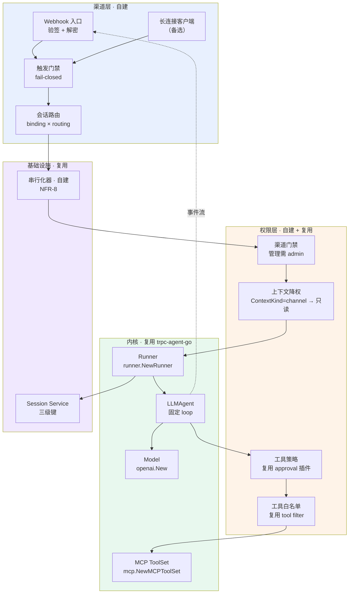
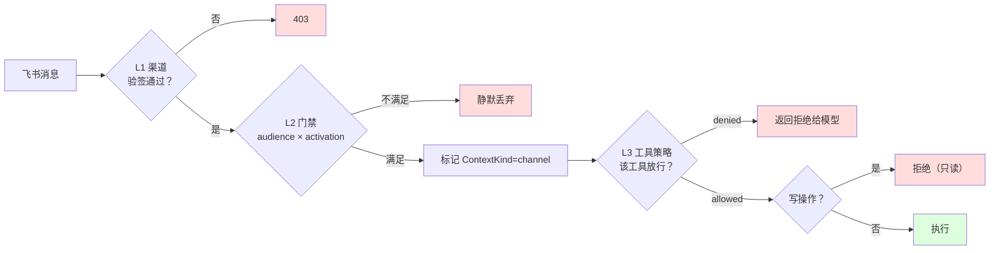
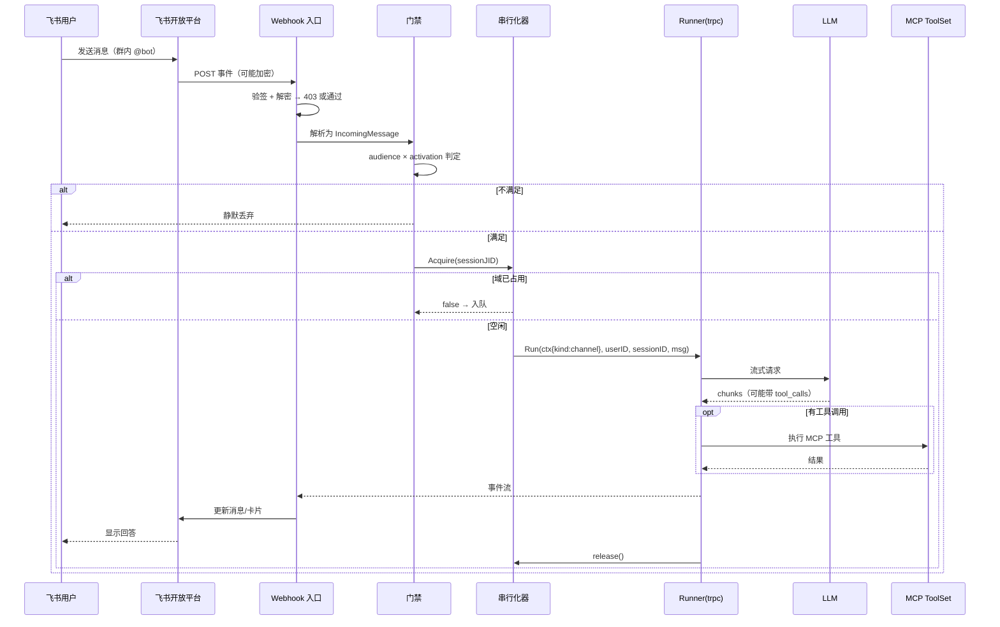

# Taiji · Go 原生 Agent Harness 原型设计文档

> 项目名称：**taiji**（原型代号 `taiji-proto`）
> 版本：**v0.1（原型）**
> 日期：2026-09-23
> 配套：`01-需求文档.md`（v1.4）、`02-设计文档.md`（v1.4）
> 定位：**v1.4 设计的一个可运行子集**——用最小工程量打通「调 LLM → 调 MCP 工具 → 权限管控 → 飞书对话」这条端到端链路
> 方法：**复用优先**。v1.4 设计的五层内核，凡 trpc-agent-go 已有的直接复用，不自建

---

## 1. 原型定位与范围

### 1.1 从 v1.4 到原型：收敛什么、保留什么

`02-设计文档.md` 描述的是一个**生产级** harness：五层架构（L0 事实层 / L1 内核层 / L2 Agent 层 / L2.5 认知治理层 / L3 编排层）、可逆 effect、日志即真相、认知治理三道反锚点结构。那是终态，不是起点。

本原型做的是**把终态里能立刻跑起来的那条竖切**抽出来，用一个可演示的程序证明四件事在 Go 里成立：

| 能力 | 原型要证明的 | v1.4 对应章节 | 原型态度 |
|---|---|---|---|
| **调用 LLM** | 能选模型、能流式、能多轮 | FR-5 | 直接复用 trpc `model/openai` |
| **调用 MCP 工具** | 能连 stdio/HTTP MCP server、能把远端工具暴露给模型 | FR-4 | 直接复用 trpc `tool/mcp` |
| **权限管理** | 渠道门禁 + 工具策略 + 上下文降权三道，且 fail-closed | FR-9.2 / FR-10.4 / FR-10.7 | **自建**（trpc 只有工具级策略） |
| **对接飞书** | 收消息、验签、路由到会话、回执 | FR-10 | **自建渠道层**（trpc 无渠道层；接口形态学 happyclaw + WeKnora，见 §4.4.1） |

**保留**：多租户三级键（FR-6.1）、会话串行化（NFR-8）、控制值隔离（NFR-9）——这三条是**内核级约束**，原型就必须立住，否则后续返工（理由见 `01-需求文档.md` §7 的 Phase 2 说明）。

**推迟**：L2.5 认知治理层（TaskContract / Evidence / Convergence / Sensorium）、可逆 effect 作用域隔离、日志迁移链、OTel 全链路追踪。这些是 v1.4 的差异化能力，但**不是原型的阻塞项**——原型阶段引入它们会淹没主线。

> **一句话边界**：原型回答「能不能跑通」，不回答「能不能上生产」。凡 v1.4 里标了 P0 但属"生产化"的（如崩溃恢复、日志迁移），原型只留接口位，不实现。

### 1.2 原型的四条验收线

原型结束时，下面四条必须能**当场演示**（不是"代码写了"）：

1. **LLM 直连**：CLI 输入一句话，模型流式回答。
2. **MCP 工具**：模型自主调用一个 stdio MCP server 的工具（如 `echo`/`add`），结果回到对话。
3. **权限拦截**：飞书群里未 @ bot 的消息被静默丢弃；被策略标为 `denied` 的工具调用被拒且模型收到拒绝原因。
4. **飞书闭环**：飞书私聊 bot → agent 回答 → 以卡片流式更新回飞书。

### 1.3 原型的非目标

- **不做** Web 端、不做多用户注册登录（用固定 owner 白名单）。
- **不做** 认知治理层（v1.4 的 TaskContract/Evidence/Convergence 全部推迟）。
- **不做** 可逆 effect 的作用域树（原型用显式构造 + `defer Close()`）。
- **不做** 除飞书外的任何渠道（但 adapter 接口按多渠道路由设计，见 §4.4.1）。
- **不做** 除内存/SQLite 外的存储后端。
- **不做** 运行时热插拔（v1.4 N1 已否决）。

---

## 2. 技术选型与复用决策

### 2.1 内核：复用 trpc-agent-go，不重造

v1.4 的 B 档定位就是"以 trpc-agent-go 的工程形态为基础"（`01-需求文档.md` §1.3）。原型把这句话落到实处：**agent loop、模型适配、工具系统、runner、session 全部用 trpc-agent-go**。

理由不是省事，而是**v1.4 已认定的差异点不在这些模块**：v1.4 要自建的是 L0 事实层（日志派生）与 L2.5 治理层，而 L2 的 loop 与工具系统"保持固定、只做扩展点"（`02-设计文档.md` §4.1）。原型的 MCP 与 LLM 恰好落在这两个"固定"面上。

**复用的具体接口**（均经源码核对，锚点见附录 A）：

```go
// 模型：窄接口，两方法（model/model.go:45）
type Model interface {
    GenerateContent(ctx context.Context, request *Request) (<-chan *Response, error)
    Info() Info
}
// 可选流式扩展（model/model.go:66），实现则走调用方 goroutine，省 channel 调度
type IterModel interface {
    Model
    GenerateContentIter(ctx context.Context, request *Request) (Seq[*Response], error)
}

// OpenAI 兼容 provider（model/openai/openai.go:442）
modelInstance := openai.New(modelName)

// 工具：声明 + 调用两接口分离（tool/tool.go:17, :23）
type Tool interface{ Declaration() *Declaration }
type CallableTool interface {
    Call(ctx context.Context, jsonArgs []byte) (any, error)
    Tool
}

// MCP 工具集（tool/mcp/toolset.go:68）
toolSet := mcp.NewMCPToolSet(mcp.ConnectionConfig{...}, mcp.WithName("fs"))
toolSet.Init(ctx)   // :102  启动即预热，失败 fail-fast
defer toolSet.Close() // :130

// Agent 组装（agent/llmagent/option.go:732, :770, :929, :936）
ag := llmagent.New("assistant",
    llmagent.WithModel(modelInstance),
    llmagent.WithInstruction(systemPrompt),
    llmagent.WithTools(localTools),
    llmagent.WithToolSets([]tool.ToolSet{mcpToolSet}),
)

// Runner（runner/runner.go:397）
r := runner.NewRunner(appName, ag, runner.WithSessionService(svc))
// 每次执行（runner/runner.go:544）
events, err := r.Run(ctx, userID, sessionID, model.NewUserMessage(text))
```

**一个必须点明的实现事实**：trpc-agent-go 的 `go.mod:3` 声明 `go 1.21`，本机 `go1.27.1 windows/amd64`（`01-需求文档.md` §5 实测）。这不构成版本门槛——Go 的 `go` 指令是**最小版本**，原型的 go.mod 可以声明更高版本。真正相关的是：**原型的事件消费只需 `for ev := range events`**，不涉及 v1.4 事件总线所需的泛型方法（那才需要 1.27，见 `01-需求文档.md` §5 的实测结论）。原型不引入该依赖，也不受其约束。

### 2.2 飞书接入：Webhook 为主，长连接为备

飞书有两种接入形态，原型**两种都支持**（接口层对两者的差异已在 §4.4.1 建模），默认 webhook：

| 形态 | 触发路径 | 依赖 | 适用 |
|---|---|---|---|
| **Webhook（默认）** | 飞书 POST 事件到你的 HTTP 端点 | 需要公网可达 URL（或内网穿透） | 有域名/内网穿透 |
| **长连接（备选）** | SDK 主动与飞书建立 WebSocket | 只需出网，**无需公网入口** | 内网部署、本地开发 |

证据：**WeKnora** 两种都实现了——webhook 走 `internal/im/feishu/adapter.go:195` 的 `VerifyCallback`（验签+解密）+ `:313` 的 `ParseCallback`；长连接走 `internal/im/feishu/longconn.go:30` 的 `NewLongConnClient`（内部用 `larksuite/oapi-sdk-go/v3/ws`，`:52` 的 `larkws.NewClient`）。**happyclaw** 是纯长连接形态——`FeishuConnection.connect()`（`feishu.ts:234`）内部建 `new lark.WSClient({...})`（`:3735, 4015`）。

**关键差异（决定接口分层）**：

- 长连接模式下 **`verificationToken` 与 `encryptKey` 都不需要**——源码注释明说："Long connection mode does not require verificationToken or encryptKey; those are only used for webhook signature verification and decryption."（`longconn.go:31-32`）。这省掉了验签环节，但也**失去了验签这层安全边界**——长连接的信任来自 SDK 与飞书的 TLS 通道本身。
- 长连接**停止**只能靠 `Client.Close()`，不能靠 cancel ctx。源码注释（`longconn.go:70-76`）：SDK 的 `Start` 阻塞在裸 `select{}`，不观察 ctx，取消 ctx 会让 socket 存活并自动重连；`Close()`（oapi-sdk-go **v3.9.7** 新增）才会真正断开。`Close()` 在 `:77-79`。
- 两者**入站方向不同**：webhook 是"被推送"（需要验签的 HTTP 处理器），长连接是"主动拉"（SDK 回调直出消息，无 HTTP 入口）。这决定了接口必须分两层，见 §4.4.1。

> **原型的取舍**：默认 webhook，因为验收线 3（权限拦截）需要验签这条安全边界可被演示。长连接作为 `--feishu-mode=longconn` 的开关保留，用于本地开发免穿透。

**SDK 选型**：`github.com/larksuite/oapi-sdk-go/v3 v3.9.7`（WeKnora `go.mod:36` 实测采用；happyclaw 用的是 Node 版 `@larksuiteoapi/node-sdk`，`package.json:30`）。原型**webhook 路径不依赖 SDK**——验签与解密是标准库代码（AES-256-CBC + token 比对），用 `crypto/aes` 即可，避免为一个 token 比对引入整个 SDK。**长连接路径必须用 SDK**（WebSocket 协议封装，`larkws.NewClient`）。

### 2.3 权限管理：自建，但站在 trpc 的工具策略上

trpc-agent-go **有**工具级审批，但**没有**渠道级与上下文级。原型分三层，能复用则复用：

| 层 | 机制 | 来源 |
|---|---|---|
| **工具级** | 按工具名配策略：放行 / 拒绝 / 需审批 | **复用** trpc `plugin/guardrail/approval` |
| **工具可见性** | 只把白名单内的工具暴露给模型 | **复用** trpc `tool.NewIncludeToolNamesFilter` |
| **渠道级** | 管理渠道需 admin；使用渠道只验签 | **自建**（v1.4 FR-10.1） |
| **触发门禁** | audience × activation，fail-closed | **自建**（v1.4 FR-10.4） |
| **上下文级** | IM 来源一律降权为只读 | **自建**（v1.4 FR-10.7） |

复用的部分证据：

```go
// 工具审批插件（plugin/guardrail/approval/approval.go:33）
p, _ := approval.New(
    approval.WithDefaultToolPolicy(approval.ToolPolicyDenied),   // option.go:54
    approval.WithToolPolicy("read_file", approval.ToolPolicySkipApproval), // :61
    approval.WithToolPolicy("shell", approval.ToolPolicyDenied),
)
// 挂到 Runner（runner/runner.go:169）
r := runner.NewRunner(appName, ag, runner.WithPlugins(p))

// 工具名过滤（tool/filter.go:70, :87）
mcp.WithToolFilterFunc(tool.NewIncludeToolNamesFilter("echo", "add"))
```

`approval` 的判定发生在 `Registry.BeforeTool`（`plugin/manager.go:143`），策略为 `ToolPolicyDenied` 时**返回 `CustomResult` 而不执行工具**（`approval.go:79-82`）——这正是原型需要的"拒绝但让模型知道被拒"的语义。

> **注意一处限制**：`approval` 的策略是**按工具名**的静态映射（`approval.go:150` 的 `resolveToolPolicy`），**不感知调用者身份**。所以"同一工具对 admin 放行、对 IM 用户拒绝"**不能**靠它实现——必须靠自建的上下文级降权（§4.3.3）。这是原型权限设计的核心约束。

### 2.4 明确不复用的部分

| 不做的 | 理由 |
|---|---|
| trpc 的 `session.Service`（16 方法） | 原型只需 session 存取，不需状态作用域矩阵；但**键用它的三级结构**（`session/session.go:1180`）以保持前向兼容 |
| trpc 的 `PluginManager` 组件替换 | 它是"只能挂回调、不能换组件"（`agent/plugins.go:26-45` 无 setter）——v1.4 决策一已点明这是要补强的点，但原型不补 |
| WeKnora 的 feishu adapter 直接 import | 它在 `internal/` 包下（Go 语言禁止跨模块 import internal），**只能读其形态、不能复用其代码** |
| happyclaw 的代码直接复用 | TypeScript，且是模块化单体。**但其接口形态是渠道层主参照**（§4.4.1）——不复用的是代码，不是设计 |
| happyclaw 的 `StreamSender`/`onFollowUp*` | 属会话治理与卡片流式，原型推迟（§4.4.1 已说明） |
| happyclaw 的 8 渠道实现 | 原型只做飞书；但前缀映射与元数据契约按多渠道路由设计（§4.4.1） |

---

## 3. 架构

### 3.1 分层图



**分层原则**：渠道层只做"消息进出与身份解析"，权限层只做"能不能做"，内核层只做"怎么做"。权限层不碰 LLM，内核层不碰 HTTP。

### 3.2 组件清单

| 组件 | 路径（拟定） | 复用/自建 | 参照 | 对应 v1.4 |
|---|---|---|---|---|
| CLI 入口 | `cmd/taiji/main.go` | 自建 | — | — |
| Runner 装配 | `internal/bootstrap/runner.go` | 自建（调 trpc） | trpc | §5.1 |
| 模型装配 | `internal/bootstrap/model.go` | 自建（调 trpc） | trpc | FR-5 |
| MCP 装配 | `internal/bootstrap/mcp.go` | 自建（调 trpc） | trpc | FR-4 |
| **连接层接口** | `internal/channel/channel.go` | 自建 | **happyclaw `IMChannel`** | FR-10.1 |
| **入站层接口** | `internal/channel/inbound.go` | 自建 | **WeKnora `Adapter`** | FR-10.1 |
| 飞书连接实现 | `internal/channel/feishu/channel.go` | 自建（用 SDK） | happyclaw `feishu.ts` | FR-10.1 |
| 飞书验签 | `internal/channel/feishu/verify.go` | 自建（标准库） | WeKnora `adapter.go` | FR-10.1 |
| 飞书长连接 | `internal/channel/feishu/longconn.go` | 自建（用 SDK） | WeKnora `longconn.go` | FR-10.1 |
| JID 前缀 | `internal/channel/prefix.go` | 自建 | happyclaw `channel-prefixes.ts` | FR-10.2 |
| 触发门禁 | `internal/channel/gate.go` | 自建 | happyclaw `feishu-mention-gate.ts` | FR-10.4 |
| 会话路由 | `internal/channel/router.go` | 自建 | happyclaw `channel-inbound-routing.ts` | FR-10.3 |
| 主体解析 | `internal/authz/principal.go` | 自建 | WeKnora `service.go` | FR-10.2 |
| 上下文降权 | `internal/authz/context.go` | 自建 | WeKnora `service.go` + v1.4 | FR-10.7 |
| 工具策略 | `internal/authz/toolpolicy.go` | 自建（调 trpc approval） | trpc | FR-9.2 |
| 串行化器 | `internal/concurrency/serializer.go` | 自建 | happyclaw `group-queue.ts` | NFR-8 |
| 控制值保护 | `internal/config/guard.go` | 自建 | happyclaw `runtime-config.ts` | NFR-9 |

### 3.3 目录结构

```
taiji-proto/
├── cmd/taiji/main.go              # 入口：CLI 模式 / serve 模式
├── internal/
│   ├── bootstrap/                 # 装配（model / mcp / runner）
│   ├── channel/                   # 渠道层
│   │   ├── channel.go             #   Channel 接口（连接层，学 happyclaw）
│   │   ├── inbound.go             #   InboundSource 接口（入站层，学 WeKnora）
│   │   ├── prefix.go              #   JID 渠道前缀
│   │   ├── gate.go                #   触发门禁
│   │   ├── router.go              #   会话路由
│   │   └── feishu/                #   飞书实现
│   │       ├── channel.go         #     连接（webhook / 长连接两形态）
│   │       ├── verify.go          #     验签 + 解密
│   │       └── longconn.go        #     长连接
│   ├── authz/                     # 权限层
│   ├── concurrency/               # 串行化
│   └── config/                    # 配置 + 控制值保护
├── configs/
│   └── taiji.example.yaml
└── go.mod
```

---

## 4. 关键设计

### 4.1 LLM 调用

原型的模型层是**三行装配**——这是复用策略的直接收益：

```go
// internal/bootstrap/model.go
func NewModel(cfg ModelConfig) (model.Model, error) {
    if cfg.Name == "" {
        return nil, errors.New("model name is required")  // 显式报错，不返回 nil
    }
    return openai.New(cfg.Name, openai.WithAPIKey(cfg.APIKey), openai.WithBaseURL(cfg.BaseURL)), nil
}
```

**为什么用 `openai.New` 而不是别的 provider**：`model/openai` 走 OpenAI 兼容协议，同一实现可指向 DeepSeek、Moonshot、Ollama、vLLM——原型只需一个 provider 就能覆盖本地与云端（trpc 的 `model/` 下另有 anthropic/gemini/hunyuan/ollama 等，见 §2.1 目录列举，按需替换）。

**流式**：`GenerateContent` 返回 `<-chan *Response`（`model/model.go:53`），runner 消费后转成 `<-chan *event.Event`。原型**不在这一层做处理**——事件格式转换是 trpc 的事。

**原型不做的事**（v1.4 有，原型推迟）：
- 模型路由与降级（FR-5.3）——原型单模型
- 前缀缓存优化（v1.4 L2.5）——原型不做

### 4.2 MCP 工具接入

MCP 是原型的**核心能力之一**，且复用成本极低。一个 ToolSet 支持三种 transport（`tool/mcp/config.go` 的 `ConnectionConfig.Transport`）：

```go
// internal/bootstrap/mcp.go
func NewMCPSets(cfgs []MCPServerConfig) ([]tool.ToolSet, error) {
    var sets []tool.ToolSet
    for _, c := range cfgs {
        ts := mcp.NewMCPToolSet(
            mcp.ConnectionConfig{
                Transport: c.Transport,   // "stdio" | "sse" | "streamable"
                Command:   c.Command,     // stdio 模式
                Args:      c.Args,
                ServerURL: c.URL,         // http 模式
                Headers:   c.Headers,
                Timeout:   c.Timeout,
            },
            mcp.WithName(c.Name),                                  // 防多 server 工具名前缀冲突
            mcp.WithToolFilterFunc(tool.NewIncludeToolNamesFilter(c.AllowTools...)), // 白名单
            mcp.WithSessionReconnect(3),                            // 会话过期自动重连
        )
        if err := ts.Init(ctx); err != nil {
            return nil, fmt.Errorf("mcp %q init: %w", c.Name, err)   // fail-fast
        }
        sets = append(sets, ts)
    }
    return sets, nil
}
```

**四个必须知道的实现事实**（均来自源码）：

1. **工具名会加前缀**。`WithName("github")` + 远端工具 `search` → 模型看到 `github_search`（`config.go` 的 `WithName` 注释原文）。多个 MCP server **必须**给不同 name，否则前缀冲突。
2. **`Init` 是显式预热**。它调用一次 `Initialize` + `ListTools`，返回错误让调用方在启动期 fail-fast（`toolset.go:102`）。**不调 `Init` 也能用**（`Tools()` 内部会 lazy list，`toolset.go:110`），但那样错误会延迟到首次调用才暴露。
3. **`Tools()` 刷新失败会降级返回缓存**。源码：refresh 失败时 `log.ErrorContext` 后继续返回缓存工具（`toolset.go:110-116`）。这意味着**MCP server 挂了，已列出的工具仍在**——调用时才失败。原型应在启动期记日志区分"预热成功"与"缓存降级"。
4. **重连只针对特定错误**。`sessionReconnectErrorPatterns` 是保守白名单（`toolset.go:30-41`）：`session_expired:`、`transport is closed`、`connection refused`、`EOF` 等才重连；**DNS 配置错误与超时被明确排除**（源码注释："Configuration errors (DNS) and potential performance issues (timeout) are excluded"）。所以配错地址**不会**靠重连自愈。

**stdio 模式的路径陷阱**：`Command`/`Args` 是相对**进程工作目录**执行的。trpc 官方示例用 `Command: "go", Args: []string{"run", "./stdioserver/main.go"}`（`examples/mcptool/main.go`）——原型若从别处启动，相对路径会失效。原型配置里**必须用绝对路径或显式设置工作目录**。

### 4.3 权限管理（三层）

这是原型的**自建重点**，也是与"直接拿 trpc 跑起来"的差异所在。

#### 4.3.1 第一层：渠道级（管理 vs 使用）

对齐 v1.4 FR-10.1 的核心区分：

- **管理渠道**（建/改/删/轮换凭据）：需管理员。原型用配置文件 + 启动时校验（无 Web 管理端）。
- **使用渠道**（发消息）：走 callback，**只验签不验用户身份**。

这条区分的安全含义：**能配渠道的是管理员，用渠道的人不必是系统用户**——他们统一降权（§4.3.3）。

#### 4.3.2 第二层：工具级（策略 + 白名单）

复用 trpc `approval` 插件 + `tool` filter，按 v1.4 FR-9.2 的"按 agent 限定能力集"落地：

```go
// internal/authz/toolpolicy.go
func NewToolPolicyPlugin(cfg ToolPolicyConfig) (plugin.Plugin, error) {
    opts := []approval.Option{
        approval.WithDefaultToolPolicy(approval.ToolPolicyDenied), // 默认拒绝，白名单放行
    }
    for name, policy := range cfg.Tools {
        opts = append(opts, approval.WithToolPolicy(name, toPolicy(policy)))
    }
    return approval.New(opts...)
}
```

**默认拒绝**（`ToolPolicyDenied`）是原型的安全基线——新增 MCP 工具不会自动获得执行权，必须显式放行。这与 v1.4 FR-10.4 门禁的 fail-closed 取向一致。

#### 4.3.3 第三层：上下文级（IM 来源降权）

**这是三层里唯一必须自建的**，因为 trpc 的 approval 不感知调用者（§2.3 已述）。

对齐 v1.4 FR-10.7 与 FR-6.0 的 `ContextKind` 表：IM 渠道来源一律标为 `ContextKind=channel`，**写操作被拒**。

```go
// internal/authz/context.go
type ContextKind string

const (
    KindInteractive ContextKind = "interactive" // 顶层交互，按 ACL
    KindScheduled   ContextKind = "scheduled"   // 定时任务，只读
    KindSubagent    ContextKind = "subagent"    // 子 agent，只读
    KindChannel     ContextKind = "channel"     // IM 渠道，只读
)

type ctxKey struct{}

// WithContextKind 注入执行上下文类型。
func WithContextKind(ctx context.Context, k ContextKind) context.Context {
    return context.WithValue(ctx, ctxKey{}, k)
}

// RequireWritable 在写操作前校验。上下文缺失 → fail-closed 拒绝。
func RequireWritable(ctx context.Context) error {
    k, ok := ctx.Value(ctxKey{}).(ContextKind)
    if !ok {
        return ErrContextKindMissing   // 不默认为 interactive
    }
    if k != KindInteractive {
        return fmt.Errorf("%w: context %q is read-only", ErrWriteDenied, k)
    }
    return nil
}
```

**fail-closed 的关键在 `!ok` 分支**：上下文丢失时**拒绝**，不默认放行。这条与 v1.4 的表述逐字一致——"上下文丢失必须 fail-closed：无 `ContextKind` 时拒绝写操作，不得默认为 `interactive`"（`01-需求文档.md` FR-6.0）。

WeKnora 的对应实现是 `internal/im/service.go:428` 强制 `TenantRoleViewer`（其 `:425` 构造主体四元组 `{tenantID}:{channelID}:{platform}:{userID}`）。原型借用其**形态**，但把"降权"从角色位改成显式的上下文类型位——因为原型的只读约束来自**执行来源**而非**角色等级**。

#### 4.3.4 三层的关系



四道闸门，任一不过即拒绝。**注意顺序**：门禁（L2）在降权（L3）之前——先判断"该不该响应"，再判断"响应时能做什么"。

### 4.4 飞书接入

#### 4.4.1 渠道接口：两个参照回答两个问题

**先纠正一处此前的设计偏差**：本文档早期版本把渠道接口完全照 WeKnora 的 `Adapter` 写（`internal/im/adapter.go:126`，含 `VerifyCallback`/`ParseCallback`/`SendReply`/`HandleURLVerification`）。那是**webhook 专属**形态——而原型明确支持 webhook 与长连接两种模式（§2.2），长连接下 `VerifyCallback` 根本不存在（WeKnora 自己的源码就说长连接不需要 token，`longconn.go:31-32`），硬套会写出空方法。

两个参照回答的是**不同问题**，原型两种模式都需要，所以需要**两层接口**：

| 层 | 回答的问题 | 参照 | 依据 |
|---|---|---|---|
| **Channel（连接层）** | 长驻连接如何建立、如何出站、如何收尾 | **happyclaw `IMChannel`** | `happyclaw/src/im-channel.ts:224-278` |
| **InboundSource（入站层）** | HTTP 回调如何变成消息 | **WeKnora `Adapter`** | `WeKnora/internal/im/adapter.go:126-144` |

**为什么 Channel 层必须学 happyclaw 而不是 WeKnora**：happyclaw 的渠道是**长连接形态**——`FeishuConnection` 接口的第一个方法就是 `connect(opts)`（`feishu.ts:234`），其实现里 `wsClient = new lark.WSClient({...})`（`feishu.ts:3735, 4015`），注释明写"Each instance manages its own client, WebSocket, and state maps"（`feishu.ts:1150`）。这种「连接是长期持有的对象」的建模，正是长连接模式需要的；而 WeKnora 的 `Adapter` 是**无状态回调处理器**，没有连接生命周期概念。

```go
// internal/channel/channel.go —— 连接层（借鉴 happyclaw IMChannel，im-channel.ts:224）
type Channel interface {
    Platform() Platform

    // Connect 建立连接。webhook 模式下是"注册路由 + 校验凭据"，
    // 长连接模式下是"启动 WebSocket 并阻塞"。
    Connect(ctx context.Context, opts ConnectOptions) error

    // Disconnect 释放连接。
    // 长连接模式必须实现真正的关闭——见 §2.2 的 Close() 语义
    // （SDK 的 Start 不观察 ctx，cancel 不足以停止）。
    Disconnect() error

    // SendMessage 出站。
    // 对齐 happyclaw IMChannel.sendMessage（im-channel.ts:231-236）。
    SendMessage(ctx context.Context, chatID, text string, opts SendOptions) error

    IsConnected() bool
}

// internal/channel/inbound.go —— 入站层（借鉴 WeKnora Adapter，adapter.go:126）
// 仅 webhook 模式需要实现；长连接模式的入站由 SDK 推送直接产出 IncomingMessage。
type InboundSource interface {
    // VerifyCallback 验签（失败返回 error，调用方回 403）
    VerifyCallback(r *http.Request) error
    // ParseCallback 解析为统一消息；非消息事件返回 nil
    ParseCallback(r *http.Request) (*IncomingMessage, error)
    // HandleURLVerification 处理平台首次配置的挑战请求
    HandleURLVerification(w http.ResponseWriter, r *http.Request) bool
}
```

**两种模式的实现矩阵**：

| | Channel（连接层） | InboundSource（入站层） |
|---|---|---|
| **webhook** | 实现（Connect 注册路由） | **实现**（验签 + 解析） |
| **长连接** | 实现（Connect 启 WebSocket） | **不实现**（入站由 SDK 回调直出） |

这解释了为什么不能用单接口：单接口必然让长连接模式实现三个永不调用的方法。

**happyclaw 贡献的其他接口面**（原型采纳）：

- **JID 前缀映射**：`CHANNEL_PREFIXES`（`channel-prefixes.ts:2-11`）——`feishu:`/`telegram:`/`qq:` 等。原型的会话标识用 `{workspaceId}#{localSessionId}`，**多渠道路由还需渠道前缀**，否则不同渠道的同名 chatID 会撞。对齐 `getChannelFromJid`（`:14-19`）。
- **消息元数据契约**：`ChannelMessageMeta`（`types.ts:163-176`）——含 `provider`/`chatType`/`mentionedBot`/`nativeContextType`/`contextId`/`threadId`/`rootId`/`messageId`/`text`/`title`。原型的 `IncomingMessage` 字段应对齐它，而不是自造。
- **路由回调**：`resolveEffectiveChatJid`（`im-channel.ts:146-153`）——返回 `{effectiveJid, agentId, sourceJid}` 三元组。原型 §4.4.4 的路由函数签名应对齐这个形状。

**刻意省掉 happyclaw 的 `StreamSender`/`createStreamingSession`**（`im-channel.ts:261-266`，WeKnora 对应 `adapter.go:150-164`）：原型用**简化版流式**——先发一条占位文本消息，收到完整回答后用飞书的**更新消息 API** 替换。代价是看不到逐 token 打字效果，收益是省掉 CardKit 的完整状态机。若验收线 4 要求卡片流式，再补该接口（接口位已预留）。

**同样省掉 happyclaw 的 `onFollowUpMessage`/`onSessionBreak`/`onFollowUpCardAction`**（`im-channel.ts:156-187`）：这些是"运行中会话的插话/打断/续跑"机制，属 v1.4 的会话治理范畴，原型不做。

#### 4.4.2 验签与解密（webhook 模式）

飞书 webhook 两层校验，对齐 WeKnora `adapter.go:195-235` 的实测实现：

```go
// internal/channel/feishu/verify.go
func VerifyCallback(cfg VerifyConfig, r *http.Request) ([]byte, error) {
    if cfg.VerificationToken == "" {
        return nil, errors.New("verification token is required")  // fail-closed
    }
    body, err := io.ReadAll(r.Body)
    if err != nil {
        return nil, err
    }
    defer r.Body.Close()
    r.Body = io.NopCloser(bytes.NewReader(body))  // 还原，供后续解析

    raw := body
    // 第一层：若有 encrypt 字段，先 AES-256-CBC 解密
    var enc struct{ Encrypt string `json:"encrypt"` }
    if json.Unmarshal(body, &enc) == nil && enc.Encrypt != "" {
        if raw, err = decrypt(cfg.EncryptKey, enc.Encrypt); err != nil {
            return nil, fmt.Errorf("decrypt: %w", err)
        }
    }
    // 第二层：比对 verification token
    var ev struct {
        Header *eventHeader `json:"header"`
    }
    if err := json.Unmarshal(raw, &ev); err != nil {
        return nil, fmt.Errorf("unmarshal header: %w", err)
    }
    if ev.Header == nil || ev.Header.Token != cfg.VerificationToken {
        return nil, errors.New("invalid verification token")
    }
    return raw, nil
}
```

**两个细节**：

1. **body 必须还原**。`io.ReadAll` 消费了 body，后续 `ParseCallback` 会读到空。WeKnora 用 `defer func() { c.Request.Body = io.NopCloser(bytes.NewReader(bodyBytes)) }()`（`adapter.go:205-206`）解决。
2. **token 为空必须拒绝**。WeKnora 的 `if a.verificationToken == ""` 直接报错（`adapter.go:196-198`）——这是 fail-closed，不是 fail-open。

> **一处未验证项**：飞书**签名算法**的精确拼接顺序（timestamp + nonce + encryptKey + body）本会话**未逐字核实**（官方文档页为 SPA 无法抓取正文，`01-需求文档.md` 附录 A 已标注）。原型采用 WeKnora 的 token 比对路径（不依赖签名拼接），规避该不确定性。

#### 4.4.3 触发门禁（fail-closed）

对齐 v1.4 FR-10.4 的判定优先级，逐条实现：

```go
// internal/channel/gate.go
func EvaluateGate(in GateInput) Decision {
    // 1. disabled 是硬停止（即使被 @ 也拒）
    if in.Activation == ActivationDisabled {
        return Reject("activation_disabled")
    }
    // 2. 非群聊放行（私聊无 @ 概念）
    if in.ChatType != ChatGroup {
        return Allow()
    }
    // 3. always 放行
    if in.Activation == ActivationAlways {
        return Allow()
    }
    // 4. botOpenID 未知 → 拒绝（fail-closed）
    if in.BotOpenID == "" {
        return Reject("bot_open_id_missing")
    }
    // 5. 未 @ bot → 拒绝
    if !containsMention(in.Mentions, in.BotOpenID) {
        return Reject("not_mentioned")
    }
    // 6. owner_only 且非 owner → 拒绝
    if in.Audience == AudienceOwnerOnly && !in.IsOwner(in.SenderID) {
        return Reject("not_owner")
    }
    return Allow()
}
```

**第 4 条是血泪教训的固化**。happyclaw `src/feishu-mention-gate.ts` 的文件头注释（`:8-10`）记录了历史 bug：旧实现 `botOpenId` 为空时"安全降级 = 默认放行"，导致 `require_mention=true` 在所有群**静默失效**（fail-open）；新行为是 fail-closed。原型必须照此 fail-closed。

**@ 判定用元数据不用文本**：不能用 `strings.Contains(text, "@bot")` 判断——用户手写 `@name` 会被误判为"bot 被提及"。必须读飞书事件的 `mentions` 数组里的 `id.open_id`（happyclaw `isBotMentioned` 即比对 `m.id?.open_id === botOpenId`，见 `feishu-mention-gate.ts:84-85`）。

#### 4.4.4 会话路由

原型的路由是 v1.4 FR-10.3 的**简化子集**，签名对齐 happyclaw 的 `resolveEffectiveChatJid`（`im-channel.ts:146-153` 返回 `{effectiveJid, agentId, sourceJid}` 三元组）：

```go
// internal/channel/router.go
// 会话标识格式：{channelPrefix}{workspaceId}#{localSessionId}
// 话题追加：#thread:{contextId}#root:{rootMessageId}
type RouteTarget struct {
    EffectiveJID string  // 路由后的会话标识
    AgentID      string  // 话题独立 agent 的 ID；无话题时为空
    SourceJID    string  // 原始会话标识（审计用）
}

// 话题标识归一化，对齐 happyclaw resolveNativeThreadContext
// （channel-native-context.ts:22-38：contextId || threadId || rootId || messageId）
func ResolveThread(meta *ChannelMessageMeta) *NativeThreadContext {
    if meta == nil {
        return nil
    }
    ctxID := firstNonEmpty(meta.ContextID, meta.ThreadID, meta.RootID, meta.MessageID)
    if ctxID == "" {
        return nil
    }
    return &NativeThreadContext{
        ContextID:     ctxID,
        RootMessageID: firstNonEmpty(meta.RootID, ctxID),
        Title:         summarizeTitle(firstNonEmpty(meta.Title, meta.Text)),  // 上限 48 字符
    }
}

// 会话标识构造，对齐 happyclaw buildNativeThreadRouteJid
// （channel-native-context.ts:41-47）
func ResolveRoute(cfg RouteConfig, in *IncomingMessage) RouteTarget {
    base := ChannelPrefix(in.Platform) + cfg.WorkspaceID + "#" + in.ChatID
    if in.ChatType == ChatGroup && cfg.BindingMode == BindingThreadMap {
        if t := ResolveThread(in.Meta); t != nil {
            return RouteTarget{
                EffectiveJID: base + "#thread:" + t.ContextID + "#root:" + t.RootMessageID,
                AgentID:      deterministicAgentID(base, t.ContextID),
                SourceJID:    base,
            }
        }
    }
    return RouteTarget{EffectiveJID: base, SourceJID: base}
}
```

**`ChannelPrefix` 的必要性**（happyclaw `channel-prefixes.ts:2-11` 的 `CHANNEL_PREFIXES`）：会话标识若不含渠道前缀，`feishu:xxx` 与 `telegram:xxx` 的同名 chatID 会撞进同一会话。happyclaw 用 `getChannelFromJid`（`:14-19`）从 JID 前缀反解渠道类型——原型采纳同一约定。

**飞书的保守判定**（happyclaw `channel-inbound-routing.ts:82-85`）：仅当显式 `nativeContextType === 'thread'` 才视为话题，否则走普通会话——避免把每条顶层消息都开成新话题。

**保留的约束**：会话标识编码了 workspace（`...{workspaceId}#...`），这是 v1.4 FR-6.0 的设计——使串行化键派生保持**纯字符串解析、零 IO**（§4.5）。原型**不实现** v1.4 的完整"绑定模式 × 路由模式"矩阵（2×2 组合），只实现 `single_context` 与 `thread_map` 两种最常用的绑定模式。

#### 4.4.5 主体解析

```go
// internal/authz/principal.go
type Principal struct {
    Type string // "im_user"
    ID   string // 规范化：{channelID}:{platform}:{openID}
}

// 从平台元数据实取，不信任调用方传入
func ResolvePrincipal(channelID string, in *IncomingMessage) Principal {
    return Principal{
        Type: "im_user",
        ID:   fmt.Sprintf("%s:%s:%s", channelID, in.Platform, in.UserID),
    }
}
```

**ID 带渠道前缀**的理由（v1.4 FR-10.2）：不同平台的 sender ID 空间不通用，owner 比对必须用规范化 ID。反例是 trpc-agent-go 的 `preAuthIdentityMiddleware`——它从 HTTP header 直接读 userID（`server/a2a/server_option.go:139` 定义，`:149` 的 `r.Header.Get(m.userIDHeader)`），任何调用方都能声称自己是任何人；原型不采用。

**owner 判定**（借鉴 happyclaw `im-audience-policy.ts`）：

```go
// 对齐 isSenderAllowedByAudience（im-audience-policy.ts:21-33）
// audience=everyone 直接放行；owner_only 时要求 sender 等于 owner
func IsSenderAllowedByAudience(audience AudienceMode, ownerIMID, senderIMID string) bool {
    if audience == AudienceEveryone {
        return true
    }
    return senderIMID != "" && ownerIMID != "" && senderIMID == ownerIMID
}
```

**一处有意分歧**：happyclaw 的 `checkOwnerActive` 在**无 owner 信息时放行**（`owner-gate.ts:26` 的 `if (!owner) return { allowed: true }`，注释 `:12-14` 说明是为 legacy groups 兼容）。原型**新渠道必须 fail-closed**——无 owner 即拒绝。这与 v1.4 FR-10.5 的表述一致，也是对参考实现的显式偏离。

### 4.5 会话串行化（NFR-8，原型必须做）

**为什么原型就要做**：`runner.Run` 每次返回独立 goroutine（trpc 行为），但**未约束同一会话的并发**。飞书用户连发两条消息 → 两个 run 并发 → session log 交错 → 回答错乱。这是**会在验收线 4 现场暴露的缺陷**，不能推迟。

```go
// internal/concurrency/serializer.go
type Serializer struct {
    busy map[string]struct{}
    mu   sync.Mutex
}

// DeriveKey 从会话标识派生串行化键（纯字符串，零 IO）
func DeriveKey(jid string) string {
    if i := strings.IndexByte(jid, '#'); i >= 0 {
        return jid[:i]   // 同 workspace 的多个会话共享串行化域
    }
    return jid
}

// Acquire 占用串行化域；已占用返回 false，调用方排队
func (s *Serializer) Acquire(jid string) (release func(), ok bool) {
    key := DeriveKey(jid)
    s.mu.Lock()
    defer s.mu.Unlock()
    if _, busy := s.busy[key]; busy {
        return nil, false
    }
    s.busy[key] = struct{}{}
    return func() {
        s.mu.Lock()
        delete(s.busy, key)
        s.mu.Unlock()
    }, true
}
```

对齐 v1.4 NFR-8.2 的关键洞察：**匹配依据是派生键而非 JID**——同一 workspace 下不同 JID 的会话共享串行化域，否则虚拟 JID 会让本该串行的消息并发起来。

**原型简化**：不做 v1.4 NFR-8.3 的"容量准入按执行模式分叉"（原型只有进程内模式，串行化键即唯一准入边界），不做 NFR-8.5 的游标持久化（原型队列在内存，重启丢待处理消息可接受）。

### 4.6 控制值隔离（NFR-9，原型必须做）

**为什么原型就要做**：这是**安全不变量**，不是性能优化（v1.4 NFR-9 原文）。原型有 agent 可写的工具（如 MCP 的 file 工具），若控制值可被工作区覆盖，agent 能通过写文件提权。

```go
// internal/config/guard.go
var ReservedKeys = map[string]struct{}{
    "MODEL_ROUTE": {}, "EXECUTION_MODE": {}, "SANDBOX_POLICY": {},
    "CREDENTIAL_REF": {}, "MCP_SERVERS": {}, "TOOL_POLICY": {},
}

// MergeWorkspaceEnv 合并工作区环境；保留键跳过并告警
func MergeWorkspaceEnv(base, workspace map[string]string, warn func(string)) map[string]string {
    out := make(map[string]string, len(base))
    for k, v := range base {
        out[k] = v
    }
    for k, v := range workspace {
        if _, reserved := ReservedKeys[k]; reserved {
            warn("skipping managed env variable in workspace override: " + k)
            continue   // 跳过，不是覆盖
        }
        out[k] = sanitizeValue(v)
    }
    return out
}

// sanitizeValue 剥离控制字符，防环境文件结构注入
func sanitizeValue(v string) string {
    return strings.Map(func(r rune) rune {
        if r < 0x20 && r != '\t' {
            return -1
        }
        return r
    }, v)
}
```

**原型简化**：v1.4 NFR-9.2 要求**三处独立检查**（纵深防御），原型只做一处（合并点）。这是**有意的降级**——原型的配置面窄（单进程、单配置文件），三处检查的收益在原型阶段体现不出来。但 `ReservedKeys` 集合与 `sanitizeValue` 必须保留，因为它们是语义核心。

### 4.7 端到端数据流



---

## 5. 接口汇总

```go
// ===== 渠道层 · 连接层（借鉴 happyclaw IMChannel, im-channel.ts:224）=====
type Channel interface {
    Platform() Platform
    Connect(ctx context.Context, opts ConnectOptions) error
    Disconnect() error   // 长连接模式必须真正关闭（见 §2.2）
    SendMessage(ctx context.Context, chatID, text string, opts SendOptions) error
    IsConnected() bool
}

// ===== 渠道层 · 入站层（借鉴 WeKnora Adapter, adapter.go:126）=====
// 仅 webhook 模式实现；长连接模式的入站由 SDK 回调直出。
type InboundSource interface {
    VerifyCallback(r *http.Request) error
    ParseCallback(r *http.Request) (*IncomingMessage, error)
    HandleURLVerification(w http.ResponseWriter, r *http.Request) bool
}

// 统一消息（字段对齐 happyclaw ChannelMessageMeta, types.ts:163）
type IncomingMessage struct {
    Platform  Platform
    UserID    string // 平台原生 ID（飞书为 open_id）
    ChatID    string
    ChatType  ChatType // direct | group
    MessageID string   // 用于去重
    Content   string
    Mentions  []Mention
    Meta      *ChannelMessageMeta // 话题/上下文元数据
}

type ChannelMessageMeta struct {
    NativeContextType string // 仅 "thread" 视为话题
    ContextID         string
    ThreadID          string
    RootID            string
    MessageID         string
    Title             string
    Text              string
}

// ===== 路由（对齐 happyclaw resolveEffectiveChatJid, im-channel.ts:146）=====
type RouteTarget struct{ EffectiveJID, AgentID, SourceJID string }
func ResolveRoute(cfg RouteConfig, in *IncomingMessage) RouteTarget
func ChannelPrefix(p Platform) string  // 对齐 channel-prefixes.ts:2

// ===== 门禁 =====
type AudienceMode string   // everyone | owner_only
type ActivationMode string // always | when_mentioned | disabled

type GateInput struct {
    Audience   AudienceMode
    Activation ActivationMode
    ChatType   ChatType
    BotOpenID  string
    SenderID   string
    Mentions   []Mention
    IsOwner    func(string) bool
}

// ===== 权限层 =====
type ContextKind string // interactive | scheduled | subagent | channel

func WithContextKind(ctx context.Context, k ContextKind) context.Context
func RequireWritable(ctx context.Context) error

type Principal struct{ Type, ID string }

// ===== 串行化 =====
func DeriveKey(jid string) string
func (s *Serializer) Acquire(jid string) (release func(), ok bool)
```

---

## 6. 配置与运行

```yaml
# configs/taiji.example.yaml
app_name: taiji-proto
model:
  name: deepseek-v4-flash       # OpenAI 兼容
  api_key: ${TAIJI_MODEL_API_KEY}  # 从环境读，不写文件
  base_url: ""

mcp_servers:
  - name: fs
    transport: stdio
    command: /abs/path/to/mcp-fs-server   # 绝对路径（§4.2 路径陷阱）
    args: []
    allow_tools: [read_file, list_dir]    # 白名单
  - name: web
    transport: streamable
    url: http://localhost:3000/mcp
    allow_tools: [fetch]

tool_policy:
  default: denied                 # 安全基线
  allow: [fs_read_file, fs_list_dir, web_fetch]

channel:
  feishu:
    mode: webhook                 # webhook | longconn
    app_id: ${TAIJI_FEISHU_APP_ID}
    app_secret: ${TAIJI_FEISHU_APP_SECRET}
    verification_token: ${TAIJI_FEISHU_VERIFY_TOKEN}   # webhook 模式必需
    encrypt_key: ${TAIJI_FEISHU_ENCRYPT_KEY}
    bot_open_id: ou_xxx           # 门禁第 4 条依赖它，缺失即 fail-closed
    binding_mode: single_context  # single_context | thread_map
    audience: owner_only
    activation: when_mentioned
    owners: [ou_yyy]              # 显式白名单，禁止"首个发言者自动成为 owner"
```

**运行**：

```bash
# CLI 模式（验收线 1、2）
go run ./cmd/taiji chat

# Serve 模式（验收线 3、4）
go run ./cmd/taiji serve --config configs/taiji.yaml
# 飞书开放平台配置事件订阅 URL → http://<host>:8080/webhook/feishu
```

**配置里的安全约定**：所有凭据走环境变量（`${...}`），配置文件不落密钥。这与 v1.4 NFR-9.1"控制值来自受信启动环境"同源。

---

## 7. 风险与缓解

| 风险 | 影响 | 缓解 |
|---|---|---|
| MCP stdio 相对路径失效 | server 起不来，工具不可用 | 配置强制绝对路径；启动期 `Init` fail-fast |
| MCP `Tools()` 缓存降级掩盖故障 | server 已挂但工具列表仍在 | 启动日志区分"预热成功/缓存降级"；调用失败单独告警 |
| 飞书验签算法未逐字核实 | 若用签名路径可能验签失败 | 原型走 token 比对路径，不依赖签名拼接（§4.4.2） |
| 长连接无法用 ctx 停止 | 进程退出时 socket 存活、自动重连 | 必须显式 `Close()`（v3.9.7+）；`defer` + signal 处理 |
| 同一会话并发污染日志 | 回答错乱、事件交错 | §4.5 串行化器，验收线 4 现场压测 |
| 工具策略不感知身份 | IM 用户与 admin 拿到相同工具集 | §4.3.3 上下文降权补齐；策略层只做静态白名单 |
| 两接口职责混淆 | 长连接实现空的 `InboundSource` 方法 | Wave 3 用编译期断言锁住职责分离（§8 Wave 3） |
| 跨渠道 chatID 撞车 | 不同渠道同名会话串扰 | 会话标识带渠道前缀（§4.4.4） |
| 控制值三处检查降级为一处 | 纵深防御变单点 | 有意降级，已在 §4.6 明示；`ReservedKeys` 语义保留 |
| trpc 依赖 go 1.21 声明 | 无实际影响（go 指令是最小版本） | 原型 go.mod 自行声明版本；不使用泛型方法（仅 v1.4 事件总线需要） |

---

## 8. 分波实施计划

> 每波结束必须有**可运行的验证命令**与**明确的 RED→GREEN**。不写"实现了 X"这种无法验证的完成标准。

### Wave 0：骨架 + 配置（半天）

- `go mod init`，引入 trpc-agent-go 与 larksuite SDK（仅长连接需要）
- `internal/config`：配置加载 + `ReservedKeys` 保护
- `cmd/taiji`：子命令骨架（chat / serve）

**验证**：`go build ./... && go vet ./...`
**RED→GREEN**：先写一个测试断言"工作区环境含 `MODEL_ROUTE` 键时合并结果仍取启动值"——初始失败（未实现），实现后通过。

### Wave 1：LLM 直连（半天）

- `internal/bootstrap/model.go`
- `cmd/taiji chat`：交互式循环

**验证**：`go run ./cmd/taiji chat` 输入一句话得到流式回答。
**RED→GREEN**：`model` 名称为空时必须返回错误而非 nil——先写测试（失败），再实现。

### Wave 2：MCP 工具（一天）

- `internal/bootstrap/mcp.go`
- 白名单过滤 + 工具策略插件
- 测试用本地 stdio MCP server（可复用 trpc `examples/mcptool/stdioserver`）

**验证**：`go test ./internal/bootstrap/... -run TestMCP` + 手工 `chat` 让模型调用 `echo`。
**RED→GREEN**：先构造"工具不在白名单 → 模型看不到该工具"的失败用例，再实现过滤。
**注意**：必须实测**两个 MCP server 前缀不冲突**（`WithName` 不同）。

### Wave 3：飞书接入（一天半）

- `internal/channel/channel.go` Channel 接口（连接层）
- `internal/channel/inbound.go` InboundSource 接口（入站层）
- `internal/channel/prefix.go` JID 渠道前缀
- `internal/channel/feishu/verify.go` 验签 + 解密
- `internal/channel/feishu/channel.go` 解析 + 回执
- `internal/channel/gate.go` 门禁
- `internal/channel/router.go` 路由 + 话题归一化

**验证**：`go test ./internal/channel/... -race`
**RED→GREEN**（四个必测失效场景）：
1. 伪造 token → 403（先写断言"错误 token 返回 error"）
2. `botOpenID` 为空 + 群消息 → 拒绝（**这是 fail-closed 的核心断言**）
3. 用户手写 `@bot` 文本但 mentions 数组为空 → 拒绝（**防文本误判**）
4. 不同渠道前缀的同名 chatID → 路由到**不同**会话（防跨渠道撞车）

**接线验证**（task-depth 要求）：长连接模式不得实现 `InboundSource`——用一个编译期断言（`var _ Channel = (*feishuChannel)(nil)`）证明两接口的职责分离，而非靠代码评审。

### Wave 4：权限层 + 串行化（一天）

- `internal/authz/principal.go` / `context.go` / `toolpolicy.go`
- `internal/concurrency/serializer.go`

**验证**：`go test ./internal/authz/... ./internal/concurrency/... -race`
**RED→GREEN**：
1. 无 `ContextKind` 时写操作被拒（fail-closed）
2. 同一 JID 并发 Acquire 只有一次成功
3. 同 workspace 不同 JID 共享串行化域（派生键生效）

### Wave 5：端到端联调（一天）

- serve 模式串起全链路
- 飞书开放平台配置事件订阅

**验证**：四条验收线逐条现场演示（§1.2）。
**反模式检查**：同一会话连发两条消息，session 无交错。

---

## 附录 A：证据索引

> 本会话对 trpc-agent-go 与 WeKnora 的源码直读（Go），happyclaw 为 TS 源码。所有 `file:line` 对应读取时刻的代码状态。

| 断言 | 来源 |
|---|---|
| trpc Model 窄接口（两方法） | `trpc-agent-go/model/model.go:45-57` |
| trpc IterModel 可选流式扩展 | `trpc-agent-go/model/model.go:66-69` |
| trpc openai provider 构造 | `trpc-agent-go/model/openai/openai.go:442` |
| trpc Tool / CallableTool 分离 | `trpc-agent-go/tool/tool.go:17-29` |
| trpc FilterFunc | `trpc-agent-go/tool/filter.go:15` |
| trpc 工具名包含/排除过滤器 | `trpc-agent-go/tool/filter.go:70, 87` |
| trpc MCP ToolSet 构造 | `trpc-agent-go/tool/mcp/toolset.go:68` |
| trpc MCP Init / Tools / Close | `trpc-agent-go/tool/mcp/toolset.go:102, 110, 130` |
| trpc MCP 重连错误白名单（排除 DNS/超时） | `trpc-agent-go/tool/mcp/toolset.go:30-41` |
| trpc MCP ConnectionConfig 三 transport | `trpc-agent-go/tool/mcp/config.go`（`Transport` 字段 + `validateTransport`） |
| trpc MCP 工具名前缀 `{name}_{remote}` | `trpc-agent-go/tool/mcp/config.go`（`WithName` 注释） |
| trpc MCP stdio 相对路径示例 | `trpc-agent-go/examples/mcptool/main.go` |
| trpc llmagent 选项 | `trpc-agent-go/agent/llmagent/option.go:732, 770, 929, 936, 1496` |
| trpc llmagent 构造 | `trpc-agent-go/agent/llmagent/llm_agent.go:101` |
| trpc NewRunner | `trpc-agent-go/runner/runner.go:397` |
| trpc Runner.Run 签名 | `trpc-agent-go/runner/runner.go:544` |
| trpc runner 选项（含 WithPlugins） | `trpc-agent-go/runner/runner.go:88, 169, 194` |
| trpc session.Service | `trpc-agent-go/session/session.go:1111` |
| trpc 三级键 Key / UserKey | `trpc-agent-go/session/session.go:1180, 1197` |
| trpc Plugin 接口 | `trpc-agent-go/plugin/manager.go:33-40` |
| trpc Registry 9 hook 点 | `trpc-agent-go/plugin/manager.go:71-202` |
| trpc PluginManager 无组件 setter | `trpc-agent-go/agent/plugins.go:26-45` |
| trpc approval 插件构造 | `trpc-agent-go/plugin/guardrail/approval/approval.go:33` |
| trpc approval BeforeTool 判定 | `trpc-agent-go/plugin/guardrail/approval/approval.go:72-92` |
| trpc approval 三态策略 | `trpc-agent-go/plugin/guardrail/approval/approval.go:79, 83, 85` |
| trpc approval 按工具名解析（不感知身份） | `trpc-agent-go/plugin/guardrail/approval/approval.go:150-154` |
| trpc approval 选项 | `trpc-agent-go/plugin/guardrail/approval/option.go:47, 54, 61` |
| trpc 从 HTTP header 读 userID（反例） | `trpc-agent-go/server/a2a/server_option.go:139, 149` |
| trpc openai APIKey/BaseURL 选项 | `trpc-agent-go/model/openai/options.go:165, 172` |
| trpc go.mod 声明 go 1.21 | `trpc-agent-go/go.mod:3` |
| trpc 无飞书/lark 依赖 | `grep -rin "larksuite\|feishu" --include=*.go --include=go.mod` 0 命中 |
| WeKnora larksuite SDK 版本 | `WeKnora/go.mod:36`（v3.9.7） |
| WeKnora Adapter 接口 | `WeKnora/internal/im/adapter.go:126-144` |
| WeKnora StreamSender 可选接口 | `WeKnora/internal/im/adapter.go:150-164` |
| WeKnora 飞书验签 + 解密 | `WeKnora/internal/im/feishu/adapter.go:195-235` |
| WeKnora 飞书 URL 挑战 | `WeKnora/internal/im/feishu/adapter.go:238` |
| WeKnora 飞书 ParseCallback | `WeKnora/internal/im/feishu/adapter.go:313` |
| WeKnora 飞书 SendReply（回复 API + 回退） | `WeKnora/internal/im/feishu/adapter.go:524, 534, 613-659` |
| WeKnora 飞书 getTenantAccessToken | `WeKnora/internal/im/feishu/adapter.go:1306` |
| WeKnora 飞书 decrypt（AES-256-CBC） | `WeKnora/internal/im/feishu/adapter.go:1359` |
| WeKnora 长连接构造（无需 token/encryptKey） | `WeKnora/internal/im/feishu/longconn.go:30`（定义）、`:31-32`（注释原文） |
| WeKnora 长连接 Start 阻塞 / Close 语义 | `WeKnora/internal/im/feishu/longconn.go:63-66`（Start）、`:68-79`（Close 及其注释） |
| WeKnora Principal 四元组 | `WeKnora/internal/im/service.go:425` |
| WeKnora IM 降权 TenantRoleViewer | `WeKnora/internal/im/service.go:428` |
| happyclaw 统一渠道接口 `IMChannel` | `happyclaw/src/im-channel.ts:224-278` |
| happyclaw `IMChannelConnectOpts`（含路由回调） | `happyclaw/src/im-channel.ts:115-222` |
| happyclaw 路由三元组 `resolveEffectiveChatJid` | `happyclaw/src/im-channel.ts:146-153` |
| happyclaw `FeishuConnection`（connect/stop/sendMessage） | `happyclaw/src/feishu.ts:233-241` |
| happyclaw 飞书长连接（`lark.WSClient`） | `happyclaw/src/feishu.ts:1171`（字段）、`:3735, 4015`（实例化）、`:1150`（注释） |
| happyclaw 飞书 `connect()` 实现 | `happyclaw/src/feishu.ts:3801` |
| happyclaw 话题上下文归一化 | `happyclaw/src/channel-native-context.ts:27-38`（`resolveNativeThreadContext`） |
| happyclaw 话题虚拟 JID | `happyclaw/src/channel-native-context.ts:41-47`（`buildNativeThreadRouteJid`） |
| happyclaw 话题保守判定（仅显式 thread） | `happyclaw/src/channel-inbound-routing.ts:82-85` |
| happyclaw 入站路由器 | `happyclaw/src/channel-inbound-routing.ts:57`（`createChannelInboundRouter`） |
| happyclaw 渠道前缀映射 | `happyclaw/src/channel-prefixes.ts:2-11`（`CHANNEL_PREFIXES`）、`:14-19`（`getChannelFromJid`） |
| happyclaw 消息元数据契约 | `happyclaw/src/types.ts:163-176`（`ChannelMessageMeta`） |
| happyclaw 绑定/路由双维度 | `happyclaw/src/types.ts:42-43` |
| happyclaw 响应对象枚举 | `happyclaw/src/types.ts:44`（`AudienceMode`） |
| happyclaw audience 判定 | `happyclaw/src/im-audience-policy.ts:11`（`effectiveAudienceMode`）、`:21-32`（`isSenderAllowedByAudience`）、`:35-40` |
| happyclaw owner 失效门禁（fail-open 处） | `happyclaw/src/owner-gate.ts:12-14`（注释：无 owner 信息即 allowed）、`:23`（`checkOwnerActive`）、`:26`（`if (!owner) return {allowed:true}`） |
| happyclaw 飞书门禁 fail-closed 教训 | `happyclaw/src/feishu-mention-gate.ts:8-10`（历史 bug 注释）、`:126`（`evaluateMentionGate`）、`:146-148`（`botOpenId` 缺失即 reject） |
| happyclaw `isBotMentioned` 用 open_id 比对 | `happyclaw/src/feishu-mention-gate.ts:84-85` |
| happyclaw 会话串行化键派生 | `happyclaw/src/index.ts:22189-22192` |
| happyclaw 容量准入按执行模式分叉 | `happyclaw/src/group-queue.ts:944-954` |
| happyclaw 飞书 SDK 版本 | `happyclaw/package.json:30`（@larksuiteoapi/node-sdk ^1.58.0） |

**未验证项**（原型实现前需确认）：
1. 飞书**签名算法**精确拼接顺序——本会话未逐字核实（官方文档页 SPA 无法抓取）。原型以 token 比对路径规避。
2. `larksuite/oapi-sdk-go/v3` 的 **v3.9.7 `Client.Close()`** 在 Windows 上的行为——WeKnora 的注释基于其部署环境，原型在 Windows 上需实测。
3. 飞书 `open_id` 跨应用**稳定性**——直接影响能否用它当主体 ID（`01-需求文档.md` 附录 A 已标注同一未验证项）。

---

## 附录 B：与 `02-设计文档.md` 的映射

| 本原型章节 | 02-设计文档对应 | 关系 |
|---|---|---|
| §2.1 内核复用 | §8.1 从 trpc 复用 | 落地 |
| §4.1 LLM 调用 | §2.1 Context / FR-5 | 简化（无 seam） |
| §4.2 MCP 接入 | FR-4 工具系统 | 落地 |
| §4.3 权限三层 | FR-9.2 / FR-10.1 / FR-10.4 / FR-10.7 | 落地（治理层推迟） |
| §4.4 飞书接入 | §5.5 渠道接入层 | 子集（无 StreamSender 完整态） |
| §4.5 串行化 | §4.5 会话串行化 | 落地（无容量分叉） |
| §4.6 控制值隔离 | §4.6 运行时控制值隔离 | 降级（三处检查→一处） |
| — | §4.4 认知治理层 | **推迟** |
| — | §3 事实层（日志派生） | **推迟**（用 trpc session） |

> **推迟项的代价必须明说**：原型用 trpc 的 `session.Service`，意味着**没有"日志即真相"能力**（v1.4 决策二）。若原型要演进为生产版，L0 事实层是**第一个必须补的模块**——它是 dsh 理念的落地核心，也是与 trpc 最本质的差异点。
