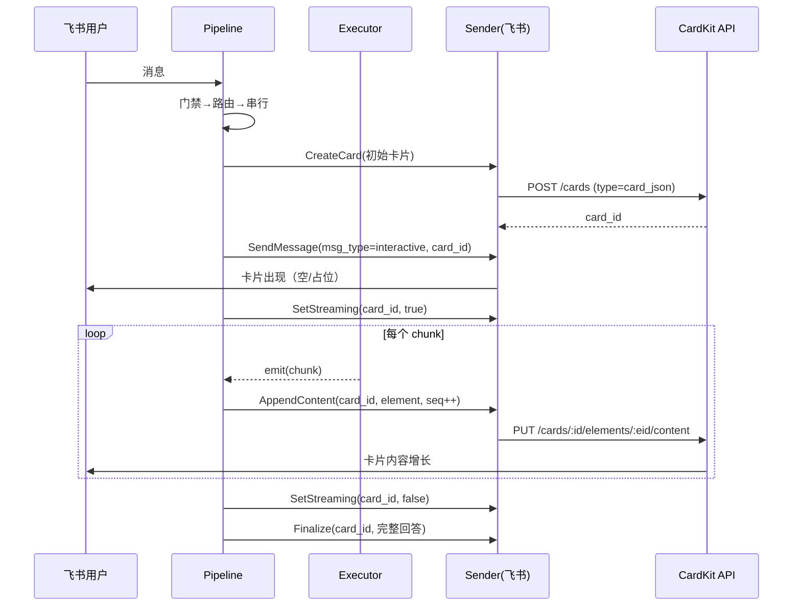
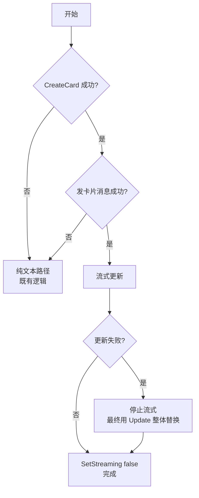

# Taiji · 飞书卡片流式渲染设计文档

> 项目：**taiji**（Go 原生 Agent Harness 原型）
> 版本：**v0.1**
> 日期：2026-09-24
> 配套：`05-飞书卡片流式需求文档.md`、`03-原型设计文档.md`（v0.1）
> 承载 Issue：**#10**
> 前置：issue #9 已闭环

---

## 1. 需求提炼

**目标**（用户原话）："现在飞书的输出没有使用卡片渲染的"——飞书回复改用卡片，让 Markdown 正确渲染，并带上流式打字机效果。

**非目标**：卡片交互回调、多卡片编排、模板管理、富媒体。见需求文档 §2.2。

---

## 2. 现状约束（实测，非推断）

### 2.1 三处硬约束

| 约束 | 证据 | 影响 |
|---|---|---|
| 出站接口无消息类型位 | `internal/channel/outbound.go`：`SendMessage(..., text string, opts SendOptions)` | 接口需改 |
| 出站写死 `MsgTypeText` | `internal/channel/feishu/send.go:109`（create）、`:136`（update） | 实现需改 |
| 生产调用点仅 1 处 | `internal/server/pipeline.go:210` | 改动波及面小 |

### 2.2 一个有利发现

`internal/chat/execute.go:240` 的 `runOneTurn` **已有 `emit func(string)` 回调**，但 `Execute`（`:111`）只用它拼接：

```go
var sb strings.Builder
runOneTurn(..., func(chunk string) { sb.WriteString(chunk) })   // 只拼接
```

**流式底层管道已就绪**——只需把 chunk 外传。这使 FR-2（打字机效果）的实现成本远低于预期。

### 2.3 文档偏差（须记录）

`docs/03-原型设计文档.md:498` 称"接口位已预留"——**实测不成立**（`SendOptions` 只有 `ReceiveIDType`/`MessageID`）。本文档的设计是**真实设计**，非"补上预留位"。

---

## 3. 架构

### 3.1 数据流



### 3.2 分层归属

| 改动 | 层 | 理由 |
|---|---|---|
| `Sender` 接口加消息形态 | `internal/channel`（契约层） | 形态是渠道无关概念 |
| 卡片实现（Create/Settings/Content） | `internal/channel/feishu`（实现层） | CardKit 是飞书专有 |
| chunk 外传 | `internal/chat`（执行层） | 执行层产出流 |
| 编排（何时开关流式） | `internal/server`（管道层） | 管道负责流程编排 |

**依赖方向不变**：`server → chat → channel`，无环。

### 3.3 接口设计（关键决策）

**方案**：`SendOptions` 加一个**消息形态**字段，`text` 参数语义不变。

```go
// internal/channel/outbound.go

// MessageKind 是出站消息的形态。
type MessageKind string

const (
    // KindText 纯文本（既有行为，默认）。
    KindText MessageKind = "text"
    // KindCard 交互式卡片（Markdown 渲染 + 可流式更新）。
    KindCard MessageKind = "card"
)

type SendOptions struct {
    ReceiveIDType ReceiveIDType
    MessageID     string
    // Kind 指定消息形态。空 = KindText（向后兼容）。
    Kind MessageKind
}
```

**为什么用「形态字段」而非「新方法」**：

| 方案 | 优点 | 缺点 |
|---|---|---|
| **加 Kind 字段**（选） | 1 处生产调用点改动；8 个测试夹具只改 fake 内部；语义集中 | `SendOptions` 承担两种形态的字段 |
| 加 `SendCard` 方法 | 语义清晰 | 接口膨胀；调用方需分支；fake 要实现两个方法 |
| 引入 `Message` 结构体替换 `text string` | 最干净 | 破坏面最大（所有调用点 + 夹具） |

选加字段：**改动最小且语义可扩展**——将来加 `KindMarkdown` 等无需再动接口形状。

### 3.4 流式 chunk 外传（执行层）

`Execute` 当前签名返回 `(string, error)`。要外传 chunk，加一个可选回调：

```go
// internal/chat/execute.go

// Execute 执行单轮。onChunk 非 nil 时逐块回调（流式）；nil 则只返回完整回答。
func (e *Executor) Execute(ctx context.Context, sessionID, input string, onChunk func(string)) (string, error)
```

**为什么用可选回调而非返回 channel**：

| 方案 | 优点 | 缺点 |
|---|---|---|
| **可选回调**（选） | 改动最小；`runOneTurn` 已有 emit；调用方无需管理生命周期 | 回调在调用栈内同步执行，慢回调会拖慢生成 |
| 返回 `<-chan string` | 解耦 | 需管理 goroutine 生命周期 + 错误传递复杂；`runOneTurn` 是同步的，需重构 |

回调同步执行是**可接受的**：卡片更新是 HTTP 调用（毫秒级），而模型生成 token 间隔通常更长。若将来需要异步，可在管道层用 buffer + goroutine 包裹，不必改 `Execute` 签名。

**节流**：不对每个 chunk 都调 CardKit——按时间或长度阈值聚合（设计见 §4.3）。

---

## 4. 关键设计

### 4.1 卡片创建与消息发送的两步

CardKit 的 `card_id` 与 IM 的 `message_id` 是**两个不同的标识**：

```
1. POST /open-apis/cardkit/v1/cards        → card_id
2. POST /open-apis/im/v1/messages          → message_id
     msg_type = "interactive"
     content  = {"type":"card","data":{"card_id":"<card_id>"}}
3. PATCH /open-apis/cardkit/v1/cards/:card_id/settings   ← 用 card_id
   PUT   /open-apis/cardkit/v1/cards/:card_id/elements/:element_id/content
```

**为什么不用 `card.Update` 整体替换**：整体替换会让卡片闪烁重绘，且每次要传完整 JSON。`cardElement.Content` 只更新**文本元素**，是流式的正确形态（SDK 注释明说它用于 streaming 周期）。

### 4.2 流式协议时序

```
sequence 从 1 开始单调递增（**不用时间戳**——时钟回拨会导致报错）

Settings(streaming_mode=true,  sequence=1)
Content(element_id, text=chunk1, sequence=2)
Content(element_id, text=chunk1+chunk2, sequence=3)
...
Settings(streaming_mode=false, sequence=N)
```

**`Content` 传的是「更新后的完整文本」还是「增量」**：SDK 字段注释写 `Content *string // 更新后的文本内容`——传**完整文本**（幂等），非增量。这简化了重试语义。

### 4.3 节流策略

**问题**：模型可能逐字符产出 chunk，每个都调 CardKit 会产生大量请求（限流风险 + 成本）。

**策略**：按「时间 + 长度」双阈值聚合。

| 参数 | 值 | 理由 |
|---|---|---|
| 最小间隔 | 200ms | 飞书卡片更新有频率限制；200ms 肉眼已是流畅打字 |
| 最小增量 | 16 字符 | 避免短间隔内发微小更新 |
| 强制刷新 | 流结束时 | 保证最终内容完整 |

**实现位置**：管道层（`server/pipeline.go`）——它掌握"何时开始/结束"，且节流是编排策略而非渠道实现。

### 4.4 降级路径（FR-4）

CardKit 任何一步失败 → **回退到既有纯文本路径**：



**为什么降级到文本而非报错**：用户等的是回答，不是错误。CardKit 是**展示层增强**，不该成为可用性单点。

**降级时的一致性**：若已发出卡片消息但后续失败，用 `card.Update` 写入完整回答（而非再发一条文本）——避免用户看到两条消息。

### 4.5 长回答处理（FR-5）

**待实测**：卡片元素内容长度限制未知。

**设计**：超限时的行为**显式定义**而非静默截断——

- 若截断：在末尾加 `…（回答过长，已截断）`
- 或分段：拆成多个元素（`cardElement.Create`）

**实现顺序**：先实测限制（探针），再定策略。若限制足够大（> 数万字符），原型阶段只做截断提示即可。

---

## 5. 接口变更与迁移

### 5.1 变更清单

| 文件 | 变更 | 破坏性 |
|---|---|---|
| `internal/channel/outbound.go` | `SendOptions` 加 `Kind` 字段；新增 `MessageKind` 类型 | 否（空值 = 既有行为） |
| `internal/chat/execute.go` | `Execute` 加 `onChunk` 参数 | **是**（签名变更） |
| `internal/channel/feishu/send.go` | 按 `Kind` 分流；新增卡片实现 | 否 |
| `internal/channel/feishu/card.go` | **新建**：CardKit 封装 | — |
| `internal/server/pipeline.go` | 编排流式 + 节流 | 否 |
| 8 个测试文件 | 适配 `Execute` 签名 | 机械迁移 |

### 5.2 向后兼容策略

- `SendOptions.Kind` 空值 → `KindText`：**既有调用无需改动**
- `Execute` 的 `onChunk` 传 `nil` → 行为与现在完全一致

### 5.3 迁移步骤（分波）

见 §7。

---

## 6. 反证/复现

| 断言 | 反证方式 | 当前状态 |
|---|---|---|
| "飞书纯文本不渲染 Markdown" | 查飞书文档确认 text 类型不解析 Markdown | **未独立验证**（无官方文档抓取）；但有实际观感证据（用户报告 + 截图中的 `- ` 裸字符） |
| "CardKit 支持流式" | SDK 注释明确描述 streaming_mode + sequence | ✅ 已核实（`model.go:2267`/`:2615` 原文） |
| "`runOneTurn` 已有 emit 回调" | 读 `execute.go:240` 源码 | ✅ 已核实 |
| "生产调用点仅 1 处" | grep `SendMessage` 排除测试 | ✅ 已核实（`pipeline.go:210`） |
| "文档 `:498` 声称接口位已预留" | 读 `outbound.go` 的 `SendOptions` | ✅ 已核实为**不成立** |
| "卡片元素长度限制" | **未测**——需探针 | ⚠️ 待验证 |
| "飞书应用已开通 CardKit 权限" | **未验证** | ⚠️ 待验证（可能阻塞真实环境验收） |

---

## 7. 分波实施计划

### Wave 1：接口扩展 + 卡片实现骨架

**范围**：`outbound.go`（加 Kind）、`feishu/card.go`（新建，CardKit 封装）、`send.go`（按 Kind 分流）

**验证**：
```bash
go test ./internal/channel/... -count=1
# 期望：既有测试全绿（Kind 空值 = 既有行为）
```

### Wave 2：流式外传 + 管道编排

**范围**：`execute.go`（onChunk）、`pipeline.go`（编排 + 节流）

**验证**：
```bash
go test ./internal/chat/... ./internal/server/... -count=1
# 期望：既有测试全绿（onChunk=nil 时行为不变）
```

### Wave 3：测试迁移 + 卡片端到端

**范围**：8 个测试文件适配签名；新增卡片端到端测试（假端点断言协议序列）

**验证**：
```bash
go test ./... -count=1
# 期望：9 包全绿 + 新卡片测试通过
```

### Wave 4：真实环境验证

**范围**：真实飞书 + 真实 CardKit

**验证**：飞书私聊发消息 → 目视卡片流式增长 + Markdown 渲染

**前置**：确认飞书应用已开通 CardKit 权限

---

## 8. 风险与缓解

| 风险 | 影响 | 缓解 |
|---|---|---|
| CardKit 权限未开通 | 真实验收阻塞 | Wave 4 前置检查；假端点测试不受影响 |
| `sequence` 语义理解偏差 | 流式更新被拒 | 用单调计数器；失败即降级 |
| 卡片长度限制未知 | 长回答截断 | 探针实测后定策略 |
| 8 个测试文件迁移引入回归 | 既有能力被破坏 | 分波提交；每波跑全量 |
| 降级路径未覆盖 | CardKit 故障时用户收空白 | 强制 AC-5 + 反向验证（注入失败） |
