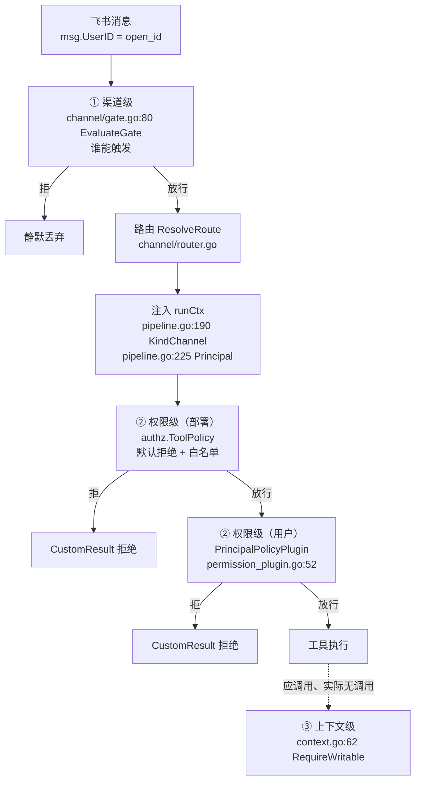
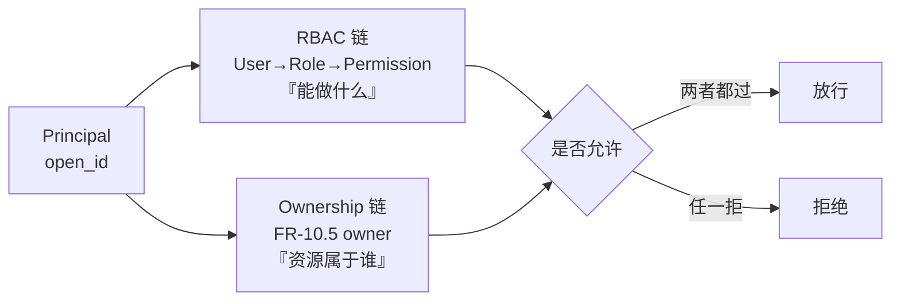
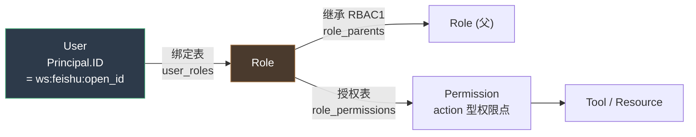

# Taiji · RBAC 权限体系接入设计

> 项目：**taiji**（Go 原生 Agent Harness 原型）
> 状态：**方案定稿（讨论产出）**，尚未落代码
> 前置：`03-原型设计文档.md` §4.3 权限三层、`01-需求文档.md` FR-10.5~10.9
> 参照系：`happyclaw/docs/ACL-MATRIX.md`（12 层权限矩阵，源码直读）

---

## 0. 结论摘要

TaiJi 现有权限是 **RBAC0 的退化形态**——`StaticPermissions` 把 User 直连 Permission，
中间没有 Role 层（`internal/authz/permission.go:51` 的 `byPrincipal map[string][]string`）。

本设计把直连掰成三段：`User → Role → Permission`。三个决策已定稿：

| 决策 | 结论 | 一句话理由 |
|---|---|---|
| **一：owner 与 RBAC 的关系** | **正交，不可合并** | owner 是「资源属于谁」，RBAC 是「主体能做什么」——不同维度 |
| **二：接口签名** | **现在扩为 `(principal, action, resource)`** | 消费方仅 1 处，一次痛；避免 v2 二次破坏 |
| **三：User→Role 绑定** | **现在做**（静态配置起步） | 绑定是 RBAC 的前置依赖，无绑定则 Role 无着落 |

**核心判断**：RBAC 本身很轻（一个 `PermissionSource` 实现 + 接口微调）；
重的是它背后的连锁——FR-10.7 语义改写、owner 边界、日志/测试维护税。见 §6。

---

## 1. 现状：三层正交 + 一个退化

### 1.1 现有判定链（按执行顺序）



三层各管一个正交维度：

| 层 | 文件 | 管什么 | 依据 |
|---|---|---|---|
| ① 渠道级 | `internal/channel/gate.go` | **能不能触发** | owner / @ / audience |
| ② 权限级 | `internal/authz/permission.go` | **触发后能做什么** | 白名单 / 权限表 |
| ③ 上下文级 | `internal/authz/context.go` | **这个来源允许做什么** | ContextKind |

### 1.2 退化点：User 直连 Permission

```
现状:  User ──N×M──▶ Permission
RBAC:  User ──N×R──▶ Role ──R×M──▶ Permission
```

`StaticPermissions` 的形态是 `byPrincipal[open_id] → []toolPattern`（`permission.go:51`）。
RBAC 要做的唯一一件事，就是把中间补上 Role 层，把 N×M 配置降为 N+R×M。

**这个收益只在用户规模上来后才成立**——个位数用户时 RBAC 是过度设计。
本项目引入 RBAC 的真实理由不是"配置量"，而是 FR-10.8 的**用户绑定**需要 Role 作为中间概念。

### 1.3 现有接缝（RBAC 的落点，无需重构）

`permission.go:21-24` 的原注释已预留：

> 抽象出来的理由：数据源形态可变（静态配置 / 外部权限中心 / 混合），
> 而消费方（插件）不关心数据从哪来。**换数据源只需换实现**。

爆炸半径（已核验）：

| 项 | 位置 | 改动 |
|---|---|---|
| 接口 | `permission.go:25` `PermissionSource` | 扩签名（决策二） |
| 实现 | `permission.go:51` `StaticPermissions` | 替换/新增 |
| 消费方 | `permission_plugin.go:71` `p.source.Allowed(...)` | 传参调整 |
| 装配 | `cmd/taiji/main.go:679` `envPermissions()` | 换成 RBAC 装配 |
| 挂载 | `internal/chat/execute.go:236` | **零改动**（插件接口不变） |

---

## 2. 决策一：owner 与 RBAC 正交，不可合并

### 2.1 判定链：两条正交的链，最后合并



### 2.2 为什么不可合并

owner 与 Role 建模的是**不同维度的关系**：

| | owner | Role |
|---|---|---|
| 建模对象 | **资源归属**（这个工作区属于谁） | **主体能力**（这个用户能做什么动作） |
| 形态 | 资源 → 主体（一对多） | 主体 → 能力（多对多） |
| 生命周期 | 随资源创建/转移/释放 | 随组织架构调整 |
| 特例 | break-glass（`/release_owner`、admin reset） | 角色继承 |

**若用 Role 替代 owner，会丢掉两条已承诺的需求**：

- FR-10.5 的 break-glass 路径（`01-需求文档.md:504-516`）——owner 离群/换号后的兜底；
- FR-10.6「**admin 不自动绕过工作区所有权**」（`01-需求文档.md:517-526`）——这条本身就是
  「拥有高权限角色 ≠ 拥有资源所有权」的声明，恰恰证明两者是不同维度。

### 2.3 参照系佐证

`happyclaw/docs/ACL-MATRIX.md` 也是分开的：

- §4「工作区 ACL」= ownership（`canAccessGroup`/`canModifyGroup`/`canDeleteGroup`）；
- §6「系统和管理权限」= RBAC（`manage_users`/`manage_system_config`/`manage_invites`）。

§1 权限层次表把两者并列为不同层次：`Access/Modify/Delete`（资源动作）与
`Host/System/Users`（能力点）。

### 2.4 本设计的取舍

**owner 沿用现有实现**（`internal/authz/principal.go:129` `IsOwner`），不并入 RBAC。
RBAC 只接管"②权限级"的判定，不碰"①渠道级"的 owner 判定。

> **注意一处张力**：owner 判定在①渠道级（`gate.go:112`），而 RBAC 在②权限级——
> 两层都在 `runCtx` 上有输入，但 owner 判定发生在门禁期（早于 Principal 注入）。
> 本设计**不改动**这个顺序，owner 判定仍用 `msg.UserID` 直查（`pipeline.go:163`）。

---

## 3. 决策二：接口现在扩为 `(principal, action, resource)`

### 3.1 新接口形态

```go
// AccessRequest 是一次权限查询的完整上下文。
//
// 从 (principal, toolName) 扩为三元组，是为了让「资源级」判定
// 无需二次改接口——v1 填 action=toolName、resource=工作区 ID（见 §3.3）。
type AccessRequest struct {
    Principal Principal // 谁
    Action    string    // 做什么（v1：工具名；v2：动作如 "fs.write"）
    Resource  string    // 对什么（v1：工作区 ID；v2：细化到路径 / 参数摘要）
}

type PermissionSource interface {
    // Allowed 判断该请求是否被允许。
    //
    // 返回 error 表示**无法判定**（数据源不可达），与 (false, nil) 语义不同：
    //   - (false, nil) —— 查了，不允许
    //   - (false, err) —— 查不了
    // 两者都必须拒绝，但日志要区分——否则数据源故障会被误读为权限收紧。
    Allowed(ctx context.Context, req AccessRequest) (bool, error)
}
```

### 3.2 物理可行性（已核验）

`resource` 在 v1 **结构可行**：`trpc-agent-go/tool/callbacks.go:58` 的 `BeforeToolArgs` 含：

- `ToolName string`（`callbacks.go:62`）→ action；
- `Arguments []byte`（`tool/callbacks.go:66`，工具参数 JSON）→ resource 的**潜在来源**；
- `Declaration *Declaration`（`callbacks.go:64`）→ 参数 schema。

即：消费方 `permission_plugin.go:52` 的 `beforeTool` 能拿到工具参数，
未来可从中提取 resource（如 `fs_write` 的路径参数）。

### 3.3 v1 的 resource 语义——**探针验证后修订**

> **本节经运行时探针修订**。原稿断言「v1 的 `resource` 恒为空，因为 `beforeTool`
> 拿不到 route 信息」——该断言**已被探针推翻**（证据见 §10）。

**修订结论**：框架传给 `beforeTool` 的 ctx 是**原 ctx 对象**，任意自定义 key 原样透传
（探针用一个 chat 包私有 key 读到了注入值）。故 `resource` 在 **v1 即可有值**，不必等到 v2。

**资源值的两个来源**：

1. **工作区 ID**（推荐 v1 采用）——IM 渠道的 resource 天然是当前工作区
   （`pipeline.go:226` 的 `p.route.WorkspaceID` 已有）；只需在 `pipeline.go:225` 附近
   多注入一行 `WithResource(ctx, p.route.WorkspaceID)`，消费方零解析。
2. **工具参数解析**（v2 精确化）——从 `BeforeToolArgs.Arguments`（`callbacks.go:66`）
   解析具体资源（如 `fs_write` 的 path 参数），精确到"哪个文件"，但需每个工具的
   schema 知识。

> **v1 实现建议**：采用来源 1——`WithResource` 注入工作区 ID，成本仅一行。
> v2 再叠加来源 2 做参数级细分。**接口无需二次改动**（这正是决策二"现在扩"的兑现）。

### 3.4 改动清单（爆炸半径）

| 文件 | 改动 | 风险 |
|---|---|---|
| `internal/authz/permission.go:25-34` | 接口签名 | 定义变更 |
| `internal/authz/permission.go:85` | `StaticPermissions.Allowed` 适配 | 低（改参数解构） |
| `internal/authz/permission_plugin.go:71` | 构造 `AccessRequest` | 低 |
| `cmd/taiji/main.go:679` | `envPermissions` 换 RBAC 装配 | 中 |
| `internal/authz/permission_test.go` | 12 处调用点适配 | 机械 |
| `internal/chat/permission_wiring_test.go:30` | fake 实现适配 | 机械 |
| `cmd/taiji/mcpauth_test.go:437-469` | 4 处调用点适配 | 机械 |

**总计**：接口 1 处 + 实现 1 处 + 消费 1 处 + 装配 1 处 + 测试 17 处。
测试占大头——但都是机械适配（参数从散列变结构体）。

---

## 4. 决策三：User→Role 绑定，现在做

### 4.1 数据模型



三张表：

| 表 | 形态 | v1 配置来源 |
|---|---|---|
| `user_roles` | `map[userID][]roleName` | 静态配置（环境变量 / YAML） |
| `roles` | `map[roleName][]permission` | 静态配置 |
| `role_parents` | `map[roleName][]roleName` | 静态配置（RBAC1 继承） |

### 4.2 权限点形态——抄 happyclaw 的 action 型

`ACL-MATRIX.md` §1 的权限是 **action 型**（`Access/Modify/Delete` + `manage_users` 等能力点），
**不是**直接映射工具名。本设计采纳：

```
Role: operator
  permissions:
    - "tool:mockmcp_echo"       # 工具级（v1 主体）
    - "tool:infraverse_*"       # 通配
    - "ws:modify"               # 资源级动作（v2 启用）
```

**为什么用 action 型而非直接列工具名**：

1. 权限点可跨角色复用（`ws:modify` 多个角色都要）；
2. 审计时「为什么被拒」能追到具体动作，而非笼统角色名；
3. v2 资源级扩展时，权限点空间不变（只是 action 从 `tool:x` 增到 `ws:modify`）。

### 4.3 User 主体的着落

**这是决策三的核心张力**：RBAC 的 User 主体现在只有 IM 用户
（`principal.go:36` `Type="im_user"`），ID 形态是 `{workspace}:{feishu}:{open_id}`
（`principal.go:103` `ResolvePrincipal`）——**平台 ID，不是系统账号**。

FR-10.8（`01-需求文档.md:536`）要求「用户在 Web 端完成身份绑定（IM 平台 ID ↔ 系统账号）」。

**v1 处理**：`user_roles` 的 key 直接用 `Principal.ID`（即 `ws:feishu:open_id`）。
**v2 处理**：引入绑定表 `map[principalID]systemUserID`，`user_roles` 的 key 改用 `systemUserID`。

> **为什么 v1 直接用 Principal.ID**：绑定表的存在意义是"多个 IM 账号映射到同一系统用户"。
> v1 没有系统账号体系，直接用 Principal.ID 作 key 是**语义上正确的退化**——
> 与现有 `StaticPermissions` 的 key 形态完全一致，迁移零成本。

### 4.4 配置形态

沿用 `TAIJI_USER_PERMISSIONS` 的**同源约定**（`cmd/taiji/main.go:679`）：

```
# v1：单环境变量，分号分隔条目
TAIJI_RBAC="
  role:admin=*;
  role:operator=tool:mockmcp_echo,tool:infraverse_*;
  user:ws1:feishu:ou_alice=admin;
  user:ws1:feishu:ou_bob=operator
"
```

> **配置形态是 v1 的临时选择**——正式形态应是 YAML（可读性远好于环境变量）。
> 但环境变量与现有 `envPermissions` 同源，迁移期可两者并存，故 v1 优先。

---

## 5. 与 FR-10.7 的冲突（本设计最重要的一处改写）

### 5.1 冲突陈述

- **FR-10.7**（`01-需求文档.md:528`）：「IM 渠道用户**统一降级为最低权限**」，
  理由「IM 渠道只验签不验用户，无法可靠判定个人角色」。
- **RBAC**：按角色判定权限。

两者**直接冲突**——RBAC 的前提就是按角色判定，而 FR-10.7 说"不判定角色，统一降级"。

### 5.2 出口已在文档中预留

FR-10.8（`01-需求文档.md:536`）：「绑定后**按系统角色判定权限，而非统一降级**」。

**所以「接入 RBAC」= 实现 FR-10.8**——方向与设计文档一致。

### 5.3 代价必须明说

| 项 | 影响 |
|---|---|
| FR-10.7 语义改写 | IM 用户不再统一降级，按 Role 判定——**这是改需求，不是实现需求** |
| 安全前提变化 | FR-10.7 的理由是"IM 无法可靠判定身份"；绑定后该理由消失，但**绑定的可信度**成为新前提 |
| 上下文级仍生效 | `ContextKind=channel` 的只读降权（`context.go:62`）**继续独立生效**——RBAC 不替代它 |

> **关键**：RBAC 与 ContextKind 降权**叠加**，不是替代。
> IM 用户即使有 `operator` 角色，`ContextKind=channel` 仍让写操作被拒
> （前提是③上下文级被真正接线——见 §7 缺口 1）。

---

## 6. 代价清单

只报收益是半截称量。引入 RBAC 的代价：

| 代价 | 具体表现 | 缓解 |
|---|---|---|
| **配置面变复杂** | 1 张表 → 3 张（user_roles / roles / role_permissions） | v1 单环境变量，可后续转 YAML |
| **拒绝日志要升级** | 现 `logf` 只打印 principal+tool（`permission_plugin.go:71` 附近）；引入 Role 后要追 user→role→permission 两级 | 新增 `denyReason` 结构，日志输出完整链路 |
| **测试维度翻倍** | `ACL-MATRIX.md` §11 列 8 个必测维度；ACL 改动是重维护税 | 按维度建测试矩阵，不零散补 |
| **FR-10.7 改写** | 需求语义变更，需同步更新 `01-需求文档.md` | 文档先行，代码后跟 |
| **绑定可信度** | FR-10.8 的绑定若无审计/撤销，会成为新的攻击面 | 绑定关系需可审计、可撤销（FR-10.8 已要求） |

---

## 7. 已知缺口（本设计**不**解决，但必须点明）

### 缺口 1：`RequireWritable` 零生产消费方（**最重**）

`grep` 全仓：`RequireWritable`（`context.go:62`）只在测试中出现，
**无任何生产代码调用**。这意味着"IM 来源只读"目前是**声明而非执行**。

**已由运行时探针确证**（证据见 §10）：`ContextKind=channel` 的上下文中，
工具**照常执行**（回答含工具返回值）——上下文级降权在 channel 下**零拦截**。
现在安全只是因为工具白名单默认拒绝了所有工具，不是上下文降权生效。

**与 RBAC 的关系**：RBAC 引入 `ws:modify` 等资源级权限点后，若③上下文级仍未接线，
则「有 `ws:modify` 权限的 IM 用户」会绕过只读降权。**RBAC 会放大这个缺口**。

**建议**：RBAC v1 落地时，**同步**给 `RequireWritable` 找执行点（写工具注册时声明 /
beforeTool 里按 action 前缀判定）。这是 RBAC 的前置条件，不是可选项。

### 缺口 2：`KindScheduled`/`KindSubagent` 是空壳

`context.go:23-26` 定义了两个 kind，但无生产注入点，也无定时任务/子 agent 功能。
将来做这两条路径时会踩与缺口 1 相同的坑。

### 缺口 3：用户级权限默认 fail-open

- 部署级：`AllowTools` 空 = 全部拒绝（fail-closed）。
- 用户级：`Permissions` 为 nil = 不做判定（`execute.go:236` 只在非 nil 时挂插件）。

即：**忘记配 RBAC 表 → 所有过门禁的用户能用所有已放行工具**。
v1 引入 RBAC 时应**一并修正**——要么默认拒绝，要么启动期强制要求配置。

---

## 8. 分波实施计划

### Wave 1：接口扩展（决策二）

- 新增 `AccessRequest` 结构（`permission.go`）；
- 改 `PermissionSource.Allowed` 签名；
- 新增 `WithResource`/`ResourceFrom`（`authz` 包），并在 `pipeline.go:225` 附近注入工作区 ID
  （探针已证 ctx 原样透传，见 §10）；
- 适配 `StaticPermissions`、`permission_plugin.go:71`、17 处测试调用点；
- **验证**：`go build ./...` + `go test ./internal/authz/ ./internal/chat/`（全绿，行为不变）。

### Wave 2：RBAC 核心（决策三）

- 新增 `internal/authz/rbac.go`：`RBACPermissions` 实现 `PermissionSource`；
- 三张表 + 继承展开 + 通配匹配（复用 `permission.go:107` `matchToolPattern`）；
- 装配：`cmd/taiji/main.go:679` 换 `envRBAC()`；
- **验证**：单元测试覆盖「角色继承 / 通配 / 未绑定用户拒绝 / 空表拒绝」。

### Wave 3：接线补缺（缺口 1+3）

- `RequireWritable` 接执行点；
- 用户级默认改 fail-closed（或启动期强制校验）；
- **验证**：端到端测试——IM 用户即使有角色，写操作仍被拒。

### Wave 4：资源级细化（v2）

> **定位修订**：工作区 ID 的注入（`WithResource`）已证明 v1 可行，**并入 Wave 1**（成本一行）。
> 本波只做「参数级细分」——从工具参数解析具体资源。

- 从 `BeforeToolArgs.Arguments`（`callbacks.go:66`）解析具体资源（如 `fs_write` 的 path）；
- `ws:modify` 等资源级权限点启用细粒度判定；
- **验证**：跨工作区 / 跨路径访问被拒。

---

## 9. 验收标准

| AC | 内容 | 验证方式 |
|---|---|---|
| AC-1 | `AccessRequest` 接口落地，消费方零破坏 | `go build` + 既有测试全绿 |
| AC-2 | 角色继承正确展开 | 单测：子角色继承父角色权限 |
| AC-3 | 未绑定用户拒绝（fail-closed） | 单测：空 user_roles → 拒 |
| AC-4 | 通配匹配与现有语义一致 | 单测：复用 `matchToolPattern` 的用例 |
| AC-5 | 拒绝日志含完整链路 | 单测：断言日志含 user→role→permission |
| AC-6 | owner 判定不受影响 | 回归：既有 `gate_test.go` / `principal_test.go` 全绿 |

---

## 10. 运行时探针证据

本设计的两个关键假设经一次性探针（`internal/chat/zz_ctxprobe_test.go`，跑完即删）
在真实框架链路上验证。命令：

```
go test ./internal/chat/ -run TestProbe_CtxPassthroughAndChannelGap -v
```

输出：

```
PROBE-RESULT called=true resource="ws-probe-123" kind="channel" hasPrincipal=true
PROBE-ANSWER "工具返回：[{\"type\":\"text\",\"text\":\"Echo: 你好\"}]"
--- PASS (5.62s)
```

### 证据 1：ctx 自定义值原样透传（**推翻原稿断言**）

探针用一个 **chat 包私有 key**（`probeCtxKey{}`）注入 `"ws-probe-123"`。
框架不可能认识这个私有 key——但 `beforeTool` 侧的 `PermissionSource` 读到了它
（`resource="ws-probe-123"`）。

**结论**：框架传给 `beforeTool` 的 ctx 是**原 ctx 对象**，非重建。
→ `WithResource(ctx, workspaceID)` 方案**可行**，`resource` 在 v1 即可有值（§3.3 已据此修订）。

### 证据 2：上下文级降权零拦截（**确证缺口 1**）

探针在 `KindChannel` 上下文中放行工具，工具**照常执行**
（`PROBE-ANSWER` 含 `Echo: 你好`，即 mockmcp 的真实返回值）。

**结论**：`ContextKind=channel` 虽正确透传（`kind="channel"`），但**无任何代码读取它来拦截**。
→ 缺口 1 从"静态推断"升级为"运行时事实"：IM 来源的写操作**当前不受上下文级保护**。

> **探针的边界（诚实标注）**：本探针用 `PermissionSource` 读 ctx，与真实
> `PrincipalPolicyPlugin` 的 ctx 消费点同源（都是 `beforeTool` 回调），故结论可迁移。
> 但**未覆盖**多轮工具调用、并发场景下的 ctx 一致性——如需可在实现期补。

---

## 附录：锚点索引

| 锚点 | 内容 |
|---|---|
| `internal/authz/permission.go:25` | `PermissionSource` 接口 |
| `internal/authz/permission.go:33` | `Allowed` 签名 |
| `internal/authz/permission.go:51` | `StaticPermissions` |
| `internal/authz/permission.go:85` | `StaticPermissions.Allowed` |
| `internal/authz/permission.go:107` | `matchToolPattern` |
| `internal/authz/permission_plugin.go:52` | `beforeTool` 判定入口 |
| `internal/authz/permission_plugin.go:71` | `source.Allowed` 消费点 |
| `internal/authz/principal.go:34` | `Principal` 结构 |
| `internal/authz/principal.go:103` | `ResolvePrincipal` |
| `internal/authz/principal.go:129` | `IsOwner` |
| `internal/authz/context.go:62` | `RequireWritable`（零消费方） |
| `internal/chat/chat.go:49` | `Options.Permissions` |
| `internal/chat/execute.go:236` | 插件挂载点 |
| `internal/server/pipeline.go:190` | `WithContextKind` 注入 |
| `internal/server/pipeline.go:225` | `WithPrincipal` 注入 |
| `internal/channel/router.go:37` | `RouteConfig.WorkspaceID` |
| `cmd/taiji/main.go:679` | `envPermissions` 装配 |
| `cmd/taiji/main.go:708` | `NewStaticPermissions` |
| `trpc-agent-go/tool/callbacks.go:58` | `BeforeToolArgs`（含 `Arguments`） |
| `happyclaw/docs/ACL-MATRIX.md` §1 | 权限层次表 |
| `happyclaw/docs/ACL-MATRIX.md` §11 | ACL 修改验证要求（8 维度） |
