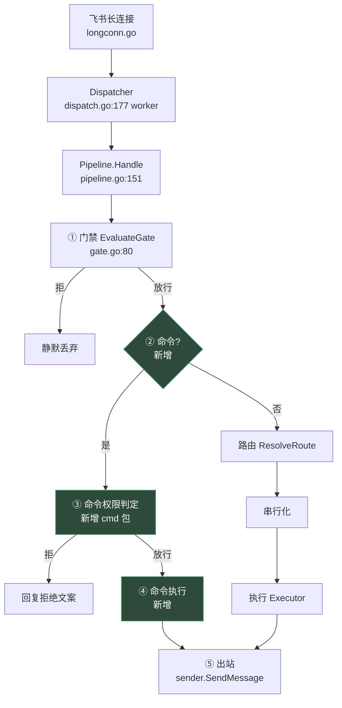
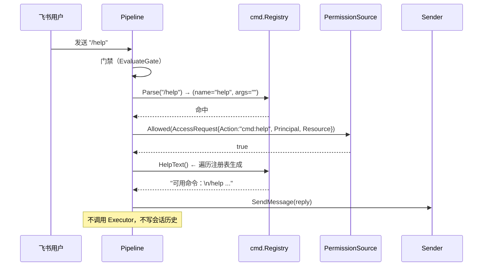
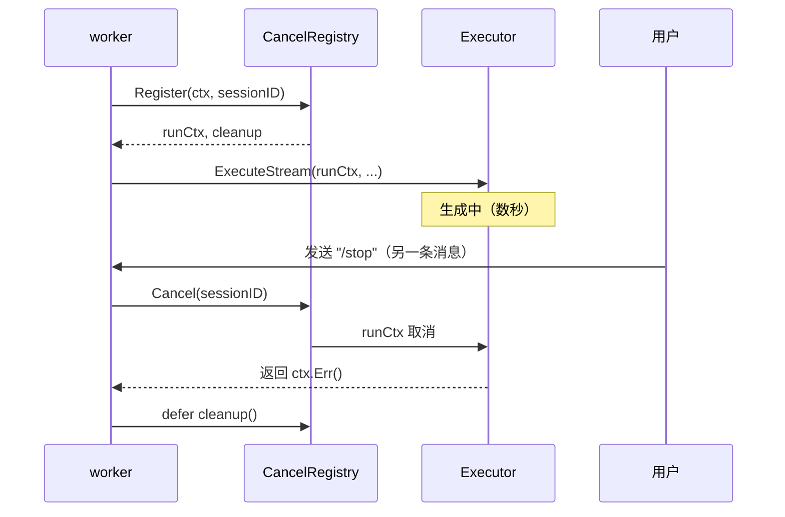

# SPEC: 飞书命令系统与 RBAC 权限点接入

> 技术规格来源：`docs/08-命令系统与RBAC需求文档.md`（PRD）
> 生成：2026-09-24 | 目标分支：main | 基线提交：`f556aa3`
> 定位：本 SPEC 描述**如何实现**，PRD 描述**要什么**。二者不重复。

---

## 1. 摘要

### 1.1 本 SPEC 覆盖什么

在 `internal/channel/cmd`（新增包）实现 IM 命令的识别与分发，并把命令权限接入已有的
`authz.PermissionSource` 判定链；同时为 `/stop` 引入 per-session 的 context 取消能力
（当前不存在，见 §2.2 裂缝 1）。

**范围**：**4 条命令**（`/help`、`/status`、`/clear`、`/stop`）的识别、权限判定、
响应投递；`/stop` 所需的取消基础设施。

**不在范围**：
- `/owner_mention`、`/release_owner`——**移出 v1**（需 owner 持久化，见 §11.1.1）
- 飞书原生指令菜单（平台侧配置，无法用代码验证）
- 命令别名、命令参数解析框架

### 1.2 PRD 引用

| PRD 条目 | 本 SPEC 章节 |
|---|---|
| FR-C1 命令识别与拦截 | §5.1, §5.2 |
| FR-C2 命令清单 | §5.1, §3.2 |
| FR-C3 命令权限判定（接 RBAC） | §5.3, §7.1 |
| FR-C4 命令必须「正常使用」四拆解 | §9.4 |
| AC-C1~C7 | §9.4 |
| AC-D1~D5（RBAC 接缝） | §9.4 |

### 1.3 设计决策摘要

| 决策 | 选择 | 理由 |
|---|---|---|
| 命令解析实现 | **自研注册表**（不用 cobra） | 用户拍板；cobra 是 CLI 参数解析器（`os.Args`/flag/子命令树），IM 命令是纯文本无 flag，7 模块依赖换 90% 用不上的能力。实测 cobra 运行时依赖 `pflag`+`mousetrap` |
| 命令拦截位置 | `Pipeline.Handle` 门禁之后、路由之前 | 门禁先判「能不能触发」，命令再判「触发后能做什么」——与 §7.1 的两层语义一致 |
| 命令权限判定 | 复用 `authz.PermissionSource`，权限点 `cmd:<name>` | 用户拍板；FR-10.6 要求跨面一致，命令是第五个面 |
| `/help` 生成 | 遍历注册表动态生成 | 用户拍板；避免硬编码漂移 |
| `/stop` 中断 | per-session cancel 注册表 | 用户拍板（选项 A）；实测无基础设施 |
| 命令是否入会话历史 | **不入** | PRD FR-C4 第 4 条；否则 `/help` 变成模型上下文噪声 |

---

## 2. 架构

### 2.1 系统上下文



**新增部分（绿框）插在门禁与路由之间**——理由见 §1.3。命令**不进入**串行化与执行层。

### 2.2 现有架构的两处裂缝（必须先指出）

**裂缝 1：`/stop` 无取消基础设施。**

实测 `dispatch.go:182` 每条消息用 `context.Background()`——**不可取消**。
生产代码全仓无 `context.WithCancel`/`WithTimeout`（实测零命中）。

后果：`/stop` 即使实现了命令识别，也**无法中断正在生成的 run**——
用户会看到「已停止」但生成仍在继续（假功能）。

**本 SPEC 的解法**：引入 `internal/server/cancel.go` 的 `CancelRegistry`
（per-session 的 `context.CancelFunc` 注册表）。详见 §5.4。

**裂缝 2：命令不经过工具链，但权限判定只在工具链上。**

现有权限判定挂在 `beforeTool` 回调（`permission_plugin.go:52`），
它只在**工具调用时**触发。命令不调用工具，因此**必须单独判定**——
不能依赖现有插件自动生效。

**本 SPEC 的解法**：命令分发器直接持有 `authz.PermissionSource`，
用 `AccessRequest{Action: "cmd:<name>", Resource: workspaceID}` 显式查询。
详见 §5.3。

> **为何不在命令上套一层假工具**：那会让命令出现在模型的工具列表里，
> 模型可能自行「调用」`/help`——语义错误。命令是**用户面**能力，不是模型面能力。

### 2.3 模块交互（`/help` 时序）



### 2.4 文件结构

```
internal/
├── channel/
│   └── cmd/                      [NEW 包]
│       ├── registry.go           [NEW] 命令注册表 + Parse + HelpText
│       ├── registry_test.go      [NEW]
│       ├── handler.go            [NEW] 6 条命令的实现
│       ├── handler_test.go       [NEW]
│       └── parse.go              [NEW] 文本 → (name, args) 解析
│       └── parse_test.go         [NEW]
├── server/
│   ├── pipeline.go               [MODIFY: Handle 插入命令分支]
│   ├── pipeline_test.go          [MODIFY: 加命令路径断言]
│   ├── cancel.go                 [NEW] CancelRegistry（/stop 基础）
│   ├── cancel_test.go            [NEW]
│   ├── dispatch.go               [MODIFY: 用 registry 提供的 ctx]
│   └── cmd_wiring_test.go        [NEW] 端到端接线断言
└── authz/
    └── permission.go             [不改] 复用 AccessRequest/Action 字段

cmd/taiji/
└── main.go                       [MODIFY: 装配命令注册表 + 权限源]
```

**注意**：`authz` 包**零改动**——`AccessRequest.Action` 字段已存在
（`permission.go:30`），`matchToolPattern`（`permission.go:127`）的前缀通配
对 `cmd:` 前缀天然兼容（工具名不含 `:`）。

---

## 3. 数据模型

### 3.1 无 Schema 变更

本特性**不引入数据库**（与 08 文档 §3.5 的决策一致）。所有状态在内存：

| 状态 | 存放 | 生命周期 |
|---|---|---|
| 命令注册表 | `cmd.Registry`（静态） | 进程级 |
| 命令权限 | 复用 `RBACPermissions.byUser`（`rbac.go:42`） | 进程级（配置变更需重启） |
| cancel 注册表 | `CancelRegistry.mu` + `map[string]context.CancelFunc` | per-session，run 结束即删 |

### 3.2 实体定义

```go
// internal/channel/cmd/registry.go

// Command 是一条命令的定义。
type Command struct {
    // Name 是命令名（不含 "/"），小写。如 "help"。
    Name string
    // Usage 是用法示例，如 "/stop"。
    Usage string
    // Desc 是一句话说明（进 /help 输出）。
    Desc string
    // OwnerOnly 标记「仅工作区 owner 可执行」。
    //
    // 注意：OwnerOnly 与 RBAC 权限点是**两个维度**（与 07 文档 §2 的
    // owner/RBAC 正交论证一致）。OwnerOnly 是资源归属判定，
    // RBAC 是能力判定——两者都要过。
    OwnerOnly bool
    // Handler 执行命令。args 是命令名之后的剩余文本（已 TrimSpace）。
    Handler func(ctx context.Context, req Request) (string, error)
}

// Request 是一次命令调用的上下文。
type Request struct {
    Principal authz.Principal
    SessionID string  // 路由后的 EffectiveJID（用于 /clear /stop）
    Args      string  // 命令名之后的剩余文本
    Sender    channel.Sender  // 命令自行出站（不走 deliverAnswer）
    Receiver  string
    IDType    channel.ReceiveIDType
}

// Registry 是命令注册表。
type Registry struct {
    // 按注册顺序保存（/help 输出顺序稳定，便于测试与阅读）
    order []string
    byName map[string]Command
}
```

```go
// internal/server/cancel.go

// CancelRegistry 管理 per-session 的取消函数（/stop 的基础设施）。
//
// 为什么需要它：实测 dispatch.go:182 每条消息用 context.Background()，
// 不可取消。要支持 /stop 必须让 run 的 ctx 可被外部取消。
type CancelRegistry struct {
    mu      sync.Mutex
    cancels map[string]context.CancelFunc
}

// Register 为 sessionID 登记一个可取消的 ctx。
// 返回的 ctx 供执行层使用；返回的 cleanup 必须 defer 调用。
func (r *CancelRegistry) Register(parent context.Context, sessionID string) (context.Context, func())

// Cancel 取消 sessionID 对应的 run。返回是否真的取消了一个 run。
func (r *CancelRegistry) Cancel(sessionID string) bool
```

### 3.3 关系

- `Command.Handler` ← 由 `Registry` 持有
- `Registry` ← 由 `Pipeline` 持有（新增字段）
- `CancelRegistry` ← 由 `Pipeline` 持有（新增字段）
- `PermissionSource` ← 已由 `chat.Options.Permissions` 持有（`execute.go` 装配链），
  命令分发器需**另一条**引用（见 §2.2 裂缝 2）

### 3.4 迁移计划

**无需迁移**——无持久化状态。回滚即删除新增文件、还原 `pipeline.go` 的 `Handle`。

---

## 4. 接口设计

### 4.1 对外接口（本特性是 IM 命令，无 HTTP 端点）

| 命令 | 用法 | 权限点 | OwnerOnly | 响应 |
|---|---|---|---|---|
| `/help` | `/help` | `cmd:help` | 否 | 遍历注册表生成的命令清单 |
| `/status` | `/status` | `cmd:status` | 否 | 会话 ID + 队列状态 |
| `/clear` | `/clear` | `cmd:clear` | **是** | 派生新 sessionID（§11.1.2） |
| `/stop` | `/stop` | `cmd:stop` | **是** | 中断当前生成 |

**v2（本 SPEC 不实现）**：

| 命令 | 为何延后 |
|---|---|
| `/owner_mention` | 需 owner 持久化（§11.1.1） |
| `/release_owner` | 同上 |

> **不注册即不可用**：注册表里没有这两条 → 用户发 `/owner_mention`
> 会走**正常消息路径**（被当普通文本送模型），不会报错也不会误触发。
> 这是有意的——比注册一个「暂不可用」的占位更干净（无死代码）。

### 4.2 请求/响应形态

**请求**：飞书消息正文，形如 `/help` 或 `/clear`。

**解析规则**（`cmd/parse.go`）：

```
输入:  strings.TrimSpace(msg.Content)
判定:  必须以 "/" 开头
      首个空白分隔的 token 去掉 "/" 后转小写，作为命令名
      剩余部分 TrimSpace 作为 args

命中:  命令名在注册表中
未命中: 返回 (Command{}, false) —— **走正常消息路径**（不是报错）
```

**边界**：`/usr/local/bin 是什么` → 命令名 `usr/local/bin` 未注册 → **走正常消息路径**。
这是 FR-C1 明确要求的「非命令的 `/` 开头文本不得误伤」。

### 4.3 错误响应

命令的响应**直接是用户可见文本**（与 `denyMessage` 的策略一致，
`permission_plugin.go:128`）：

| 情形 | 响应文案 |
|---|---|
| 无 `cmd:X` 权限 | 「你没有使用命令 `/{X}` 的权限。这是确定性拒绝，重试不会成功。」 |
| OwnerOnly 但非 owner | 「只有工作区 owner 才能执行此命令。」 |
| `/stop` 但无进行中的 run | 「当前没有正在生成的回答。」 |
| 命令执行出错 | 「命令执行失败：{err}」 |

> **文案策略**：复用 `denyMessage` 的「确定性拒绝 + 重试不会成功」措辞
> （实测教训：模型会连试 3 次被拒的工具，见 07 文档缺口 4）。

### 4.4 破坏性变更

**无**。命令分支只在「命中注册表」时激活；既有消息路径完全不变。
`dispatch.go` 的 ctx 改动需保证：**未注册 cancel 的 session 行为与现在一致**（§5.4）。

---

## 5. 业务逻辑

### 5.1 命令分发（核心算法）

```
Handle(ctx, msg):
  1. 门禁（既有，不变）
  2. **命令判定（新增）**
     if cmdName, args, ok := registry.Parse(msg.Content); ok {
         return p.handleCommand(ctx, msg, cmdName, args)
     }
  3. 路由（既有）
  4. 串行化（既有）
  5. 执行（既有）

handleCommand(ctx, msg, name, args):
  a. 构造 Principal（复用 pipeline.go:225 的 ResolvePrincipal）
  b. 权限判定：source.Allowed(AccessRequest{
         Principal: principal,
         Action:    "cmd:" + name,
         Resource:  workspaceID,
     })
     拒绝 → 回复拒绝文案，return nil（**不是 error**：拒绝是正常路径）
  c. OwnerOnly 判定：若 cmd.OwnerOnly 且 !isOwner(msg.UserID) → 回复，return nil
  d. 执行 cmd.Handler(ctx, req)
  e. 出站：sender.SendMessage(receiver, reply, opts)
  f. **不调用 executor，不写会话历史**
```

### 5.2 校验规则

| 规则 | 具体约束 |
|---|---|
| 命令名格式 | `[a-z_]+`，小写；注册时校验（非法名 panic，启动期暴露） |
| 命令名唯一 | 重复注册 panic（fail-fast，启动期暴露） |
| 命令名长度 | ≤ 32 字符（防超长文本被当命令） |
| 空 Handler | 注册时 panic |
| 命令总长度 | `msg.Content` 超过 4096 字符时**不做命令判定**（直接走消息路径） |

> 最后一条的理由：`/` 开头超长文本更可能是用户粘贴的路径/代码，不是命令。

### 5.3 命令权限与 RBAC 的接法

**权限点命名**：`cmd:<name>`（如 `cmd:help`）。

**为何带 `cmd:` 前缀**（与 07 文档 §4.2 的「工具级裸名」形成对比）：

| 类型 | 形态 | 理由 |
|---|---|---|
| 工具权限点 | 裸工具名（`mockmcp_echo`） | MCP 工具名自带 `{server}_` 前缀，再叠是冗余 |
| **命令权限点** | **`cmd:<name>`** | 命令名（`help`）**无天然命名空间**，必须显式加前缀才能与工具名区分 |

**匹配兼容性**：`matchToolPattern`（`permission.go:127`）支持 `*` 与前缀通配，
故 `cmd:*` 可匹配全部命令，`cmd:*` 不与任何工具名冲突（工具名不含 `:`）。

**配置示例**（`TAIJI_RBAC`，与既有格式同源）：

```
TAIJI_RBAC="role:viewer=cmd:help,cmd:status;role:operator=cmd:help,cmd:status,cmd:clear,cmd:stop;user:ws1:feishu:ou_alice=operator"
```

**Role 继承自动生效**：`operator` 若配 `parent:operator=viewer`，
则自动获得 `cmd:help`/`cmd:status`（`rbac.go:78` 的 `collectPermissions`）。

### 5.4 `/stop` 的取消基础设施

**当前状态**：`dispatch.go:182` 用 `context.Background()`，不可取消。

**目标状态**：



**关键设计点**：

1. **cancel 必须在 Handle 内注册**（`pipeline.go:151`），因为 `sessionID` 在那里才确定
   （路由后）。但 `Handle` 被 `AcquireBlocking` 阻塞时也可能被取消——见 §5.4 边界。
2. **`/stop` 命令自身不经过串行化**（§5.1 步骤 2 在步骤 4 之前）——
   否则 `/stop` 会排在正在生成的 run 后面等待，永远无法中断它。
   **这是本设计最容易做错的地方**。
3. **cleanup 必须幂等**：`Cancel` 与 `cleanup` 可能并发（用户连发两次 `/stop`）。

**边界情况**：

| 场景 | 行为 |
|---|---|
| `/stop` 时无进行中的 run | `Cancel` 返回 false → 回复「当前没有正在生成的回答」 |
| run 刚结束、cleanup 已执行 | 同上（注册表已删该条目） |
| `/stop` 自身被取消 | 不可能——`/stop` 不注册 cancel |
| 进程退出 | `CancelRegistry` 无需特殊处理（进程结束即释放） |

### 5.5 边界情况汇总

| 场景 | 处理 |
|---|---|
| 用户发 `/HELP`（大写） | 命令名转小写后命中 → 执行 `/help` |
| 用户发 `/help extra args` | `/help` 忽略 args（它的 Handler 不读 args） |
| 用户发 `/`（仅斜杠） | 命令名为空 → 未命中 → 走正常消息路径 |
| 用户发 `/unknown` | 未注册 → **走正常消息路径**（送模型） |
| 用户发 `/usr/local/bin 是什么` | 同上（命令名含 `/` 未注册） |
| 群聊中发命令但未 @bot | 门禁先拒（`gate.go:80`）——命令不绕过门禁 |
| 命令回复发送失败 | 记日志，返回 error（与 `deliverAsText` 一致） |

---

## 6. 错误处理

### 6.1 错误分类

| 情形 | 处理 | 用户可见 |
|---|---|---|
| 无权限 | 回复拒绝文案，返回 nil | 「你没有使用命令 X 的权限...」 |
| 非 owner 执行 OwnerOnly | 回复拒绝文案，返回 nil | 「只有工作区 owner...」 |
| Handler 返回 error | 回复错误文案，返回 nil | 「命令执行失败：...」 |
| 出站失败 | 返回 error（记日志） | 无（用户收不到） |
| 权限源不可达（`Allowed` 返回 err） | 回复「权限校验暂时不可用」，返回 nil | 是 |

> **「查不了」与「不允许」必须区分**——复用 `permission_plugin.go` 的既有语义
> （`(false,nil)` = 查了不允许；`(false,err)` = 查不了）。

### 6.2 重试策略

**命令不重试**。理由：命令是幂等的用户操作，失败即失败，用户可重发。
（`/stop` 例外说明：连发两次 `/stop` 是安全的，第二次返回「无进行中的 run」。）

### 6.3 失败模式

| 依赖失败 | 影响 | 降级 |
|---|---|---|
| 权限源不可达 | 命令无法判定 | **fail-closed**：拒绝 + 提示，不静默放行 |
| 飞书出站失败 | 命令回复发不出 | 记日志；用户可重发命令 |
| cancel 注册表异常 | `/stop` 失效 | 不影响其它命令（独立字段） |

---

## 7. 安全

### 7.1 认证与授权

**三层叠加**（缺一不可）：


- **① 门禁**：既有 `EvaluateGate`（`gate.go:80`）——命令**不绕过**它。
  群聊未 @bot 的命令同样被拒（§5.5）。
- **② 命令权限**：`cmd:<name>` 权限点，经 `PermissionSource`（§5.3）。
- **③ OwnerOnly**：与 RBAC **正交**（对齐 07 文档 §2 的论证）——
  owner 是「资源属于谁」，RBAC 是「能做什么」，两者都要过。

**身份来源**：`msg.UserID`（飞书 `sender.open_id`，`longconn.go` 的
`incomingFromLongConnEvent`）——**不可伪造**（FR-10.2）。

**fail-closed 不变量**（与既有取向一致）：

- 无 Principal → 拒绝
- 权限源为 nil → 拒绝
- 权限源返回 error → 拒绝
- 命令未在注册表 → **不走拒绝路径**，走正常消息路径（不是安全问题——它会被当普通消息处理，仍需过工具权限）

### 7.2 输入校验

| 项 | 约束 | 理由 |
|---|---|---|
| 命令名 | `^[a-z_]{1,32}$` | 防超长/特殊字符 |
| 命令总长度 | ≤ 4096 字符才做命令判定 | 防粘贴的路径被误判（§5.2） |
| args | 不做结构化解析（v1） | 减少攻击面；`/stop` 等不需要参数 |
| 不做 shell 展开 | 无 `os/exec` 参与 | 命令是 Go 函数调用，非外部进程 |

> **明确不做**：不把 args 拼进任何 SQL/shell/文件路径。v1 的 6 条命令都不消费 args
> （`/help` 忽略、`/stop` 忽略）。

### 7.3 数据保护

- **命令不入会话历史**（§1.3）——避免 `/help` 内容进入模型上下文（既是隐私，也是 token 浪费）
- **拒绝日志含审计三要素**：principal（已脱敏，`Principal.Redacted()`）+ action + resource
  （对齐 07 文档 AC-5 的要求）
- **`/stop` 不记录被中断的内容**——只记 `sessionID` 与结果

---

## 8. 性能

### 8.1 预期负载

| 项 | 估计 |
|---|---|
| 命令频率 | 极低（用户手动触发，非自动） |
| `/help` 输出大小 | ~6 行，< 500 字节 |
| 权限判定成本 | 纯内存查表（`rbac.go:170` 的 `byUser` map） |
| cancel 注册表 | O(1) 读写，map + mutex |

**结论**：无性能压力。命令路径**比消息路径更快**（不调用模型）。

### 8.2 优化策略

**不做优化**——过早优化。唯一注意点：`/help` 遍历注册表是 O(n)，n=6，
且可缓存（但缓存会引入失效问题，不值）。

### 8.3 无数据库考量

本特性无 DB 交互（§3.1）。

---

## 9. 测试策略

### 9.1 单元测试

| 包 | 测试内容 |
|---|---|
| `cmd` | Parse（大小写/空斜杠/未注册/带 args/超长）；Registry（注册/重复 panic/非法名 panic/HelpText 遍历）；Handler 各条命令 |
| `server` | CancelRegistry（注册/取消/幂等 cleanup/未注册取消返回 false） |
| `authz` | **不改**——复用既有测试 |

### 9.2 集成测试

| 测试 | 内容 | 是否 mock |
|---|---|---|
| `server/cmd_wiring_test.go` | 命令经完整 `Pipeline.Handle` 路径（门禁→命令→出站） | 用 fake Sender/Executor，**真 Registry + 真 PermissionSource** |
| `server/cancel_e2e_test.go` | `/stop` 真的中断了执行中的 run | **不 mock 执行层**：用一个阻塞的 fake Executor，断言它收到 ctx 取消 |

### 9.3 边界用例测试

覆盖 §5.5 全部 8 条边界 + §5.4 的 4 条边界。

### 9.4 验收标准映射

| PRD AC | 测试 | 类型 | 断言 |
|---|---|---|---|
| AC-C1 `/help` 列出全部命令 | `TestHelp_ListsAllRegistered` | unit | 注册 6 条 → 输出含 6 个名字 |
| AC-C2 命令不调用模型 | `TestCommand_DoesNotCallExecutor` | unit | executor 调用计数 = 0 |
| AC-C3 命令不入会话历史 | `TestCommand_NotInSessionHistory` | integration | session 消息数不变 |
| AC-C4 未注册 `/xxx` 走正常路径 | `TestUnknownCommand_GoesToModel` | unit | `/usr/local/bin 是什么` → executor 被调用 1 次 |
| AC-C5 无权限返回明确拒绝 | `TestCommand_DeniedForNoPermission` | unit | viewer 执行 `/clear` → 回复含「权限」 |
| AC-C6 `/help` 从注册表动态生成 | `TestHelp_DynamicFromRegistry` + **反证** | unit | 新增命令不更新 help → 测试应变红（见下） |
| AC-C7 私聊与群聊均可达 | `TestCommand_BothChatTypes` | integration | 两种 ChatType 各跑一遍 |
| AC-D1 `PermissionSource` 是唯一接缝 | `TestWiring_OnlyDependsOnInterface` | static | 源码断言 `cmd` 包不 import `authz` 具体实现 |
| AC-D2 换实现不改消费方 | `TestCommand_FakePermissionSource` | unit | 用 fake source → 行为不变 |
| AC-D3 命令权限走 RBAC | `TestCommandPermission_ViaRBAC` | unit | 配 `cmd:clear` → 可用 `/clear` |
| AC-D4 角色继承对命令生效 | `TestCommandPermission_Inherited` | unit | admin 继承 operator 的 `cmd:stop` |
| AC-D5 既有 RBAC 测试不回归 | `go test ./internal/authz/ ./cmd/taiji/` | — | exit 0 |

**AC-C6 的反证设计**（关键——防「测试空转」）：

```
反向验证：把 HelpText() 改成硬编码字符串（不含新命令）
         → TestHelp_DynamicFromRegistry 必须 FAIL
若仍 PASS，说明该测试没有真正验证「动态生成」
```

---

## 10. 实施计划

### 10.1 阶段

| 阶段 | 内容 | 依赖 |
|---|---|---|
| P1 | `cmd` 包：Parse + Registry + HelpText（无 Handler） | — |
| P2 | `cmd` 包：6 条 Handler | P1 |
| P3 | `server/cancel.go`：CancelRegistry | — |
| P4 | `pipeline.go`：Handle 插入命令分支 + 装配 | P1-P3 |
| P5 | `main.go`：装配注册表 + 权限源传递 | P4 |
| P6 | 端到端测试 + 反证验证 | P5 |

### 10.2 Issue 映射

| Issue | SPEC 章节 | 优先级 | 依赖 |
|---|---|---|---|
| 命令注册表与解析 | §3.2, §4.2, §5.1, §5.2 | high | — |
| 命令 Handler（6 条） | §5.1, §5.5 | high | 上一条 |
| CancelRegistry（/stop 基础） | §3.2, §5.4 | high | — |
| Pipeline 接线 | §2.1, §5.1, §5.3 | high | 前三条 |
| 命令权限接入 RBAC | §5.3, §7.1 | high | 命令注册表 |
| 端到端与反证验证 | §9.4 | high | 全部 |

### 10.3 增量交付

**无 feature flag**——命令是新增能力，不影响既有路径（§4.4 无破坏性变更）。
可按 P1→P6 顺序逐波提交，每波独立可测。

---

## 11. 开放问题与风险

### 11.1 未决问题

> **两处均已决策（2026-09-24）**，见下。

1. **`/owner_mention` 与 `/release_owner` → 决策：移出 v1 范围（路径 A）**

   **决策依据**：这两条命令需要 owner 的**可写存储**，而现状是
   **启动期静态列表**（实测：`TAIJI_FEISHU_OWNERS` 环境变量 → `main.go:576-581`
   → `GateConfig.Owners` → `authz.IsOwner`，`principal.go:129` 是**纯函数**）。

   要做 `/owner_mention` 需三样新东西：

   | 需要 | 现状 | 缺口 |
   |---|---|---|
   | owner 可写存储 | 无（环境变量只读） | 需新增 |
   | 动态判定（读存储而非配置） | `IsOwner` 纯函数 | 需接口化 |
   | 多租户隔离（按 workspace 分片） | 全局一份列表 | 需新增 |

   **代价**：`IsOwner` 被 3 处消费（`gate.go:125`、`pipeline.go:165`、测试），
   改成接口会波及**门禁**——那是安全边界，风险高于命令系统本身。

   **不做的理由（称量）**：它现在**没有消费者**。v1 的 owner 由运维在部署时配好，
   单租户原型足够；`/owner_mention` 的价值是多租户自助认领，
   而 `07-RBAC权限设计.md:64` 刚论证过「个位数用户时 RBAC 是过度设计」。
   引入它 = 新增存储 + 改安全边界 + 迁移成本，换一个当前用不上的能力
   （与「casbin 不引入」同一取舍）。

   **本 SPEC 的处理**：§4.1 的命令清单中这两条标注为「v2」，
   实现 P2 时**不注册**它们（注册表里不存在 → 用户发 `/owner_mention`
   会走正常消息路径，被当普通文本送模型）。

   > **若将来要做**：它是**独立 SPEC**（涉及安全边界 + 存储 + 迁移），
   > 不应塞进命令系统。触发条件：需要多租户自助认领 owner 时。

2. **`/clear` 的语义边界 → 决策：换 sessionID**

   **理由**：清空 session service 的历史需要访问 `runner` 的内部 session service
   （当前无暴露接口，`execute.go` 的 `assembly` 未导出它）；换 sessionID
   只需在路由层派生新 ID，成本低且语义清晰——「新会话」是用户可理解的模型。

   **实现方式**：`/clear` 为当前会话派生一个**新的 sessionID**（如
   `{effectiveJID}#gen:{n}`，n 递增），后续消息用新 ID → 历史自然隔离。

   **代价（明说）**：旧 session 的数据**不删除**（仍在 session service 内存里），
   只是不再被引用。对原型可接受（进程重启即释放）；若将来需要真删除，
   需暴露 session service 的删除接口。

   **副产物**：`/clear` 的响应应告知新会话 ID 的后缀，便于排障。

### 11.2 技术风险

| 风险 | 影响 | 缓解 |
|---|---|---|
| **`/stop` 与串行化的顺序** | 若 `/stop` 排在 run 后面，永远无法中断 | §5.4 关键设计点 2：命令判定在串行化**之前**；用集成测试锁定 |
| ~~**命令权限点与工具权限点冲突**~~ | ~~若某工具名恰为 `cmd:xxx`~~ | ✅ **已排除**（2026-09-24 探针实测）：`cmd:*` 不匹配工具名，工具权限不匹配命令，双向隔离（见 §11.3.1） |
| **`dispatch.go` 改动破坏既有行为** | 未注册 cancel 的 session 行为变化 | §4.4 要求：未注册时行为与现在**完全一致**；加回归测试 |
| **命令绕过门禁** | 群聊未 @bot 也能执行命令 | §5.1 步骤顺序：门禁在命令判定**之前**；加边界测试（§5.5） |

### 11.3 假设

以下假设在 SPEC 创建时成立，**实现前应验证**：

1. ~~**`authz.AccessRequest.Action` 可直接承载 `cmd:<name>`**~~ → ✅ **已验证（2026-09-24）**。
   用一次性探针（13 条断言）实测 `matchToolPattern` 对 `cmd:` 前缀的行为，全部通过：

   | 断言 | 结果 |
   |---|---|
   | `cmd:help` vs `cmd:help` | ✓ 精确匹配 |
   | `cmd:*` vs `cmd:help` / `cmd:clear` | ✓ 通配所有命令 |
   | `*` vs `cmd:help` | ✓ 匹配一切 |
   | `cmd:*` vs `mockmcp_echo` | ✓ **不匹配**（命名空间隔离） |
   | `mockmcp_echo` vs `cmd:help` | ✓ **不匹配**（反向隔离） |
   | `cmd:help` vs `cmd:help_extra` | ✓ 不匹配（精确匹配不做前缀） |

   并验证 RBAC 全链路：`operator` 继承 `viewer` 后同时获得 `cmd:clear`（直接）
   与 `cmd:help`/`cmd:status`（继承），未授予的 `cmd:release_owner` 被拒。

   **结论**：§11.2 的「权限点冲突」风险已排除——`cmd:` 前缀与工具权限点零冲突。

2. **命令不需要流式响应**——`/help` 输出短，一次性发送即可。若将来需要流式
   （如 `/status` 展示长队列），需扩展 `Request`。
3. **`Pipeline` 可安全新增两个字段**（`registry`、`cancels`）——`New()` 的装配
   签名需扩展，但这会影响既有 5 个测试夹具。**已核实**：`New(cfg Config)` 用
   Config 结构体，新增字段是向后兼容的（零值即禁用命令功能）。
4. **`/stop` 的中断延迟可接受**——`ctx` 取消到实际停止取决于执行层对 ctx 的响应粒度
   （模型流式读取的粒度）。**未实测**，P3 时应打探针验证。
