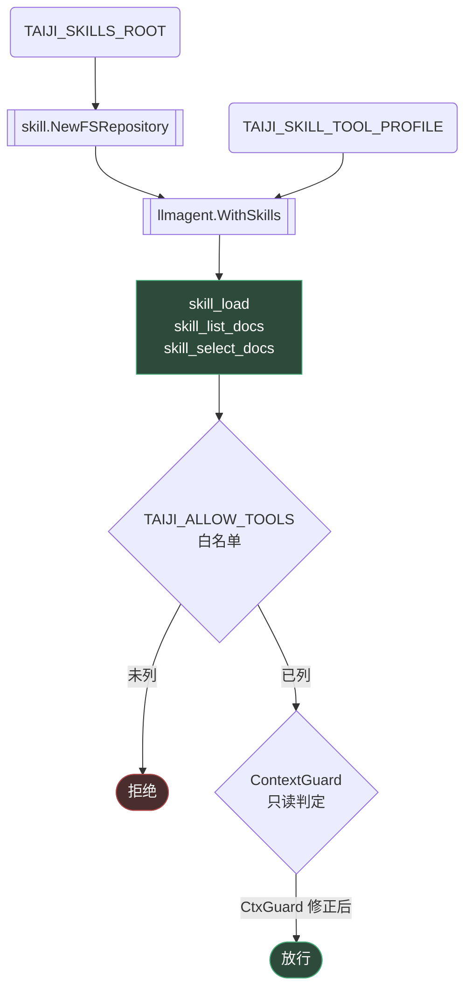

# 10 - Skill 支持设计

> 实现：2026-09-26 | 目标分支：main | 方案：全量复用上游（方案 A）
>
> 定位：本文档描述 TaiJi 如何支持 **skill**（可复用的方法论/能力包），
> 以及接入过程中发现并修复的三个真实缺陷。

---

## 1. 什么是 skill（上游约定）

skill 是一个目录，含一个 `SKILL.md`：YAML front matter（`name` / `description`）
+ Markdown 正文，可附带文档文件。缺 `name` 时回落到目录名。

```
skills/
└── demo/
    ├── SKILL.md          # name/description + 正文
    └── (可选) ref.md     # 附带文档
```

**与 MCP 工具、IM 命令的区别**：

| | 形态 | 复用的是什么 |
|---|---|---|
| MCP 工具 | 可调用的原子操作 | 一次动作 |
| IM 命令 | 固定逻辑（4 条） | 一条流程 |
| **skill** | 目录 + SKILL.md | **一段方法论/知识** |

---

## 2. 环境变量

| 变量 | 说明 | 默认 |
|---|---|---|
| `TAIJI_SKILLS_ROOT` | skill 仓库根目录，可多个（用路径分隔符） | 空 = 不启用 |
| `TAIJI_SKILL_TOOL_PROFILE` | 工具档位：`knowledge-only` / `full` | `knowledge-only` |
| `TAIJI_INSTRUCTION` | serve 路径的系统提示 | 空 |

三者都在 `internal/config/guard.go` 的 `ReservedKeys` 中——**工作区不能覆盖**
（工作区是 agent 可写区域，可覆盖即提权，与 `MODEL_ROUTE` 同一威胁模型）。

---

## 3. 架构



**两条独立闸门**：白名单（部署级，哪些工具本部署启用）+ ContextGuard
（上下文级，来源是否允许写）。skill 工具进 `ag.Tools()` ⇒ 两者都管。

---

## 4. 接入时发现并修复的三个缺陷

### 4.1 缺陷一：serve 无 Instruction 通道

**现象**：`chat.Options.Instruction` 的唯一消费点
（`internal/chat/execute.go:185`）在 CLI 有赋值（`cmd/taiji/main.go:172`，
`-instruction` flag），但 **serve 装配段完全没有该字段**——飞书场景下
模型拿到的是框架默认 instruction，用户无法施加任何引导。

**修法**：新增 `envInstruction()` + serve 装配传 `Instruction:`。
这是 skill 能否落地的前置（skill 的价值就是注入一段方法论）。

### 4.2 缺陷二：skill 读类工具被 ContextGuard 误判为写操作

**现象**（实测确认）：上游 v1.11.2 的 skill 工具**未实现
`tool.MetadataProvider`**（`grep -rln ToolMetadata` 对 `tool/skill/` 返回空），
故 `tool.MetadataOf` 返回零值 → `ReadOnly=false`。而
`internal/server/pipeline.go:290` 对 IM 来源注入 `authz.KindChannel`（非可写），
于是：

```
skill_load         被拒=true   ← "write tool in non-writable context"
skill_list_docs    被拒=true
skill_select_docs  被拒=true
```

**修法**（`internal/authz/context_guard.go`）：新增 `skillReadOnlyTools`
**精确名**修正名单。三者事实只读——`skill_load` 读 SKILL.md 进上下文、
`skill_list_docs` 列文档、`skill_select_docs` 只改会话内选择状态
（读 ctx，无外部副作用）。

> **为什么不用 `skill_` 前缀通配**：同家族的 `skill_run` / `skill_exec` /
> `skill_write_stdin` / `skill_poll_session` / `skill_kill_session` 是**真写操作**
> （执行代码）。通配会在切到 `SkillToolProfileFull` 时把它们一并放行——
> **开的洞比要修的问题更大**。测试 `TestContextGuard_SkillExecToolsStillDeniedInChannel`
> 与 `TestContextGuard_FakeSkillNameStillDenied` 锁死这点。

### 4.3 缺陷三：不传 profile 会引入代码执行工具

**现象**（实测确认）：

| 配置 | 注册的工具 |
|---|---|
| 不传 profile | (6) `workspace_exec` `workspace_write_stdin` `workspace_kill_session` + 三个读类 |
| `KnowledgeOnly` | (3) `skill_load` `skill_select_docs` `skill_list_docs` |
| `Full` | (11) 再加 `skill_run` `skill_exec` 等 |

**不传 profile 会带上 `workspace_exec`——能执行代码**。

**修法**：`skillToolProfile()` 默认返回 `KnowledgeOnly`（空串也如此），
不交给上游默认。测试 `TestSkillToolProfile_DefaultsToKnowledgeOnly` 锁死。

---

## 5. 白名单交互（必须显式放行）

skill 工具受 `TAIJI_ALLOW_TOOLS` 管辖（部署级「默认拒绝 + 白名单」）。
**配了 `TAIJI_SKILLS_ROOT` 但没放行工具 = 模型无法调用**。

启动期会打印明确提示：

```
[pipeline] 提示：skill 已启用（root=...），但以下 skill 工具未在
TAIJI_ALLOW_TOOLS 中放行，模型无法调用：[skill_load skill_list_docs
skill_select_docs]。若要使用，请把它们加入 TAIJI_ALLOW_TOOLS。
```

**为什么提示而非自动放行**：自动放行会破坏「默认拒绝」的安全基线——
新增工具（含上游将来加入的）会静默获得权限。

**推荐配置**：

```
TAIJI_SKILLS_ROOT=/opt/taiji/skills
TAIJI_ALLOW_TOOLS=skill_load,skill_list_docs,skill_select_docs
```

---

## 6. 验证

| 层 | 方式 | 结果 |
|---|---|---|
| 单元 | `internal/authz/skill_readonly_test.go`（11 例） | 全绿 |
| 单元 | `internal/chat/skill_profile_test.go`（4 例） | 全绿 |
| 单元 | `cmd/taiji/skill_env_test.go`（4 例，含接线断言） | 全绿 |
| **端到端** | `internal/chat/skill_e2e_test.go` —— 真实 HTTP 请求捕获 | Instruction 到达模型 ✓ |
| 全量 | `go test ./... -count=1` | 10 包全绿，0 FAIL |
| 真实二进制 | `/tmp/taiji_skill.exe + /tmp/skills` | 提示与放行均正确 ✓ |

**反证**（证明测试非空转）：

1. 注释接线 → `TestBuildPipeline_WiresSkillAndInstruction` 4 条断言全红 ✓
2. 移除 `skillReadOnlyTools` 修正 → `TestContextGuard_SkillReadToolsAllowedInChannel` 3 条全红 ✓

---

## 7. 与设计文档的偏离（记录）

| 计划原文 | 实测结果 | 处理 |
|---|---|---|
| 「空串 → 上游默认 KnowledgeOnly，不含执行类」 | **错**：不传 profile 会带 `workspace_exec` 等执行类 | 改为显式返回 KnowledgeOnly（§4.3） |
| 「skill 工具未声明 ReadOnly」 | 对（确认），但原因不是「没写 ReadOnly 字段」，而是**未实现 MetadataProvider 接口** | 注释按实测修正 |

---

## 8. 未做的事（明确边界）

- **不实现执行类 skill**（`skill_run` / `workspace_exec`）：与「IM 来源只读」
  语义冲突，需先有沙箱设计。
- **不做按会话差异化**：`Instruction` 是 agent 装配期字段，`Executor` 是长驻单例。
  按会话差异化需拆「共享 session service + per-session agent」，改动显著，等真实需求。
- **不做 skill 在线安装**：上游有 URL-based repository，v1 不用。
