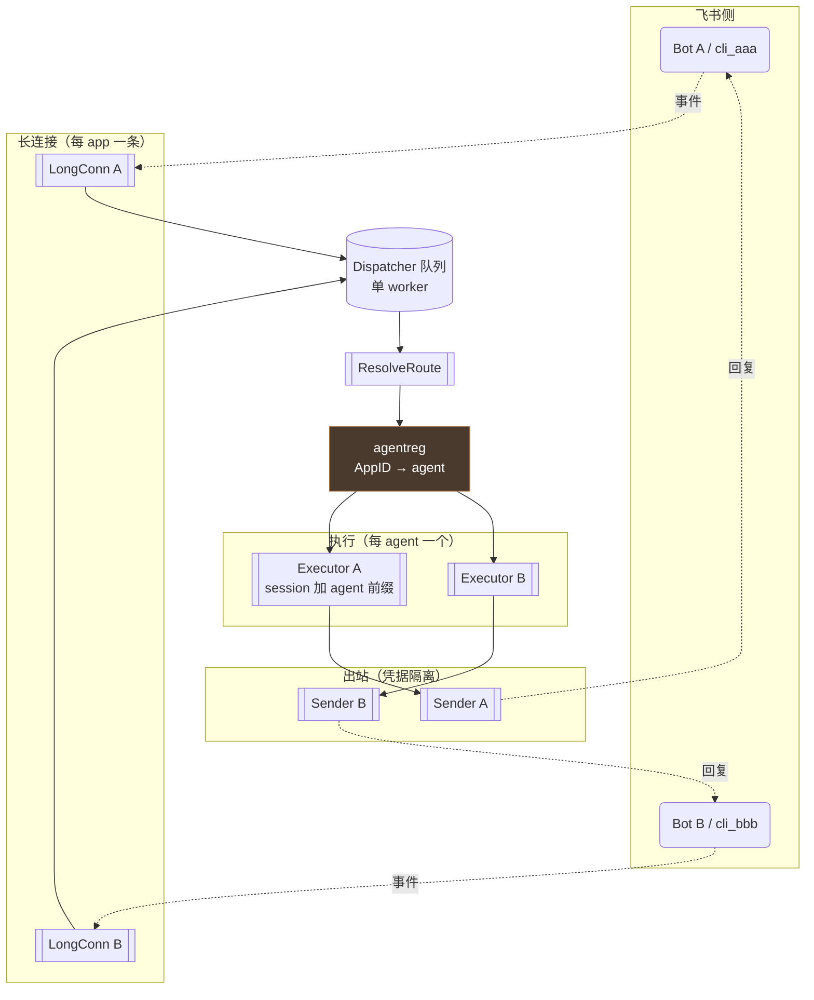

# 11 - 多 Agent 编排 + 每 Agent 绑定独立飞书应用

> 实现：2026-09-30 | 提交：`6d5fe89` | 形态：**C（Bot 即 agent）**
>
> 定位：描述 TaiJi 如何支持「多个 agent 各自绑定独立飞书应用（ak/sk）」，
> 以及执行中发现的三个真实缺口。

---

## 1. 配置

```bash
TAIJI_AGENTS="name=billing,app_id=cli_aaa,app_secret=s1;name=ops,app_id=cli_bbb,app_secret=s2"
```

分号分隔 agent，逗号分隔字段（`name` / `app_id` / `app_secret`，三者必填）。

**未配置时**回退单 agent（读 `FEISHU_APP_ID` / `FEISHU_APP_SECRET`）——
既有部署零改动。

**错误即 fail-fast 且指名**：
```
taiji serve: TAIJI_AGENTS 配置错误：agent "billing" 缺少 app_secret
```

校验项：字段缺失、agent 重名、跨 agent 的 `app_id` 重复（会导致分流歧义）。

---

## 2. 架构



**分流键**是事件头的 `Header.AppID`（SDK 每条事件都带，无需人工映射表）。

---

## 3. 执行中发现并修复的三个缺口

### 3.1 消息契约丢弃应用身份（核心）

`TaiJi/internal/channel/feishu/longconn.go:188` 的
`incomingFromLongConnEvent` 只读 `ev.Event.*`，**完全不读**
`ev.EventV2Base.Header.AppID`——尽管 SDK 提供该字段。

依据（依赖源码 `service/im/v1/model.go:15219-15223`）：

```go
type P2MessageReceiveV1 struct {
	*larkevent.EventV2Base        // ← 嵌入指针，含 Header.AppID
	*larkevent.EventReq
	Event *P2MessageReceiveV1Data
}
```

**是嵌入「指针」**，故读取必须两层判空（`EventV2Base != nil && Header != nil`）。
修法：`IncomingMessage` 新增 `AppID`，回调透传。

### 3.2 Pipeline 新增 Config 字段漏赋值（测试发现）

在 `Config` 加 `Agents`/`Executors`/`Senders` 后，`New()` 的 struct literal
**忘了赋值**——分流静默不生效（所有消息落到 default agent）。
纯静态审查看不出来，是分流测试抓到的（`default=1` 而非 `alpha=1`）。

### 3.3 session 隔离测试首版是空转的（反证发现）

首版隔离测试用两个独立 `Executor`——各有独立 inmemory session service，
**物理隔离掩盖了逻辑隔离**：去掉 agent 前缀反证时测试**没变红**。

修法：测试改用**共享** session service（`runner.WithSessionService` +
`inmemory.NewSessionService()`），这才让前缀成为必需。改后反证成功变红，
证据极清晰：

```
alpha 的请求里出现了 beta 的内容：
[alpha-第一句, ok, beta-第一句, ok, alpha-第二句]
```

---

## 4. 与计划的偏差

| 计划原文 | 实际做法 | 理由 |
|---|---|---|
| `Executor` 持多 assembly | **每 agent 一个 Executor** + session 键加前缀 | 分流已在 pipeline 完成；让 Executor 持多 assembly 会把「装配」与「选择」职责混在一起 |
| `credentialEnvKeys` 加新键 | **不改** | 该切片是「feishu 包读取的凭据键」，有双向一致性测试锁着（`config.go` 顶部注释）；`TAIJI_AGENTS` 由 `cmd/taiji` 读取，加进去会破坏测试 |

---

## 5. 验证

| 层 | 内容 | 结果 |
|---|---|---|
| 单元 | agentreg 6 + 分流 6 + 解析 10 + 隔离 3 + AppID 4 | 全绿 |
| 反证 | appID 恒空 / 移除 ReservedKey / 不做作用域化 / 分流恒空 | **4 次全部变红** |
| 全量 | `go test ./... -count=1` | **11 包 ok，0 FAIL** |
| 端到端 | 真实二进制 3 场景 | 见下 |

```
多 agent → 「多 agent 模式：[billing ops]」+「长连接已装配 2 条」
配置错误 → 「agent "billing" 缺少 app_secret」
向后兼容 → 未配时「长连接已启动（1 条）」，行为不变
```

---

## 6. 未做的事（明确边界）

- **`TAIJI_FEISHU_BOT_OPEN_ID` 未按 agent 拆分**：门禁用它判定群聊 @
  （`TaiJi/cmd/taiji/main.go:667`、`TaiJi/internal/channel/gate.go:97-104`）。
  多 bot 下每个 bot 的 open_id 不同，该配置需按 agent 拆分。
- **多 wsClient 长时稳定性未压测**：仅经真实二进制冒烟（2 条连接建立成功）。
- **agent 间协同未实现**：形态 C 是「消息找 agent」，不是「agent 之间协作」。
  若需协作，可在单个 agent 内部嵌上游 `team` 包（`team.New` / `team.NewSwarm`）。
- **RBAC 未加 agent 维度**：当前同一用户在所有 agent 权限相同。
  若需区分，按 `AccessRequest.Resource` 的同构方式加 `Agent` 字段。
