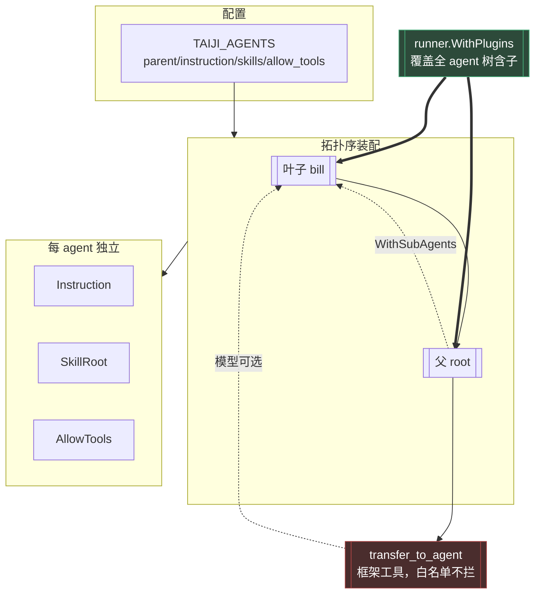

# 12 - Agent 隔离深化：父子关系 / 提示词 / Skill / MCP / 权限

> 实现：2026-10-01 | 提交：`343a668`（W1-2）、`12e103f`（W3）、`a56c76d`（W4-5）
> 承接：`docs/11-多agent与多飞书应用.md`（形态 C）

---

## 1. 配置

`TAIJI_AGENTS` 在既有三字段（`name`/`app_id`/`app_secret`）之外，
新增 4 个**可选**字段：

```
TAIJI_AGENTS="name=root,app_id=cli_r,app_secret=s1,instruction=你是调度者;\
name=bill,app_id=cli_b,app_secret=s2,parent=root,instruction=你是账单助手,skills=/tmp/skills,allow_tools=mcp_x_ping|mcp_x_echo"
```

| 字段 | 作用 | 缺省行为 |
|---|---|---|
| `parent=<name>` | 父子关系 | 顶层 agent |
| `instruction=<text>` | 该 agent 的系统提示 | 用 `TAIJI_INSTRUCTION` |
| `skills=<path>` | skill 仓库根 | 用 `TAIJI_SKILLS_ROOT` |
| `allow_tools=<a\|b>` | MCP 工具白名单 | 用 `TAIJI_ALLOW_TOOLS` |

**取值优先级**：spec 字段 > 全局环境变量（保证未配的 agent 行为不变）。

**`allow_tools` 用 `|` 分隔**而非逗号——逗号已是字段分隔符。

**fail-fast 校验**：字段缺失、agent 重名、`app_id` 重复、
**父不存在**、**父子成环（含自环）**。

---

## 2. 架构



---

## 3. 权限隔离（N5）

### 3.1 权限点语法

| 形态 | 语义 |
|---|---|
| `mockmcp_echo` / `srv_*` / `*` | **全局**，对所有 agent 生效 |
| `agent:{name}:{toolPattern}` | 仅当执行 agent == `name` 时生效 |

**裸模式必须全局**：否则任何部署一旦启用多 agent，现有配置会
**静默失去全部权限**——比缺功能严重得多。有测试锁死。

单 agent 部署（`Agent` 为空）时 agent 限定**不生效**（无 agent 可判，
fail-closed）；形态非法（`agent:ops` 缺第三段）同样不匹配。

### 3.2 传输路径

`pipeline.Handle` 分流后 `authz.WithAgent(runCtx, agent)` →
权限插件 `beforeTool` 里 `AgentFrom(ctx)` 填 `AccessRequest.Agent`。

**为什么走 ctx**：权限判定发生在插件回调内，拿不到调用方参数——
与 `Principal`/`Resource` 同路径。

---

## 4. 关键安全不变量（务必保持）

**权限守卫必须走 `runner.WithPlugins`，不得改用 `llmagent.WithExtensions`。**

依据（外部依赖 `trpc-agent-go` 的 `agent/llmagent/option.go` 注释）：

> Extensions installed here are scoped to this LLMAgent only. They do NOT
> propagate to sub-agents... use `plugin.Plugin` via `runner.WithPlugins`
> for cross-cutting concerns that must observe **every agent on a runner**.

**为什么这是安全问题**：`transfer_to_agent` 是「框架工具」——
即使用户把它写进白名单也会被跳过（外部依赖
`agent/extension/toolpipe/wrapped_tool.go` 注释：「skipped even if
explicitly in the allowlist」）。所以**白名单挡不住 agent 间转移**，
权限必须落在转移之后的目标 agent 上——而只有 `runner.WithPlugins`
能覆盖到子 agent。改用 `WithExtensions` 会让子 agent **失去权限检查**。

已用源码级断言测试锁住（`internal/chat/permission_wiring_invariant_test.go`）。

---

## 5. 验证

| 层 | 内容 | 结果 |
|---|---|---|
| Wave 1 | agent 名生效（3 测试 + 反证） | 全绿 |
| Wave 2 | 配置解析（9 测试，含缺父/成环/自环 fail-fast） | 全绿 |
| Wave 3 | 权限 agent 维度（9 测试 + 反证） | 全绿 |
| Wave 4 | 父子装配（3 测试） | 全绿 |
| Wave 5 | 安全不变量（1 测试 + 反证） | 全绿 |
| 全量 | `go test ./... -count=1` | **11 包 ok，0 FAIL** |

**端到端探针证据**（真实 `buildAgents` 装配）：

```
注册表 agent: [bill root]                                    ← 拓扑序
root.AgentName = "root" / bill.AgentName = "bill"
✓ root.FindSubAgent(bill) 找到
root 工具面 = [transfer_to_agent]                            ← 父有 transfer
bill 工具面 = [skill_list_docs skill_load skill_select_docs]  ← 子有 skill
```

**对照即证据**：父未配 `skills=` 故无 skill 工具、子配了故有
——skill 隔离实证成立；父有 `transfer_to_agent`、子无——父子实证成立。

---

## 6. 未做的事

- `TAIJI_FEISHU_BOT_OPEN_ID` 多 bot 下未按 agent 拆分（门禁判群聊 @ 需要）。
- 多 wsClient 长时稳定性未压测。
- MCP 的「连都不连」隔离：当前**共享 toolSet 实例 + 白名单**控制可见工具；
  若需彻底不连，需每 agent 各建一套（连接数乘 agent 数）。
- agent 间协同（形态 C 不含）：若需「协调者自动分派」，可评估上游 `team` 包。

---

## 7. 真实多 agent 同群：暴露的三个缺陷与修复

2026-10-02 的真实运行（两个 agent 在同一飞书群）暴露了三个问题。
以下是日志证据与修复。

### 7.1 门禁的 bot open_id 是全局单值（阻塞性）

**现象**：`@Infraverse助理`（第二个 bot）无响应。

```
[pipeline] server: 分流 message_id=om_xxx app_id=cli_aa0110cf25f41be2 agent=root
[pipeline] server: gate rejected message_id=om_yyy reason=not_mentioned
```

**为什么这行日志是决定性证据**：门禁在 `pipeline.Handle` 的**第 1 步**
（`internal/server/pipeline.go:315`），拒绝即返回，走不到后面的路由与分流。
所以出现 `gate rejected` 说明门禁确实收到了消息，只是用了错误的 open_id
比对——`TAIJI_FEISHU_BOT_OPEN_ID` 是**单个全局值**，而每个 bot 的 open_id 不同。

**"not_mentioned" 是一个误导性的诊断**：用户明明 @ 了，日志却说「未提及」。
两个 bot 同时在线时，这个名字会把排查引向「用户没 @」而不是「配置错了」。

**修复**（`internal/channel/gate.go`）：

- `GateInput` 新增 `AppID`（接收该消息的应用）与 `BotOpenIDs`（AppID → open_id 映射）
- `resolveBotOpenID()` 统一解析：
  - 映射非 nil → 按 `AppID` 查表；**未命中或空值即 fail-closed**
    （不回落全局值——否则未注册的 bot 能借用别人的身份通过门禁）
  - 映射为 nil → 用全局 `BotOpenID`（单 agent 部署行为不变）
- **不改门禁在 `Handle` 中的位置**：`AppID` 取自消息自身，不依赖分流结果，
  故「门禁先于一切」的安全语义（`gate.go:72`「顺序即语义」）保持不变

### 7.2 open_id 由启动时自动获取，不需要手填

**为什么不让人手填**：open_id 是**应用维度**的，多 agent 下有几个 bot 就有几个值。
手填既易错（复制粘贴串号），又在换应用时要求同步改配置——而启动时本来就要
用凭据换 token，顺带取一次的成本近乎零。

**实现**（`internal/channel/feishu/botinfo.go`）：

- 调 `/open-apis/bot/v3/info`（该端点未被 SDK 生成，走 `client.Get` 原生请求）
- 启动时按各 agent 凭据逐个获取，构造 `AppID → open_id` 映射
- **失败即中止启动**并点名是哪个 agent——取不到 open_id 的 bot 会被门禁
  fail-closed 拒掉所有群消息（表现为「bot 活着但永远不响应」），
  静默继续比启动失败难排查得多

### 7.3 启动日志明文打印 app_secret（凭据泄露）

**现象**：启动日志第一段直接打出完整凭据。

```
生效的控制值（来自受信启动环境）:
  TAIJI_AGENTS=name=root,app_id=cli_xxx,app_secret=xcnabOIOaSY5...（明文）
```

**根因**（`cmd/taiji/main.go` 的 `printControlValues`）：原样打印所有控制值。
而 `TAIJI_AGENTS` 是保留键（`internal/config/guard.go:32`），其值内嵌每个
agent 的 `app_secret`。

**为什么是脱敏而不是不打印**：打印控制值是 #1 的 demo path 证据面
（证明工作区文件覆盖不了保留键），且 `name`/`app_id`/`parent` 正是排障最需要的。

**修复**（`cmd/taiji/redact.go`），两层：

1. **键名级**：复用 `config.IsCredentialKey`（权威声明）+ 词表兜底。
   这层覆盖 `TAIJI_MCP_HEADERS_*` —— 键名不含敏感词，但由
   `ReservedPrefixes` 声明为凭据。
2. **字段级**：值内部含敏感字段（`app_secret=xxx`）或 URL userinfo
   （`https://user:pw@host`）→ 只脱敏该部分。
   `TAIJI_AGENTS` 的键名不含敏感词，只做第 1 层会漏掉它。

**URL 特例**：保留 scheme 与 host（排障要看连的是哪台机器），
只抹 userinfo——整条变 `***` 会让 base URL 配错时无法从日志发现。

### 7.4 多 agent 部署不再要求全局飞书凭据

**现象**：`TAIJI_AGENTS` 里每个 agent 都有凭据，却报
`feishu: outbound requires FEISHU_APP_ID and FEISHU_APP_SECRET`。

**根因**：`buildPipeline` 无条件构造全局 sender，而多 agent 的真正出站在
`buildAgents` 里按 agent 各建一个——这个全局 sender **不会被用到**，
但它在前面先失败了。

**修复**：多 agent 时用**第一个 agent 的凭据**构造它。语义自洽
（不是凭空要求用户再配一套用不上的全局凭据），且 `server.New` 的
非 nil 校验仍然满足。

### 7.5 验证

| 项 | 证据 |
|---|---|
| 门禁 per-agent | 6 个新测试全绿；**反证**改回全局单值 → `reason="not_mentioned"`，与生产日志逐字一致 |
| open_id 自动获取 | 6 个测试（真实 SDK + httptest 假端点，走通 token 换取与响应解析） |
| 脱敏 | 6 个测试（含走完整打印链的 `printControlValuesTo`）；**反证**改回原样打印 → 明文泄露被抓 |
| 全量 | `go test ./... -count=1` → 11 包 ok / 0 FAIL |
| 端到端 | 启动日志显示 `app_secret=***` 且保留 name/app_id；多 agent 无全局凭据可推进到连接阶段 |

### 7.6 上一轮判断的修正

我曾把「多个 bot 共用全局 Deduper 会误伤消息」列为**严重**问题。
本次真实日志**不支持**该判断：

- 两条消息各有独立的 `message_id`（`om_x100b64dbd55a84a4` / `om_x100b64dbd155a4a4`）
- 日志中**没有**任何 `duplicate message ignored`

**修正**：飞书给每个 bot 的投递有独立 message_id，用去重键误伤不成立。
门禁才是唯一阻塞点。
（**保留错误记录**：这是「需实测定性」的推测被实测推翻，不是当初就该知道的事。）

---

## 8. 身份键：open_id 是应用维度的（实测推翻假设）

### 8.1 现象

双 agent 同群，同一用户 @ 两个 bot，被当成**两个人**：

```
[perm] denied:  not permitted (principal=default:feishu:992b6d40 tool=...)
[perm] allowed:                principal=default:feishu:a701f26e tool=...
```

`Principal.Redacted()` 的形态是 `{workspace}:{platform}:{sha256(identity)[:8]}`
——**摘要不同 ⇒ 身份键不同**。而启动日志显示 `RBAC（2 个角色 / 1 个用户）`：
只绑了一个用户，所以只有一个 bot 能用。

### 8.2 根因：open_id 是 app-scoped

`docs/01-需求文档.md:946` 早已把这条列为**未实测的假设**：

> 飞书 `open_id` 的**稳定性**——跨应用/跨版本是否一致，未实测；
> 这直接影响能否直接用它当主体 ID。

本次实测把它测了。探针输出（两个 bot 各收一条同用户消息）：

```
app_id=cli_aa0110cf25f41be2  open_id=2fab4154  union_id=fbc51fde
app_id=cli_aa126d218d789d05  open_id=c7b7e562  union_id=fbc51fde  ← 相同
```

**结论**：open_id 跨应用**不一致**（每个应用各一套）；union_id **一致**。

```
[perm] denied:  principal=default:feishu:992b6d40   ← bill 应用
[perm] allowed: principal=default:feishu:a701f26e   ← root 应用
```

同一个人、两个摘要——这就是 RBAC 只在一个 bot 上生效的原因。

### 8.3 修复：身份键按语义分流

**关键约束：union_id 不能无差别替换 open_id。** 两者用途不同：

| 用途 | 用哪个 | 依据 |
|---|---|---|
| 权限 / owner 判定 | **union_id**（`IdentityID()`） | 需跨应用稳定 |
| 出站投递（私聊） | open_id（`UserID`） | 飞书发消息 API 只认 open_id |
| 会话隔离键 | open_id | 每 agent 独立 session 是设计要求 |

实现：

- `IncomingMessage` 新增 `UnionID` 与 `IdentitySource`
- `IdentityID()` 返回 `union_id`，缺失时回退 `open_id`（并标记来源）
- 三处判定点改用 `IdentityID()`：门禁 owner 判定、`ResolvePrincipal`、
  命令的 owner 检查
- **`receiverOf` 保持用 `UserID`**（出站必须 open_id）

**回退而非拒绝**：union_id 的可得性取决于应用的通讯录权限。
缺它时拒绝消息会让整个 bot 不可用，而回退只是「身份键不跨应用」——
功能可用，代价由 `IdentitySource` 暴露给用户。

### 8.4 新增 `/whoami` 命令

权限配置要求把主体 ID 写进 `TAIJI_RBAC` / `TAIJI_FEISHU_OWNERS`，
但该 ID 由平台元数据 + 渠道前缀拼成，**用户无从推导**；
而日志里是脱敏摘要，不是可配置的原值。没有自查手段时只能盲猜。

```
> /whoami
你的身份：
  主体 ID：default:feishu:fbc51fde
  配置位置：TAIJI_RBAC 的 user:<上面这串>=<角色名>
  Agent：bill
  身份键来源：union_id（跨应用稳定）
    同一个你在所有 bot 下都是上面这个 ID——配置一次即可。
  平台 open_id：ou_2fab4154（本应用下）
```

输出的 ID 与实际判定用的值**同源**（都是 `Principal.ID`），
避免写出看起来对、实际不匹配的配置。

### 8.5 验证

| 项 | 证据 |
|---|---|
| 身份键跨应用一致 | 4 个新测试；**反证**忽略 union_id → `UnionIDIsStableAcrossApps` 变红 |
| /whoami | 6 个测试（含「无身份不编造」的负向断言） |
| 全量 | `go test ./... -count=1` → 11 包 ok / 0 FAIL |
| 实测 | 探针输出（见 8.2），两个 bot 的 union_id 摘要一致 |

### 8.6 迁移提示

`TAIJI_FEISHU_OWNERS` 与 `TAIJI_RBAC` 里的用户键**需要用 union_id 重填**。
旧的 open_id 值现在不再匹配——但**不会静默失效**：发 `/whoami`
即可拿到当前生效的 ID。多 agent 部署下，用 open_id 填的配置
需要在每个应用各写一条（/whoami 会提示这一点）。
