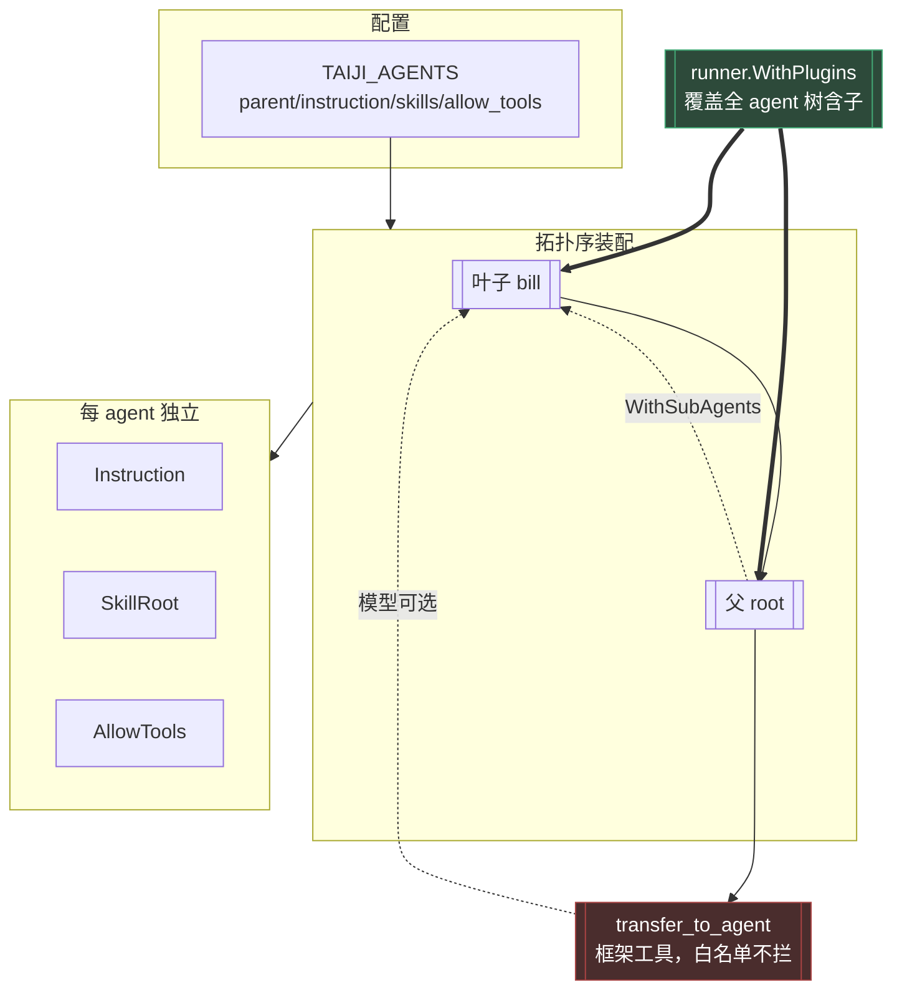

# 12 - Agent 隔离深化：父子关系 / 提示词 / Skill / MCP / 权限

> 实现：2026-10-01 | 提交：`343a668`（W1-2）、`12e103f`（W3）、`a56c76d`（W4-5）
> 承接：`docs/11-多agent与多飞书应用.md`（形态 C）

---

## 1. 配置

`TAIJI_AGENTS` 在既有三字段（`name`/`app_id`/`app_secret`）之外，
新增 4 个**可选**字段：

```
TAIJI_AGENTS="name=root,app_id=cli_r,app_secret=s1,instruction=你是调度者;\
name=bill,app_id=cli_b,app_secret=s2,parent=root,instruction=你是账单助手,skills=/tmp/skills,allow_tools=mcp_x_ping|mcp_x_echo"
```

| 字段 | 作用 | 缺省行为 |
|---|---|---|
| `parent=<name>` | 父子关系 | 顶层 agent |
| `instruction=<text>` | 该 agent 的系统提示 | 用 `TAIJI_INSTRUCTION` |
| `skills=<path>` | skill 仓库根 | 用 `TAIJI_SKILLS_ROOT` |
| `allow_tools=<a\|b>` | MCP 工具白名单 | 用 `TAIJI_ALLOW_TOOLS` |

**取值优先级**：spec 字段 > 全局环境变量（保证未配的 agent 行为不变）。

**`allow_tools` 用 `|` 分隔**而非逗号——逗号已是字段分隔符。

**fail-fast 校验**：字段缺失、agent 重名、`app_id` 重复、
**父不存在**、**父子成环（含自环）**。

---

## 2. 架构



---

## 3. 权限隔离（N5）

### 3.1 权限点语法

| 形态 | 语义 |
|---|---|
| `mockmcp_echo` / `srv_*` / `*` | **全局**，对所有 agent 生效 |
| `agent:{name}:{toolPattern}` | 仅当执行 agent == `name` 时生效 |

**裸模式必须全局**：否则任何部署一旦启用多 agent，现有配置会
**静默失去全部权限**——比缺功能严重得多。有测试锁死。

单 agent 部署（`Agent` 为空）时 agent 限定**不生效**（无 agent 可判，
fail-closed）；形态非法（`agent:ops` 缺第三段）同样不匹配。

### 3.2 传输路径

`pipeline.Handle` 分流后 `authz.WithAgent(runCtx, agent)` →
权限插件 `beforeTool` 里 `AgentFrom(ctx)` 填 `AccessRequest.Agent`。

**为什么走 ctx**：权限判定发生在插件回调内，拿不到调用方参数——
与 `Principal`/`Resource` 同路径。

---

## 4. 关键安全不变量（务必保持）

**权限守卫必须走 `runner.WithPlugins`，不得改用 `llmagent.WithExtensions`。**

依据（外部依赖 `trpc-agent-go` 的 `agent/llmagent/option.go` 注释）：

> Extensions installed here are scoped to this LLMAgent only. They do NOT
> propagate to sub-agents... use `plugin.Plugin` via `runner.WithPlugins`
> for cross-cutting concerns that must observe **every agent on a runner**.

**为什么这是安全问题**：`transfer_to_agent` 是「框架工具」——
即使用户把它写进白名单也会被跳过（外部依赖
`agent/extension/toolpipe/wrapped_tool.go` 注释：「skipped even if
explicitly in the allowlist」）。所以**白名单挡不住 agent 间转移**，
权限必须落在转移之后的目标 agent 上——而只有 `runner.WithPlugins`
能覆盖到子 agent。改用 `WithExtensions` 会让子 agent **失去权限检查**。

已用源码级断言测试锁住（`internal/chat/permission_wiring_invariant_test.go`）。

---

## 5. 验证

| 层 | 内容 | 结果 |
|---|---|---|
| Wave 1 | agent 名生效（3 测试 + 反证） | 全绿 |
| Wave 2 | 配置解析（9 测试，含缺父/成环/自环 fail-fast） | 全绿 |
| Wave 3 | 权限 agent 维度（9 测试 + 反证） | 全绿 |
| Wave 4 | 父子装配（3 测试） | 全绿 |
| Wave 5 | 安全不变量（1 测试 + 反证） | 全绿 |
| 全量 | `go test ./... -count=1` | **11 包 ok，0 FAIL** |

**端到端探针证据**（真实 `buildAgents` 装配）：

```
注册表 agent: [bill root]                                    ← 拓扑序
root.AgentName = "root" / bill.AgentName = "bill"
✓ root.FindSubAgent(bill) 找到
root 工具面 = [transfer_to_agent]                            ← 父有 transfer
bill 工具面 = [skill_list_docs skill_load skill_select_docs]  ← 子有 skill
```

**对照即证据**：父未配 `skills=` 故无 skill 工具、子配了故有
——skill 隔离实证成立；父有 `transfer_to_agent`、子无——父子实证成立。

---

## 6. 未做的事

- `TAIJI_FEISHU_BOT_OPEN_ID` 多 bot 下未按 agent 拆分（门禁判群聊 @ 需要）。
- 多 wsClient 长时稳定性未压测。
- MCP 的「连都不连」隔离：当前**共享 toolSet 实例 + 白名单**控制可见工具；
  若需彻底不连，需每 agent 各建一套（连接数乘 agent 数）。
- agent 间协同（形态 C 不含）：若需「协调者自动分派」，可评估上游 `team` 包。
