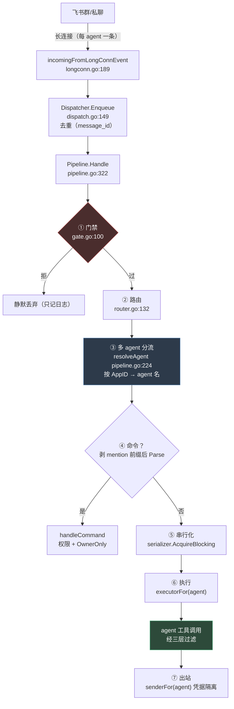
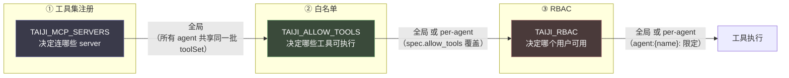

# 14 - 全局设计文档

> 生成于 2026-10-02，对应提交 `82daeee`。
>
> **本文档的性质**：不是设想，而是**现状的精确描述**——每条关键断言都
> 附 `file:line` 锚点，行号均已逐条读回核验（附录给出核验方法）。
>
> 配套文档：`13-环境变量清单.md`（配置面）、`12-agent隔离与父子关系.md`
> （多 agent 的实测故障与修复史）。

---

## 1. 总览：一次消息的完整链路



**三条贯穿全链路的不变量**：

1. **门禁最先、命令不绕过**（`pipeline.go:322` 的顺序即语义）
2. **凭据隔离**：出站必须用「接收该消息的 agent」的凭据（`senderFor`，`pipeline.go:256`）
3. **fail-closed**：任一环节拿不到判定依据时拒绝，不静默放行

---

## 2. 权限配置

### 2.1 唯一的配置入口：`TAIJI_RBAC`

```
TAIJI_RBAC="role:viewer=cmd:help,cmd:status;\
role:operator=cmd:clear,cmd:stop,infraverse_*;\
parent:operator=viewer;\
user:default:feishu:on_2fb858167...=operator"
```

四种条目（`cmd/taiji/main.go:1220` 的 `envRBAC`）：

| 前缀 | 含义 | 例 |
|---|---|---|
| `role:` | 角色 → 权限点列表 | `role:operator=cmd:clear,tool_a` |
| `parent:` | 角色 → 父角色（继承） | `parent:operator=viewer` |
| `user:` | **主体 ID** → 角色列表 | `user:default:feishu:on_xxx=operator` |

**配置校验 fail-fast**（`internal/authz/rbac.go` 的 `Validate`）：
引用未定义的角色即拒绝启动。理由——否则该用户权限为空、所有调用被拒，
而启动无提示（「配了却不生效」是最难排查的静默失效）。

### 2.2 主体 ID 从哪来：`/whoami`

配置里要写的 `user:<主体ID>` 无法自行推导（由平台元数据 + 渠道前缀拼成）。
在飞书里发 `/whoami` 即得，输出**与实际判定同源**（都是 `Principal.ID`）：

```
主体 ID：default:feishu:on_2fb858167bfd7627928743231966355
配置位置：TAIJI_RBAC 的 user:<上面这串>=<角色名>
身份键来源：union_id（跨应用稳定）
```

`/whoami` **无需权限**（`NoPermission` 标记）——它的用途正是「查出该配什么
权限」，若也要求权限就形成死锁。准入条件与正交性约束见
`internal/channel/cmd/registry.go` 的 `Command.NoPermission` 注释。

### 2.3 主体 ID 的构成与跨应用问题

`Principal.ID` 形态：`{workspace}:{platform}:{identityKey}`
（`internal/authz/principal.go:103` 的 `ResolvePrincipal`）。

**`identityKey` 优先取 `union_id`，缺失回退 `open_id`**
（`internal/channel/inbound.go` 的 `IdentityID()`）。原因是实测确定的：
**`open_id` 是应用维度的**——同一用户在不同飞书应用下值不同，
用它作身份键会导致「多 bot 部署下 RBAC 只在一个 bot 生效」。

> 这条曾是 `docs/01-需求文档.md:946` 列出的**未实测假设**，
> 2026-10-02 实测确认：两个 bot 的 `open_id` 不同、`union_id` 相同。
> 完整证据链见 `docs/12-agent隔离与父子关系.md` §8。

---

## 3. 权限生效范围

**这是最容易误解的一节**。权限点有两种形态，范围不同
（`internal/authz/permission.go:176` 的 `matchPatternForAgent`）：

| 权限点形态 | 生效范围 | 例 |
|---|---|---|
| **裸模式** | **全局**——对所有 agent 生效 | `mockmcp_echo` / `infraverse_*` / `*` |
| **agent 限定** | 仅当执行 agent 名匹配时生效 | `agent:bill:infraverse_*` |

**为什么裸模式必须是全局**（代码注释明写）：若裸模式只在「单 agent 部署」
生效，那么任何部署一旦启用多 agent，**现有配置会静默失去全部权限**——
比缺功能严重得多。

**agent 限定的 fail-closed 边界**：

- 单 agent 部署（`requestAgent == ""`）时 agent 限定**不生效**
  （没有 agent 可判，放行会让限定形同虚设）
- 形态非法（`agent:ops` 缺第三段、`agent::x` 空名）一律不匹配

### 3.1 权限在哪些点被判定

| 判定点 | 代码位置 | 控制什么 |
|---|---|---|
| 工具调用 | `internal/authz/permission_plugin.go:71` | 工具能否执行 |
| 命令 | `internal/server/pipeline.go:710` 的 `commandAllowed` | `/xxx` 能否执行 |

两处**同源**（都用 `msg.IdentityID()` 构造 Principal）——否则会出现
「工具能用但命令不能用」这类不一致。

### 3.2 与「白名单」的分工（两个正交的门）

| | `TAIJI_ALLOW_TOOLS`（白名单） | `TAIJI_RBAC`（权限） |
|---|---|---|
| 管控对象 | **工具**（部署内哪些启用） | **用户**（谁能用哪些） |
| 未命中结果 | 工具不可执行 | 拒绝该用户的该动作 |
| 关系 | **都要过**——白名单放行了但用户没权限，仍被拒 | 同上 |

---

## 4. 单 agent 对接 IM 渠道

**最小配置**（`docs/13-环境变量清单.md` §0）：

```
TAIJI_MODEL_NAME / TAIJI_MODEL_API_KEY / TAIJI_MODEL_BASE_URL
FEISHU_APP_ID / FEISHU_APP_SECRET
TAIJI_FEISHU_BOT_OPEN_ID       # 群聊 @ 判定基准（必填）
```

**装配路径**：`buildPipeline`（`cmd/taiji/main.go:415`）在
`parseAgents` 只解析出 1 个 spec 时，`buildAgents` 返回 nil
（`cmd/taiji/main.go:1005` 的 `len(specs) <= 1` 分支），
管道走单值 `executor`/`sender`。

**关键行为**：

- `resolveAgent` 在 `p.agents == nil` 时返回空串
  （`internal/server/pipeline.go:224`）
- `executorFor("")` / `senderFor("")` 回退到单值
  （`pipeline.go:256` 等）——**故单 agent 行为与引入多 agent 之前完全一致**

---

## 5. 多 agent 对接 IM 渠道

**形态 C：Bot 即 agent**——每个 agent 绑定一个飞书应用，
入站按**事件头的 `Header.AppID`** 分流。

```
TAIJI_AGENTS="name=root,app_id=cli_aaa,app_secret=s1,instruction=你是调度者;\
name=bill,app_id=cli_bbb,app_secret=s2,parent=root,instruction=你是账单助手"
```

每 agent 的可选隔离字段（`cmd/taiji/agents.go:41` 起的 `agentSpec`）：

| 字段 | 作用 | 缺省回退 |
|---|---|---|
| `parent=` | 父子关系（父可 `transfer_to_agent` 到子） | 顶层 |
| `instruction=` | 该 agent 的系统提示 | `TAIJI_INSTRUCTION` |
| `skills=` | skill 仓库根 | `TAIJI_SKILLS_ROOT` |
| `allow_tools=` | MCP 工具白名单（**`\|` 分隔**） | `TAIJI_ALLOW_TOOLS` |

优先级 **spec 字段 > 全局环境变量**（`cmd/taiji/main.go:1129-1131`）。

**启动期校验 fail-fast**：字段缺失、agent 重名、`app_id` 重复、
**父不存在**、**父子成环**（含自环）。

**自动获取 open_id**：多 agent 时启动会按各 agent 凭据逐个调
`/open-apis/bot/v3/info` 取 `open_id`，构造 `AppID → open_id` 映射供门禁使用
（`internal/channel/feishu/botinfo.go`）。失败即中止启动并点名 agent。

### 5.1 隔离的落点

| 维度 | 隔离手段 | 代码位置 |
|---|---|---|
| **会话历史** | session 键加 agent 前缀 | `internal/chat/execute.go:90` `scopedSessionID` |
| **出站凭据** | 每 agent 一个 sender | `internal/server/pipeline.go:256` `senderFor` |
| **工具面** | 每 agent 一个 Executor（各自 `AllowTools`） | `internal/chat/execute.go:323` `newToolPolicy` |
| **权限** | `agent:{name}:` 权限点 | `internal/authz/permission.go:176` |

### 5.2 一条必须保持的安全不变量

**权限守卫必须走 `runner.WithPlugins`，不得改用 `llmagent.WithExtensions`。**

依据（上游 SDK 注释）：`Extensions` **不传播到子 agent**；而
`transfer_to_agent` 是框架工具（即使用户把它写进白名单也会被跳过）。
故白名单挡不住 agent 间转移——权限必须落在转移后的目标 agent 上，
只有 `runner.WithPlugins` 能覆盖子 agent。

有源码级断言测试锁住：`internal/chat/permission_wiring_invariant_test.go`。

---

## 6. MCP 工具配置

### 6.1 配置

```
TAIJI_MCP_SERVERS="srv=./srv.exe;remote=https://host/sse"
TAIJI_MCP_HEADERS_REMOTE="Authorization:Bearer xxx"    # 前缀型，按 server 名
TAIJI_ALLOW_TOOLS="srv_echo,remote_query"              # 模型可见名
```

| 变量 | 读取点 |
|---|---|
| `TAIJI_MCP_SERVERS` | `cmd/taiji/main.go:814` |
| `TAIJI_MCP_HEADERS_<SERVER>` | `cmd/taiji/main.go:215`（`mcpHeadersPrefix`） |
| `TAIJI_ALLOW_TOOLS` | `cmd/taiji/main.go:836`（`envAllowTools`） |

### 6.2 工具名的**模型可见名**（最容易写错处）

挂载 MCP server 后，上游 `llmagent` 会用 `NamedToolSet` 包装，
工具名变成 **`{toolSetName}_{originalName}`**
（`internal/chat/execute.go:283` 的注释，引上游 `tool/toolset.go:251`）。

故白名单必须写 `srv_echo` 而非 `echo`。**装配期校验**：白名单里的名字
必须在 agent 暴露的工具名中存在，否则报错并打印「实际可用的工具名」
（`internal/authz/toolpolicy.go:55` `BuildToolPolicy` 的 `validateAllowList`）。

---

## 7. MCP 工具生效范围

**三层过滤，范围各不相同**——这是本文档最需要看清的一节：



| 层 | 范围 | 依据 |
|---|---|---|
| **① 工具集注册** | **全局**——多 agent 共享同一批 `toolSet`（不按 agent 各建连接，避免连接数乘 agent 数） | `cmd/taiji/main.go:1005` `buildAgents` 接收同一 `toolSets` |
| **② 白名单** | 全局 **或 per-agent**——`spec.allow_tools` 非空则覆盖全局 | `cmd/taiji/main.go:1129-1131`；每 agent 各建策略插件 `internal/chat/execute.go:323` |
| **③ RBAC** | 全局（裸模式）**或 per-agent**（`agent:{name}:`） | `internal/authz/permission.go:176` |

**注意**：`internal/chat/chat.go` 的 `AllowTools` 注释说它是「**部署级**策略」
——这描述的是**最常见情形**，不覆盖 `spec.allow_tools` 的 per-agent 覆盖。
以 `buildOne` 的实现为准。

**默认拒绝**：白名单为空 ⇒ 所有工具不可执行
（`internal/authz/toolpolicy.go:55` 用 `approval.ToolPolicyDenied` 作默认）。

---

## 8. Skill 配置

| 变量 | 读取点 | 说明 |
|---|---|---|
| `TAIJI_SKILLS_ROOT` | `cmd/taiji/main.go:1189` | skill 仓库根目录。多 agent 可用 `skills=` 覆盖 |
| `TAIJI_SKILL_TOOL_PROFILE` | `cmd/taiji/main.go:1199` | 工具档位。**缺省 `KnowledgeOnly`** |

**为什么默认 `KnowledgeOnly` 而非 `Full`**（`internal/chat/chat.go` 的注释）：
`Full` 会注册 `skill_run` / `skill_exec` 等**代码执行类**工具，与
「serve 面向 IM 用户 + IM 来源只读」的定位冲突。故默认取最小权限档。

档位对应的工具集（`internal/chat/execute.go` 注释）：

| Profile | 注册的工具 |
|---|---|
| `KnowledgeOnly`（默认） | `skill_load` / `skill_select_docs` / `skill_list_docs` |
| （其它档位） | 含代码执行类，需显式配置 |

---

## 9. Skill 生效范围

**注意：skill 工具的「生效」有两道独立的门**，作用不同：

### 门一：ContextGuard（只读判定）

serve 面向 IM 来源时把上下文降权为**只读**
（`internal/authz/context_guard.go`）。写类工具在此上下文中被拒。

**上游缺陷的修正**：上游的 skill 读类工具**未实现 `tool.MetadataProvider`**，
`MetadataOf` 返回 `ReadOnly=false`，导致它们**在只读上下文里全被拒**。
修正方式是精确名名单（`internal/authz/context_guard.go:80` 的
`skillReadOnlyTools`）：

```go
var skillReadOnlyTools = map[string]struct{}{
    "skill_load":        {},
    "skill_list_docs":   {},
    "skill_select_docs": {},
}
```

**为什么用精确名而非 `skill_` 前缀通配**（注释明写）：`skill_run` /
`skill_exec` 是**真写操作**，按前缀放行「开的洞比要修的问题更大」。

### 门二：RBAC

skill 工具作为普通工具，同样受 `TAIJI_RBAC` 约束——权限点用**裸工具名**
（如 `skill_load`），可用 `agent:{name}:skill_*` 限定到某 agent。

### 范围总结

| 维度 | 范围 | 依据 |
|---|---|---|
| skill **仓库**（加载哪些文档） | 全局 或 per-agent（`skills=`） | `cmd/taiji/main.go` 的 `buildOne` |
| skill **工具集**（注册哪些工具） | **全局**（`TAIJI_SKILL_TOOL_PROFILE`） | 无 per-agent 覆盖 |
| skill **工具的只读判定** | 全局（按工具名精确匹配） | `context_guard.go:80` |
| skill **工具的权限** | 全局 或 per-agent（`agent:{name}:`） | `permission.go:176` |

---

## 10. 附：本文档的核验方式

文档中所有 `file:line` 均逐条读回核验（命令示例）：

```bash
# 抽验任一锚点（以 resolveAgent 为例）
sed -n '224p' internal/server/pipeline.go
# 应输出：func (p *Pipeline) resolveAgent(msg *channel.IncomingMessage) (string, error) {

# 批量核验
grep -n "^func (p \*Pipeline) resolveAgent" internal/server/pipeline.go
```

**行号会随代码演进漂移**。改动上述任一文件后，本文档的锚点需同步核验——
建议在 PR 检视时把「文档锚点是否仍命中」作为一项检查。
